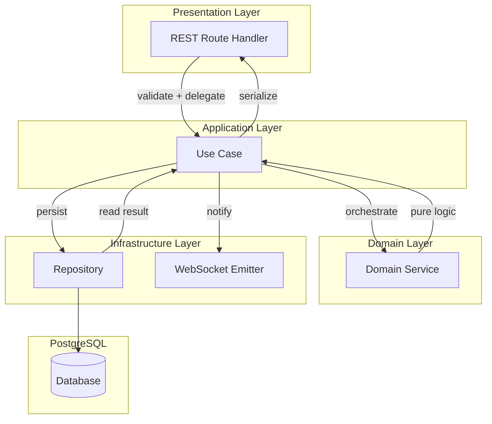
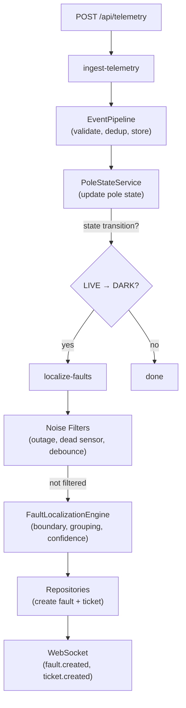
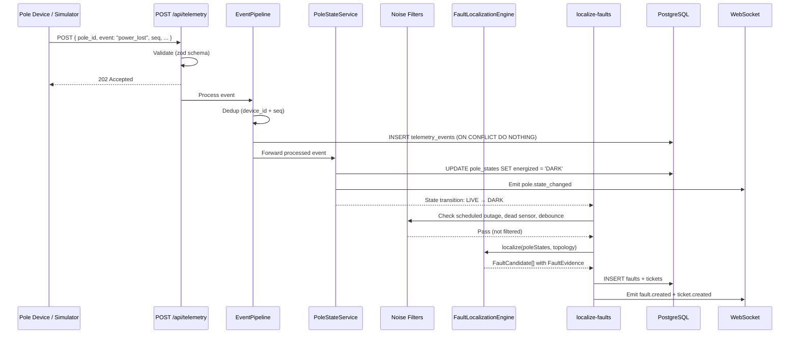
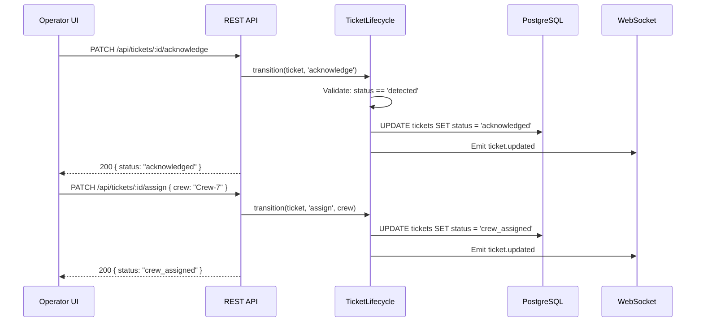
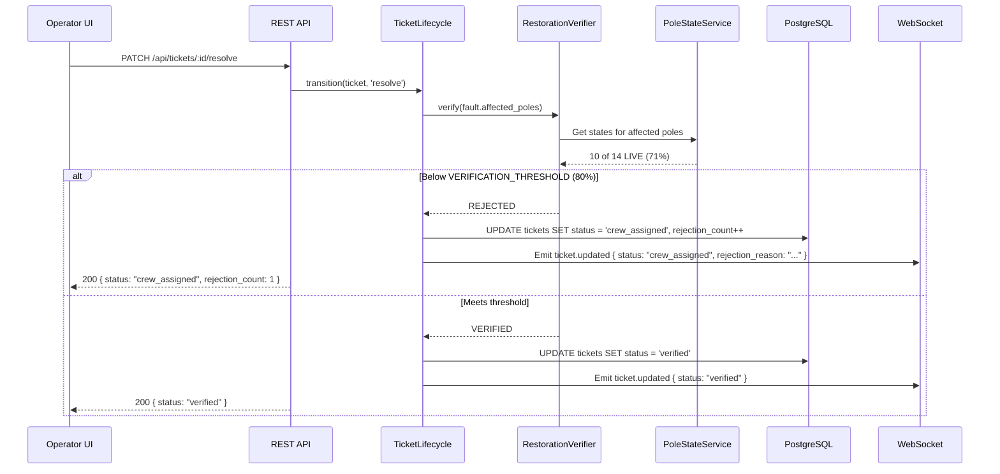
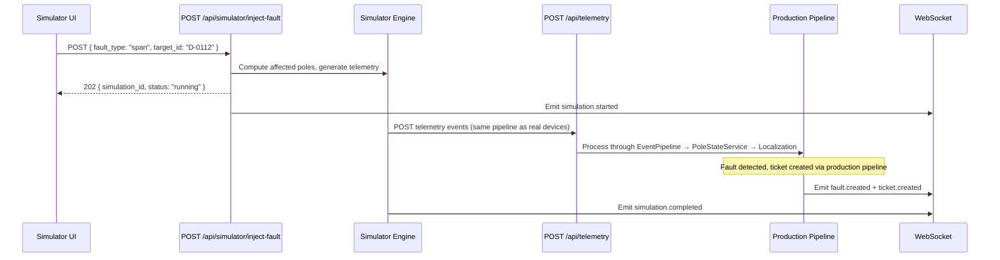
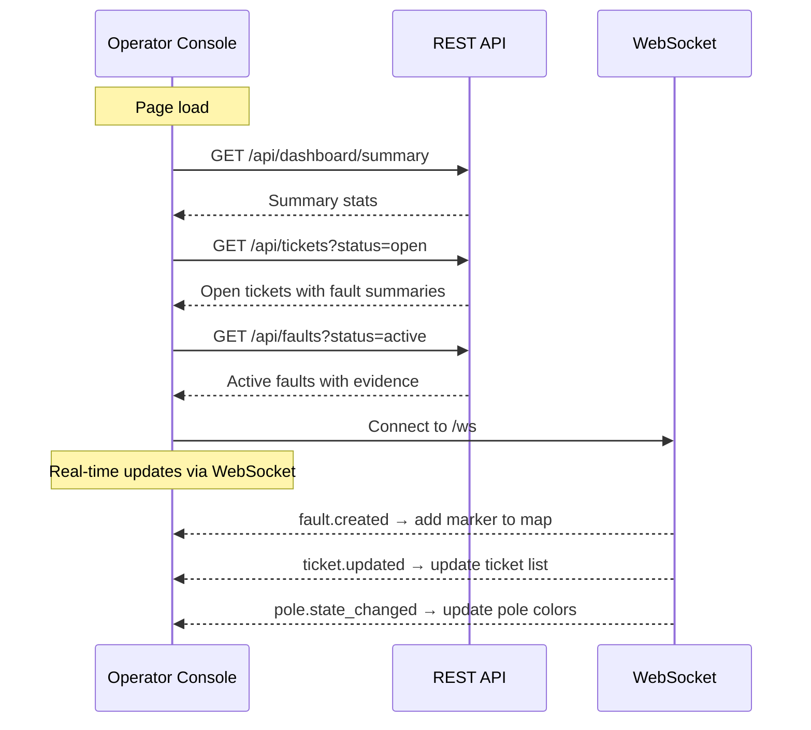
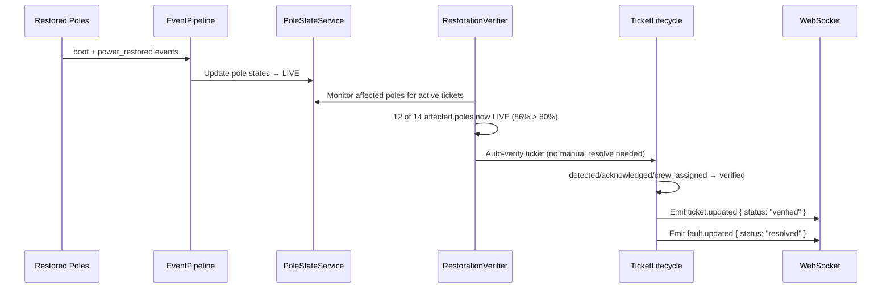
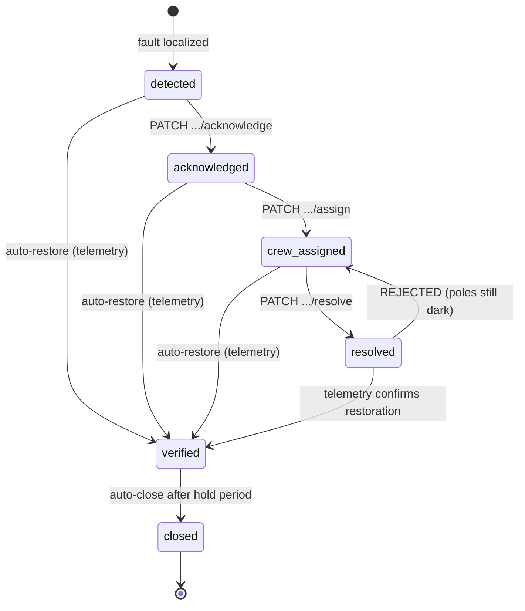

# ElectriFix — API Specification

> Engineering specification only. No implementation code. Fully consistent with [ARCHITECTURE.md](file:///Users/balajinayakbardawal/Learnings/ElectriFix/ARCHITECTURE.md), [DATABASE-DESIGN.md](file:///Users/balajinayakbardawal/Learnings/ElectriFix/DATABASE-DESIGN.md), and [LOCALIZATION-SPECIFICATION.md](file:///Users/balajinayakbardawal/Learnings/ElectriFix/LOCALIZATION-SPECIFICATION.md). Revised after engineering review on 2026-08-04.

---

## 1. Purpose

### Responsibility

The API is the **single boundary** between the frontend operator console, the simulator UI, and the backend system. All data enters and leaves the server through this contract. The API does not contain domain logic — it delegates to the application layer, which orchestrates domain services.

### Relationship to Other Specifications

| Document | Relationship |
|----------|-------------|
| [ARCHITECTURE.md](file:///Users/balajinayakbardawal/Learnings/ElectriFix/ARCHITECTURE.md) | Defines module ownership, internal layering, service boundaries. The API is the **presentation layer** — it maps HTTP verbs to use cases. |
| [DATABASE-DESIGN.md](file:///Users/balajinayakbardawal/Learnings/ElectriFix/DATABASE-DESIGN.md) | Defines entity structures and ownership. API response models are **read projections** of database entities — they may omit internal fields, denormalize for convenience, or reshape for the frontend. |
| [LOCALIZATION-SPECIFICATION.md](file:///Users/balajinayakbardawal/Learnings/ElectriFix/LOCALIZATION-SPECIFICATION.md) | Defines the FaultLocalizationEngine's inputs, outputs, algorithm, and evidence model. The API **surfaces** localization results — it does not perform localization. |

### Non Goals

The API does NOT:

- Perform fault localization. That is `FaultLocalizationEngine` in the domain layer.
- Enforce ticket state transitions. That is `TicketLifecycle` in the domain layer.
- Validate telemetry beyond schema shape. That is `EventPipeline` in the infrastructure layer.
- Manage authentication, authorization, or role-based access control.
- Serve static frontend assets. Nginx does that.

### Guiding Principles

1. **The API is a contract, not a controller.** Routes map HTTP requests to use cases. They do not contain business logic.
2. **Responses are deterministic.** Same request + same system state = same response. No randomness.
3. **Errors are structured and consistent.** Every error follows the same shape.
4. **Real-time updates go through WebSocket.** REST endpoints are for reads and commands. WebSocket is for push notifications.
5. **The simulator uses the same API as production telemetry.** Simulator-produced telemetry is posted to `POST /api/telemetry` — the same endpoint real devices would use. No backdoor.

---

## API Invariants

The following invariants are **architectural guarantees** that hold across the entire API surface. Any code change that violates an invariant is a bug.

1. **Every fault creates at most one ticket.** `tickets.fault_id` has a `UNIQUE` constraint. No API call can create a second ticket for the same fault.
2. **REST endpoints never contain business logic.** Routes validate input (zod), delegate to an application use case, and serialize the response. No localization, no state transitions, no DB queries in route handlers.
3. **Fault localization is never triggered directly by an API route.** It is triggered indirectly: `POST /api/telemetry` → `ingest-telemetry` → `PoleStateService` → state transition → `localize-faults`. The controller never calls `FaultLocalizationEngine`.
4. **The simulator never bypasses EventPipeline.** Simulator-generated telemetry flows through the same `POST /api/telemetry` or `EventPipeline` path as real device data. No direct writes to `faults` or `tickets`.
5. **WebSocket is never the source of truth.** WebSocket pushes notifications. The client re-fetches via REST to get authoritative state. If a WS event is missed, no data is lost.
6. **Database entities are never exposed directly.** API responses are read models — projections that may omit internal fields (`created_at`), denormalize for convenience (`fault` nested in ticket), or reshape for the frontend.
7. **API responses are deterministic.** Given the same system state and the same request, every endpoint returns the same response. No randomness, no AI in the response path (AI summaries are pre-computed and nullable).
8. **All state transitions occur through application use cases.** No route handler, repository, or infrastructure module modifies ticket status or fault status directly. Transitions go through `TicketLifecycle` (domain) via `manage-ticket` (application).

---

## 2. API Design Principles

### REST Conventions

| Principle | Convention |
|-----------|-----------|
| **Resource-oriented** | Endpoints name resources, not actions. `GET /api/tickets`, not `GET /api/getTickets`. |
| **HTTP verbs** | `GET` = read. `POST` = create / command. `PATCH` = partial update / state transition. `DELETE` = not used (no deletions in this system). |
| **Plural nouns** | `/api/tickets`, `/api/faults`, `/api/poles` |
| **Nested routes for relationships** | `/api/tickets/:id/acknowledge` — a command on a specific resource |
| **Consistent path prefix** | All API routes under `/api/`. WebSocket under `/ws`. |

### Naming Conventions

| Element | Convention | Example |
|---------|-----------|---------|
| Path segments | `kebab-case` | `/api/scheduled-outages` |
| Query parameters | `camelCase` | `?dtId=D-0112&status=active` |
| JSON request/response fields | `snake_case` | `{ "pole_id": "P-024431", "fault_type": "span" }` |
| Enum values | `UPPER_SNAKE_CASE` | `"RECORDED"`, `"HIGH"`, `"DARK"` |

> [!NOTE]
> JSON field naming uses `snake_case` to match the database column names from [DATABASE-DESIGN.md](file:///Users/balajinayakbardawal/Learnings/ElectriFix/DATABASE-DESIGN.md) and the assignment's data contracts. This avoids unnecessary mapping between layers.

### Timestamp Convention

All timestamps are **ISO 8601 UTC** strings: `"2026-07-29T02:14:07.412Z"`.

- Server-generated timestamps use `received_at` (trustworthy server clock).
- Device timestamps are passed through as `device_ts` but never trusted for ordering.

### ID Strategy

| Entity | ID Type | Generation |
|--------|---------|-----------|
| Poles, DTs, Feeders, Outages | Natural text key | From registry/feed (`P-024431`, `D-0112`, `F-07-03`, `SO-...`) |
| Telemetry Events | UUID v7 | Server-generated on ingest |
| Faults | UUID v7 | Server-generated on creation |
| Tickets | UUID v7 | Server-generated on creation |

### Pagination

List endpoints that may return large result sets support **cursor-based pagination**:

| Parameter | Type | Description |
|-----------|------|-------------|
| `limit` | integer (query) | Max items to return. Default: 50. Max: 200. |
| `cursor` | string (query) | Opaque cursor from previous response. Omit for first page. |

Response includes:

```
{
  "data": [...],
  "pagination": {
    "next_cursor": "eyJpZCI6IjEyMyJ9" | null,
    "has_more": true | false,
    "total_count": 42
  }
}
```

> [!NOTE]
> `total_count` is provided for small collections (faults, tickets — typically <200 active). For high-volume collections (telemetry events, pole states), `total_count` may be omitted for performance.

### Filtering

List endpoints support filtering via query parameters:

- `?status=active` — exact match
- `?dtId=D-0112` — exact match
- `?feederId=F-07-03` — exact match
- `?confidence=HIGH` — exact match
- `?since=2026-07-29T00:00:00Z` — timestamp range (lower bound)
- `?until=2026-07-29T23:59:59Z` — timestamp range (upper bound)

### Sorting

Default sort per endpoint:

| Resource | Default Sort |
|----------|-------------|
| Faults | `detected_at DESC` (newest first) |
| Tickets | `detected_at DESC` (newest first) |
| Poles | `pole_id ASC` |
| Telemetry | `received_at DESC` |

Override with `?sort=field&order=asc|desc`.

---

## 3. Authentication Assumptions

### Current Scope

Per [00-candidate-brief.md](file:///Users/balajinayakbardawal/Learnings/ElectriFix/assignmentDocs/00-candidate-brief.md): *"No real authentication, SSO, or role-based permissions (a stub is fine)."*

**Assumption:** All requests are treated as coming from a single hardcoded operator identity (`operator-1`). No authentication headers are required. No tokens are validated.

### Operator Identity

Every API response that references an operator (e.g., who acknowledged a ticket) uses a hardcoded operator ID:

```
{
  "acknowledged_by": "operator-1"
}
```

### Future Extensibility

The API is designed so that authentication can be added later without changing endpoint contracts:

1. All state-changing endpoints (`PATCH`, `POST`) could accept an `Authorization` header.
2. The `operator_id` field on tickets could be populated from a decoded token.
3. Route middleware can be inserted at the presentation layer without touching application or domain logic.

---

## 4. Module Ownership

### 4a. Telemetry Module

**Purpose:** Accept telemetry from pole devices (or simulator).

| Category | Detail |
|----------|--------|
| **Endpoints** | `POST /api/telemetry`, `POST /api/telemetry/batch` |
| **Use Case** | `ingest-telemetry` |
| **Dependencies** | `EventPipeline`, `PoleStateService`, `localize-faults` use case |

| Reads | Writes | Events Published |
|-------|--------|------------------|
| `poles` (validate `pole_id` exists) | `telemetry_events` (append-only via EventPipeline) | None directly. Triggers downstream: `pole.state_changed`, `fault.created`, `ticket.created` |
| | `pole_states` (via PoleStateService) | |

### 4b. Faults Module

**Purpose:** Expose localized faults with evidence and confidence. Read-only from the API perspective.

| Category | Detail |
|----------|--------|
| **Endpoints** | `GET /api/faults`, `GET /api/faults/:id` |
| **Use Case** | `get-dashboard-data` |
| **Dependencies** | `fault-repository` |

| Reads | Writes | Events Published |
|-------|--------|------------------|
| `faults` (with `evidence` JSONB) | None from API. Faults are created internally by `localize-faults` use case. | None from API. `fault.created` and `fault.updated` are emitted by `localize-faults`. |

### 4c. Tickets Module

**Purpose:** Expose ticket lifecycle and process operator actions.

| Category | Detail |
|----------|--------|
| **Endpoints** | `GET /api/tickets`, `GET /api/tickets/:id`, `PATCH .../acknowledge`, `PATCH .../assign`, `PATCH .../resolve` |
| **Use Case** | `manage-ticket`, `get-dashboard-data` |
| **Dependencies** | `ticket-repository`, `TicketLifecycle`, `RestorationVerifier` |

| Reads | Writes | Events Published |
|-------|--------|------------------|
| `tickets`, `faults` (denormalized summary) | `tickets` (status, timestamps, crew, rejection via `TicketLifecycle`) | `ticket.updated` on every state change |

### 4d. Pole State Module

**Purpose:** Expose current pole states for map rendering and diagnostics.

| Category | Detail |
|----------|--------|
| **Endpoints** | `GET /api/poles/states`, `GET /api/poles/states/:poleId` |
| **Use Case** | `get-dashboard-data` |
| **Dependencies** | `pole-repository`, `PoleStateService` |

| Reads | Writes | Events Published |
|-------|--------|------------------|
| `pole_states` joined with `poles` (coordinates) | None from API. `PoleStateService` writes are triggered by telemetry. | `pole.state_changed` (emitted by `PoleStateService`, not the route) |

### 4e. Network Module

**Purpose:** Expose network topology: poles, DTs, feeders, topology trees.

| Category | Detail |
|----------|--------|
| **Endpoints** | `GET /api/network/poles`, `GET /api/network/dts`, `GET /api/network/feeders`, `GET /api/network/topology/:dtId` |
| **Use Case** | `get-dashboard-data` |
| **Dependencies** | `network-repository`, `TopologyResolver` |

| Reads | Writes | Events Published |
|-------|--------|------------------|
| `poles`, `distribution_transformers`, `feeders` | None. Static registry data. | None. |

### 4f. Simulator Module

**Purpose:** Enable reviewers to inject faults, noise, and repairs.

| Category | Detail |
|----------|--------|
| **Endpoints** | `POST /api/simulator/inject-fault`, `POST /api/simulator/repair`, `POST /api/simulator/inject-noise`, `GET /api/simulator/scenarios` |
| **Use Case** | `run-simulation` |
| **Dependencies** | `fault-injector`, `telemetry-producer`, `noise-generator`, `repair-executor` |

| Reads | Writes | Events Published |
|-------|--------|------------------|
| `poles`, `distribution_transformers`, `feeders` (to compute affected poles), `faults` (for repair lookup) | None directly. All writes occur through the standard telemetry pipeline. | `simulation.started`, `simulation.completed` |

### 4g. Scheduled Outages Module

**Purpose:** Expose scheduled outage windows for display and filtering.

| Category | Detail |
|----------|--------|
| **Endpoints** | `GET /api/scheduled-outages` |
| **Use Case** | `get-dashboard-data` |
| **Dependencies** | `network-repository`, `scheduled-outage-client` |

| Reads | Writes | Events Published |
|-------|--------|------------------|
| `scheduled_outages` | None from API. | None. |

### 4h. Dashboard Module

**Purpose:** Assemble dashboard summary data in a single call.

| Category | Detail |
|----------|--------|
| **Endpoints** | `GET /api/dashboard/summary` |
| **Use Case** | `get-dashboard-data` |
| **Dependencies** | All read repositories |

| Reads | Writes | Events Published |
|-------|--------|------------------|
| Aggregates from `faults`, `tickets`, `pole_states`, `scheduled_outages` | None. | None. WS events are emitted by individual domain services. |

### 4i. Health Module

**Purpose:** Health checks for deployment verification.

| Category | Detail |
|----------|--------|
| **Endpoints** | `GET /api/health` |
| **Dependencies** | Database connection pool |

| Reads | Writes | Events Published |
|-------|--------|------------------|
| PostgreSQL connection check | None. | None. |

### 4j. Configuration Module

**Purpose:** Expose current system configuration and product policies.

| Category | Detail |
|----------|--------|
| **Endpoints** | `GET /api/config` |
| **Dependencies** | `config/env.ts`, product policies from [LOCALIZATION-SPECIFICATION.md](file:///Users/balajinayakbardawal/Learnings/ElectriFix/LOCALIZATION-SPECIFICATION.md) §Product Policies |

| Reads | Writes | Events Published |
|-------|--------|------------------|
| Environment variables, product policies | None. | None. |

### 4k. AI Feature Module

**Purpose:** Generate natural-language incident summaries from structured FaultEvidence.

| Category | Detail |
|----------|--------|
| **Endpoints** | None dedicated. Summaries are included in fault responses when available (`faults.ai_summary`). |
| **Dependencies** | LLM API (optional, graceful degradation) |
| **Use Case** | Generated lazily after localization by `localize-faults`. |

| Reads | Writes | Events Published |
|-------|--------|------------------|
| `FaultEvidence` (structured data from localization) | `faults.ai_summary` (nullable, lazy) | `fault.updated` when summary is generated asynchronously |

### AI API Principles

Per [ARCHITECTURE.md](file:///Users/balajinayakbardawal/Learnings/ElectriFix/ARCHITECTURE.md) Decision D5 and [LOCALIZATION-SPECIFICATION.md](file:///Users/balajinayakbardawal/Learnings/ElectriFix/LOCALIZATION-SPECIFICATION.md) §Engine Invariants:

1. **AI only enriches responses.** It generates human-readable text from structured `FaultEvidence`. It does not produce or modify data.
2. **AI never changes:**
   - Fault localization results
   - Confidence levels or reasons
   - Topology resolution
   - Ticket workflow or state
   - Pole state
   - Fault detection decisions
3. **AI failures never affect system correctness.** If the LLM is unavailable, slow, or returns garbage, `ai_summary` is `null`. All other fields are unaffected.
4. **AI summaries are optional enhancements.** The `ai_summary` field is nullable in every response model. The frontend must render correctly when it is `null`.
5. **AI is never in the critical path.** Localization completes and the ticket is created before any LLM call is made. The summary is backfilled asynchronously.

### Endpoint Ownership Flow

How an incoming REST request travels through the architecture layers:



Telemetry ingestion flow (the critical path):



---

## 5. Complete Endpoint Catalogue

---

### 5.1. `POST /api/telemetry` — Ingest Telemetry

| Attribute | Value |
|-----------|-------|
| **Method** | `POST` |
| **Path** | `/api/telemetry` |
| **Purpose** | Accept telemetry events from pole devices or the simulator. |
| **Owner** | Telemetry Module → `ingest-telemetry` use case |
| **Auth** | None required. |

**Request Body:**

```
{
  "device_id": "KSPDB-SD07-D0112-4431",     // required, string
  "pole_id": "P-024431",                     // required, string
  "event": "power_lost",                     // required, enum: heartbeat | power_lost | power_restored | boot
  "energized": false,                        // required, boolean
  "ts": "2026-07-29T02:14:07.412Z",          // required, ISO 8601
  "seq": 88213,                              // required, integer ≥ 0
  "battery_mv": 3480,                        // optional, integer
  "rssi": -91,                               // optional, integer
  "fw": "1.4.2"                              // optional, string
}
```

**Validation Rules:**

1. `device_id`: non-empty string.
2. `pole_id`: must exist in `poles` table. If unknown, reject with 422.
3. `event`: must be one of `heartbeat`, `power_lost`, `power_restored`, `boot`.
4. `energized`: boolean.
5. `ts`: valid ISO 8601 timestamp.
6. `seq`: non-negative integer.

**Success Response:** `202 Accepted`

```
{
  "status": "accepted",
  "received_at": "2026-07-29T02:14:07.500Z"
}
```

**Failure Responses:**

| Status | Condition |
|--------|-----------|
| `400 Bad Request` | Malformed JSON or missing required fields |
| `422 Unprocessable Entity` | Schema valid but business rule violated (unknown `pole_id`, invalid `event` value) |

**Idempotency:** Duplicate `(device_id, seq)` pairs are silently accepted (return `202`). The EventPipeline drops them via `ON CONFLICT DO NOTHING`. The caller never sees an error for duplicates.

**Side Effects:**

1. `EventPipeline`: validate → dedup → store in `telemetry_events`.
2. `PoleStateService`: update `pole_states` if state changed.
3. If state transition triggers localization (see LOCALIZATION-SPECIFICATION.md §Localization Triggers) → `localize-faults` → may create fault + ticket → WebSocket events.

**Events Emitted (Indirect):**

- `pole.state_changed` — if pole state transitions
- `fault.created` — if a new fault is localized
- `ticket.created` — if a new ticket is opened
- `fault.updated` — if an existing fault is updated (merge, affected count change)
- `ticket.updated` — if restoration is detected

**Performance:** < 50ms p95 response time. Must sustain ≥ 500 msg/s. Must tolerate 5,000 messages in 10 seconds without data loss.

---

### 5.2. `POST /api/telemetry/batch` — Batch Ingest

| Attribute | Value |
|-----------|-------|
| **Method** | `POST` |
| **Path** | `/api/telemetry/batch` |
| **Purpose** | Accept multiple telemetry events in one request. Used primarily by the simulator. |
| **Owner** | Telemetry Module → `ingest-telemetry` use case |

**Request Body:**

```
{
  "events": [
    { "device_id": "...", "pole_id": "...", "event": "...", ... },
    { "device_id": "...", "pole_id": "...", "event": "...", ... }
  ]
}
```

**Validation:** Each event in the array follows the same rules as `POST /api/telemetry`. Max batch size: 500 events.

**Success Response:** `202 Accepted`

```
{
  "status": "accepted",
  "accepted_count": 47,
  "rejected_count": 3,
  "received_at": "2026-07-29T02:14:07.500Z"
}
```

**Idempotency:** Same as single ingest. Duplicate events within the batch or against existing data are silently skipped.

---

### 5.3. `GET /api/faults` — List Active Faults

| Attribute | Value |
|-----------|-------|
| **Method** | `GET` |
| **Path** | `/api/faults` |
| **Purpose** | List all faults. Default: active only. Dashboard primary data source. |
| **Owner** | Faults Module → `get-dashboard-data` use case |

**Query Parameters:**

| Parameter | Type | Default | Description |
|-----------|------|---------|-------------|
| `status` | string | `active` | Filter by fault status: `active`, `resolved`, `merged`, or `all` |
| `dtId` | string | — | Filter by DT |
| `feederId` | string | — | Filter by feeder |
| `confidence` | string | — | Filter by confidence level: `HIGH`, `MEDIUM`, `LOW` |
| `since` | ISO 8601 | — | Faults detected after this time |
| `limit` | integer | 50 | Max results |
| `cursor` | string | — | Pagination cursor |

**Success Response:** `200 OK`

```
{
  "data": [
    {
      "fault_id": "uuid",
      "dt_id": "D-0112",
      "feeder_id": "F-07-03",
      "fault_type": "span",
      "status": "active",
      "span_pole_a": "P-024431",
      "span_pole_b": "P-024432",
      "lat": 12.9685,
      "lon": 77.5944,
      "pincode": "560078",
      "affected_pole_count": 14,
      "confidence_level": "HIGH",
      "topology_source": "RECORDED",
      "ai_summary": "Span fault between P-024431 and P-024432..." | null,
      "detected_at": "2026-07-29T02:14:07Z",
      "resolved_at": null,
      "evidence": { ... }       // Full FaultEvidence object (see §7)
    }
  ],
  "pagination": {
    "next_cursor": "..." | null,
    "has_more": false,
    "total_count": 3
  }
}
```

**Performance:** < 200ms p95. Operator console load (incident list) target: < 2 seconds.

---

### 5.4. `GET /api/faults/:faultId` — Get Fault Detail

| Attribute | Value |
|-----------|-------|
| **Method** | `GET` |
| **Path** | `/api/faults/:faultId` |
| **Purpose** | Retrieve a single fault with complete evidence. |
| **Owner** | Faults Module |

**Success Response:** `200 OK` — Single fault object (same shape as list item, with full evidence).

**Failure Responses:**

| Status | Condition |
|--------|-----------|
| `404 Not Found` | No fault with this ID exists |

---

### 5.5. `GET /api/tickets` — List Tickets

| Attribute | Value |
|-----------|-------|
| **Method** | `GET` |
| **Path** | `/api/tickets` |
| **Purpose** | List tickets with lifecycle status. Primary ticket management view. |
| **Owner** | Tickets Module → `get-dashboard-data` use case |

**Query Parameters:**

| Parameter | Type | Default | Description |
|-----------|------|---------|-------------|
| `status` | string | — | Filter: `detected`, `acknowledged`, `crew_assigned`, `resolved`, `verified`, `closed`, or `open` (shorthand for `detected\|acknowledged\|crew_assigned`) |
| `feederId` | string | — | Filter by feeder |
| `since` | ISO 8601 | — | Tickets created after |
| `limit` | integer | 50 | Max results |
| `cursor` | string | — | Pagination cursor |

**Success Response:** `200 OK`

```
{
  "data": [
    {
      "ticket_id": "uuid",
      "fault_id": "uuid",
      "status": "detected",
      "assigned_crew": null,
      "operator_notes": null,
      "rejection_count": 0,
      "rejection_reason": null,
      "detected_at": "2026-07-29T02:14:07Z",
      "acknowledged_at": null,
      "crew_assigned_at": null,
      "resolved_at": null,
      "verified_at": null,
      "closed_at": null,
      "fault": {                          // Denormalized fault summary
        "fault_id": "uuid",
        "fault_type": "span",
        "dt_id": "D-0112",
        "lat": 12.9685,
        "lon": 77.5944,
        "pincode": "560078",
        "affected_pole_count": 14,
        "confidence_level": "HIGH",
        "topology_source": "RECORDED"
      }
    }
  ],
  "pagination": { ... }
}
```

---

### 5.6. `GET /api/tickets/:ticketId` — Get Ticket Detail

| Attribute | Value |
|-----------|-------|
| **Method** | `GET` |
| **Path** | `/api/tickets/:ticketId` |
| **Purpose** | Full ticket detail with complete fault evidence. |
| **Owner** | Tickets Module |

**Success Response:** `200 OK` — Ticket object with nested full `fault` (including `evidence`).

**Failure:** `404 Not Found`.

---

### 5.7. `PATCH /api/tickets/:ticketId/acknowledge` — Acknowledge Ticket

| Attribute | Value |
|-----------|-------|
| **Method** | `PATCH` |
| **Path** | `/api/tickets/:ticketId/acknowledge` |
| **Purpose** | Operator acknowledges the fault. Transitions `detected → acknowledged`. |
| **Owner** | Tickets Module → `manage-ticket` use case → `TicketLifecycle` |

**Request Body:** Empty or:

```
{
  "operator_notes": "Dispatching team to area"    // optional
}
```

**Valid Transitions:** `detected → acknowledged`

**Success Response:** `200 OK`

```
{
  "ticket_id": "uuid",
  "status": "acknowledged",
  "acknowledged_at": "2026-07-29T02:15:00Z",
  "updated_at": "2026-07-29T02:15:00Z"
}
```

**Failure Responses:**

| Status | Condition |
|--------|-----------|
| `404 Not Found` | No ticket with this ID |
| `409 Conflict` | Ticket is not in `detected` status (invalid transition) |

**Idempotency:** Re-acknowledging an already `acknowledged` ticket returns `409`. The operation is not repeatable because it changes state.

**Events Emitted:** `ticket.updated`

**DB Changes:** `tickets.status = 'acknowledged'`, `tickets.acknowledged_at = now()`

---

### 5.8. `PATCH /api/tickets/:ticketId/assign` — Assign Crew

| Attribute | Value |
|-----------|-------|
| **Method** | `PATCH` |
| **Path** | `/api/tickets/:ticketId/assign` |
| **Purpose** | Assign crew to the ticket. Transitions `acknowledged → crew_assigned`. |
| **Owner** | Tickets Module → `manage-ticket` → `TicketLifecycle` |

**Request Body:**

```
{
  "assigned_crew": "Crew-Alpha-7",           // required, non-empty string
  "operator_notes": "Take 11kV ladder"       // optional
}
```

**Valid Transitions:** `acknowledged → crew_assigned`

**Success Response:** `200 OK`

```
{
  "ticket_id": "uuid",
  "status": "crew_assigned",
  "assigned_crew": "Crew-Alpha-7",
  "crew_assigned_at": "2026-07-29T02:20:00Z"
}
```

**Failure:**

| Status | Condition |
|--------|-----------|
| `404` | Ticket not found |
| `409` | Not in `acknowledged` status |
| `422` | `assigned_crew` is empty or missing |

**Events Emitted:** `ticket.updated`

---

### 5.9. `PATCH /api/tickets/:ticketId/resolve` — Mark Resolved (Crew Reports Done)

| Attribute | Value |
|-----------|-------|
| **Method** | `PATCH` |
| **Path** | `/api/tickets/:ticketId/resolve` |
| **Purpose** | Crew reports the fault is fixed. System verifies via telemetry. |
| **Owner** | Tickets Module → `manage-ticket` → `TicketLifecycle` + `RestorationVerifier` |

**Request Body:**

```
{
  "operator_notes": "Replaced fuse at pole P-024432"    // optional
}
```

**Valid Transitions:** `crew_assigned → resolved`

**Behavioral Contract:**

1. `TicketLifecycle` transitions ticket to `resolved`.
2. `RestorationVerifier` checks: does the fraction of affected monitored poles reporting `LIVE` meet `VERIFICATION_THRESHOLD`? (See [LOCALIZATION-SPECIFICATION.md](file:///Users/balajinayakbardawal/Learnings/ElectriFix/LOCALIZATION-SPECIFICATION.md) §Product Policies for threshold value.)
3. **If YES** → ticket moves to `verified` (auto-verified).
4. **If NO** → ticket is **rejected**. Pushed back to `crew_assigned`. `rejection_count` incremented. `rejection_reason` set.

**Success Response (Verified):** `200 OK`

```
{
  "ticket_id": "uuid",
  "status": "verified",
  "verified_at": "2026-07-29T03:00:00Z",
  "rejection_count": 0
}
```

**Success Response (Rejected):** `200 OK`

```
{
  "ticket_id": "uuid",
  "status": "crew_assigned",
  "rejection_count": 1,
  "rejection_reason": "3 of 14 affected poles still dark",
  "resolved_at": null
}
```

> [!IMPORTANT]
> Both verification and rejection are success responses (`200`). The system processed the request correctly in both cases. The response `status` field tells the caller what happened. This follows the assignment requirement: *"If a lineman marks it fixed and the poles are still dark, the system should not believe him."*

**Failure:**

| Status | Condition |
|--------|-----------|
| `404` | Ticket not found |
| `409` | Not in `crew_assigned` status |

**Events Emitted:** `ticket.updated` (with new status — either `verified` or `crew_assigned` with rejection)

---

### 5.10. `GET /api/poles/states` — List Pole States

| Attribute | Value |
|-----------|-------|
| **Method** | `GET` |
| **Path** | `/api/poles/states` |
| **Purpose** | Current state of poles for map rendering. |
| **Owner** | Pole State Module |

**Query Parameters:**

| Parameter | Type | Default | Description |
|-----------|------|---------|-------------|
| `dtId` | string | — | Filter by DT (strongly recommended) |
| `feederId` | string | — | Filter by feeder |
| `energized` | string | — | Filter: `LIVE`, `DARK`, `PRESUMED_DARK`, `UNKNOWN` |
| `limit` | integer | 200 | Max results |
| `cursor` | string | — | Pagination cursor |

**Success Response:** `200 OK`

```
{
  "data": [
    {
      "pole_id": "P-024431",
      "lat": 12.968214,
      "lon": 77.594612,
      "dt_id": "D-0112",
      "energized": "LIVE",
      "has_device": true,
      "device_health": "HEALTHY",
      "last_heartbeat_at": "2026-07-29T02:10:00Z",
      "firmware_version": "1.4.2"
    }
  ],
  "pagination": { ... }
}
```

> [!NOTE]
> This endpoint merges data from `poles` (coordinates, DT) and `pole_states` (energized status) into a single response for frontend convenience. The frontend should not need to make two separate calls.

**Performance:** < 500ms. The `dtId` filter is strongly recommended — loading all ~4,000 poles in one call is acceptable but slower.

---

### 5.11. `GET /api/poles/states/:poleId` — Single Pole State

Returns a single pole state by ID. `200 OK` or `404 Not Found`.

---

### 5.12. `GET /api/network/poles` — List Registry Poles

| Attribute | Value |
|-----------|-------|
| **Method** | `GET` |
| **Path** | `/api/network/poles` |
| **Purpose** | Static pole registry data (GPS, DT, feeder, device). For map tile initialization. |
| **Owner** | Network Module |

**Query Parameters:** `dtId`, `feederId`, `limit`, `cursor`.

**Response:** Same as `poles` table minus `created_at`. Includes `lat`, `lon`, `dt_id`, `feeder_id`, `seq_on_line`, `parent_pole_id`, `pincode`, `device_id`, `pole_type`.

---

### 5.13. `GET /api/network/dts` — List Distribution Transformers

| Attribute | Value |
|-----------|-------|
| **Method** | `GET` |
| **Path** | `/api/network/dts` |
| **Purpose** | List DTs with coordinates and topology availability. |
| **Owner** | Network Module |

**Success Response:** `200 OK`

```
{
  "data": [
    {
      "dt_id": "D-0112",
      "feeder_id": "F-07-03",
      "lat": 12.967801,
      "lon": 77.595120,
      "capacity_kva": 250,
      "households_served": 318,
      "has_recorded_topology": true,
      "pole_count": 72
    }
  ]
}
```

---

### 5.14. `GET /api/network/feeders` — List Feeders

Returns feeder list with substation info and DT count.

---

### 5.15. `GET /api/network/topology/:dtId` — Get DT Topology Tree

| Attribute | Value |
|-----------|-------|
| **Method** | `GET` |
| **Path** | `/api/network/topology/:dtId` |
| **Purpose** | Resolved topology tree for a specific DT. Used by the map to draw lines. |
| **Owner** | Network Module → `TopologyResolver` |

**Success Response:** `200 OK`

```
{
  "dt_id": "D-0112",
  "source": "RECORDED",
  "nodes": [
    { "pole_id": "P-024431", "lat": 12.968214, "lon": 77.594612 },
    { "pole_id": "P-024432", "lat": 12.968901, "lon": 77.594330 }
  ],
  "edges": [
    { "parent": "P-024431", "child": "P-024432" }
  ]
}
```

For `FALLBACK` topology (no recorded ordering):

```
{
  "dt_id": "D-0200",
  "source": "FALLBACK",
  "nodes": [ ... ],
  "edges": []           // No edges — flat list
}
```

**Failure:** `404` if DT not found.

---

### 5.16. `GET /api/scheduled-outages` — List Scheduled Outages

| Attribute | Value |
|-----------|-------|
| **Method** | `GET` |
| **Path** | `/api/scheduled-outages` |
| **Purpose** | Current and upcoming outage windows. |
| **Owner** | Scheduled Outages Module |

**Query Parameters:**

| Parameter | Type | Description |
|-----------|------|-------------|
| `from` | ISO 8601 | Start of time range |
| `to` | ISO 8601 | End of time range |
| `scope` | string | `feeder` or `dt` |

**Success Response:** `200 OK`

```
{
  "data": [
    {
      "outage_id": "SO-2026-07-29-014",
      "scope": "feeder",
      "target_id": "F-07-03",
      "scheduled_start": "2026-07-29T10:00:00Z",
      "scheduled_end": "2026-07-29T12:30:00Z",
      "reason": "Planned maintenance - jumper replacement",
      "is_active": true
    }
  ]
}
```

---

### 5.17. `POST /api/simulator/inject-fault` — Inject Simulated Fault

| Attribute | Value |
|-----------|-------|
| **Method** | `POST` |
| **Path** | `/api/simulator/inject-fault` |
| **Purpose** | Inject a fault into the system via simulated telemetry. |
| **Owner** | Simulator Module → `run-simulation` use case |

**Request Body:**

```
{
  "fault_type": "span",                 // required, enum: span | dt | feeder
  "target_id": "D-0112",               // required, string — DT ID (for span/dt) or feeder ID (for feeder)
  "span_pole_a": "P-024431",           // optional, for span faults: upstream pole
  "span_pole_b": "P-024432",           // optional, for span faults: downstream pole
  "options": {                          // optional
    "fw12_percentage": 0.08,            // fraction of affected devices on fw 1.2
    "power_lost_delivery_rate": 0.70,   // fraction of power_lost messages that succeed
    "clock_skew_seconds": 90,           // max clock skew
    "include_duplicates": false         // inject duplicate messages
  }
}
```

**Validation Rules:**

1. `fault_type` must be `span`, `dt`, or `feeder`.
2. `target_id` must exist in the registry.
3. For `span` faults: if `span_pole_a` / `span_pole_b` are provided, they must exist under the target DT.
4. If `span_pole_a` / `span_pole_b` are omitted for a `span` fault, the simulator picks a random span on the DT.

**Behavioral Contract:**

The simulator does NOT directly create faults or tickets. It:

1. Computes which poles would go dark (subtree traversal from fault point).
2. Generates realistic `power_lost` telemetry (respecting 70% delivery, fw 1.2 silence, clock skew).
3. Posts generated telemetry to `POST /api/telemetry` (or directly to `EventPipeline` internally).
4. Returns a simulation receipt — the fault detection, localization, and ticket creation emerge from the production pipeline.

**Success Response:** `202 Accepted`

```
{
  "simulation_id": "uuid",
  "status": "running",
  "fault_type": "span",
  "target_id": "D-0112",
  "expected_dark_poles": 14,
  "events_generated": 10,
  "events_dropped": 4,
  "started_at": "2026-07-29T02:14:07Z"
}
```

**Failure:**

| Status | Condition |
|--------|-----------|
| `400` | Invalid request body |
| `404` | Target DT/feeder/pole not found |
| `409` | Active simulation already running for this target |
| `422` | Invalid fault configuration (e.g., span poles not adjacent) |

**Events Emitted:** `simulation.started`

---

### 5.18. `POST /api/simulator/repair` — Simulate Repair

| Attribute | Value |
|-----------|-------|
| **Method** | `POST` |
| **Path** | `/api/simulator/repair` |
| **Purpose** | Simulate power restoration for a fault. |
| **Owner** | Simulator Module → `run-simulation` use case |

**Request Body:**

```
{
  "fault_id": "uuid"                    // required — which fault to "repair"
}
```

**Behavioral Contract:**

1. Look up the fault and its affected poles.
2. Generate `boot` + `power_restored` telemetry for each affected pole (within ~20 seconds).
3. Post through standard telemetry pipeline.
4. Restoration emerges from the production pipeline: `PoleStateService` → `RestorationVerifier` → ticket auto-verified.

**Success Response:** `202 Accepted`

```
{
  "simulation_id": "uuid",
  "status": "running",
  "fault_id": "uuid",
  "poles_restoring": 14,
  "events_generated": 28
}
```

**Failure:** `404` if `fault_id` not found. `409` if fault is already resolved.

---

### 5.19. `POST /api/simulator/inject-noise` — Inject Noise

| Attribute | Value |
|-----------|-------|
| **Method** | `POST` |
| **Path** | `/api/simulator/inject-noise` |
| **Purpose** | Inject noise scenarios independently of faults. |
| **Owner** | Simulator Module |

**Request Body:**

```
{
  "noise_type": "dead_sensor",          // required, enum: dead_sensor | duplicate_telemetry | stale_retry | out_of_order
  "target_pole_id": "P-024450",        // required for dead_sensor, optional for others
  "options": {
    "count": 5,                         // number of noise events to generate
    "delay_seconds": 3600               // for stale_retry: how old the replayed event is
  }
}
```

**Success Response:** `202 Accepted` with summary of injected events.

---

### 5.20. `GET /api/simulator/scenarios` — List Available Scenarios

| Attribute | Value |
|-----------|-------|
| **Method** | `GET` |
| **Path** | `/api/simulator/scenarios` |
| **Purpose** | Provide the simulator UI with available DTs, feeders, and suggested fault points. |
| **Owner** | Simulator Module |

**Success Response:** `200 OK`

```
{
  "fault_types": ["span", "dt", "feeder"],
  "noise_types": ["dead_sensor", "duplicate_telemetry", "stale_retry", "out_of_order"],
  "targets": {
    "feeders": [
      { "feeder_id": "F-07-03", "dt_count": 12, "pole_count": 840 }
    ],
    "dts": [
      { "dt_id": "D-0112", "feeder_id": "F-07-03", "pole_count": 72, "has_recorded_topology": true }
    ]
  }
}
```

---

### 5.21. `GET /api/dashboard/summary` — Dashboard Summary

| Attribute | Value |
|-----------|-------|
| **Method** | `GET` |
| **Path** | `/api/dashboard/summary` |
| **Purpose** | Single call for the dashboard's summary statistics. |
| **Owner** | Dashboard Module → `get-dashboard-data` use case |

**Success Response:** `200 OK`

```
{
  "active_faults": 3,
  "open_tickets": 5,
  "tickets_by_status": {
    "detected": 2,
    "acknowledged": 1,
    "crew_assigned": 2,
    "resolved": 0,
    "verified": 0
  },
  "network_status": {
    "total_poles": 4000,
    "live_poles": 3850,
    "dark_poles": 120,
    "presumed_dark_poles": 15,
    "unknown_poles": 15,
    "dead_sensors": 8,
    "active_outages": 1
  },
  "recent_faults": [ ... ],              // Last 5 faults (summary objects)
  "timestamp": "2026-07-29T02:14:07Z"
}
```

**Performance:** < 500ms. This is the landing page call — must be fast.

---

### 5.22. `GET /api/health` — Health Check

**Success Response:** `200 OK`

```
{
  "status": "healthy",
  "database": "connected",
  "uptime_seconds": 3600,
  "version": "1.0.0"
}
```

**Failure:** `503 Service Unavailable` if database connection fails.

---

### 5.23. `GET /api/config` — System Configuration

Returns current product policies as defined in [LOCALIZATION-SPECIFICATION.md](file:///Users/balajinayakbardawal/Learnings/ElectriFix/LOCALIZATION-SPECIFICATION.md) §Product Policies.

The API is the **read-only surface** for these policies. The source of truth for policy definitions, defaults, and consumers is the localization specification. This endpoint exposes their current runtime values.

```
{
  "policies": {
    "HEARTBEAT_INTERVAL": { "value": 15, "unit": "minutes" },
    "HEARTBEAT_TIMEOUT_MULTIPLIER": { "value": 2, "unit": "count" },
    "DEBOUNCE_DURATION": { "value": 30, "unit": "minutes" },
    "OUTAGE_TOLERANCE_MINUTES": { "value": 40, "unit": "minutes" },
    "VERIFICATION_THRESHOLD": { "value": 0.80, "unit": "fraction" },
    "FEEDER_DARK_THRESHOLD": { "value": 0.80, "unit": "fraction" },
    "STALE_HEARTBEAT_MINUTES": { "value": 20, "unit": "minutes" },
    "SENSOR_GAP_THRESHOLD": { "value": 0.30, "unit": "fraction" }
  }
}
```

> [!NOTE]
> Policy values are not hardcoded in API endpoint contracts. Wherever this specification references a threshold (e.g., verification threshold in §5.9, outage tolerance in §5.16), it refers to the policy defined in [LOCALIZATION-SPECIFICATION.md](file:///Users/balajinayakbardawal/Learnings/ElectriFix/LOCALIZATION-SPECIFICATION.md) §Product Policies. The `GET /api/config` endpoint is the runtime source for current values.

---

## 6. Request Models

### TelemetryEvent (Input)

| Field | Type | Required | Validation |
|-------|------|----------|------------|
| `device_id` | string | YES | Non-empty. Stable per physical device. |
| `pole_id` | string | YES | Must exist in `poles` table. |
| `event` | enum | YES | `heartbeat` \| `power_lost` \| `power_restored` \| `boot` |
| `energized` | boolean | YES | Current state as device sees it. |
| `ts` | ISO 8601 | YES | Device clock. Skew up to ±90s. Not trusted for ordering. |
| `seq` | integer | YES | ≥ 0. Monotonic per device. Resets on `boot`. |
| `battery_mv` | integer | NO | Capacitor voltage. Below ~3200 = may miss dying message. |
| `rssi` | integer | NO | Radio signal strength. |
| `fw` | string | NO | Firmware version. ~8% on 1.2.x (no `power_lost`). |

### InjectFaultRequest

| Field | Type | Required | Validation |
|-------|------|----------|------------|
| `fault_type` | enum | YES | `span` \| `dt` \| `feeder` |
| `target_id` | string | YES | Must exist in registry (DT ID or feeder ID) |
| `span_pole_a` | string | NO | For span faults. Must exist under target DT. |
| `span_pole_b` | string | NO | For span faults. Must exist under target DT. |
| `options` | object | NO | Simulation parameters |

### RepairRequest

| Field | Type | Required | Validation |
|-------|------|----------|------------|
| `fault_id` | UUID | YES | Must exist and be active |

### TicketAssignRequest

| Field | Type | Required | Validation |
|-------|------|----------|------------|
| `assigned_crew` | string | YES | Non-empty |
| `operator_notes` | string | NO | Free text |

### TicketActionRequest (Acknowledge / Resolve)

| Field | Type | Required | Validation |
|-------|------|----------|------------|
| `operator_notes` | string | NO | Free text |

---

## 7. Response Models

### FaultResponse

```
{
  "fault_id": "uuid",
  "dt_id": "D-0112",
  "feeder_id": "F-07-03",
  "fault_type": "span" | "dt" | "feeder",
  "status": "active" | "resolved" | "merged",
  "span_pole_a": "P-024431" | null,
  "span_pole_b": "P-024432" | null,
  "lat": 12.9685,
  "lon": 77.5944,
  "pincode": "560078" | null,
  "affected_pole_count": 14,
  "confidence_level": "HIGH" | "MEDIUM" | "LOW",
  "topology_source": "RECORDED" | "INFERRED" | "FALLBACK",
  "ai_summary": "string" | null,
  "detected_at": "ISO 8601",
  "resolved_at": "ISO 8601" | null,
  "evidence": FaultEvidenceResponse
}
```

### FaultEvidenceResponse

Directly mirrors the domain `FaultEvidence` type from [LOCALIZATION-SPECIFICATION.md](file:///Users/balajinayakbardawal/Learnings/ElectriFix/LOCALIZATION-SPECIFICATION.md) §3b:

```
{
  "last_live_pole": "P-024431" | null,
  "first_dark_pole": "P-024432" | null,
  "fault_span": ["P-024431", "P-024432"] | null,
  "affected_poles": ["P-024432", "P-024433", ...],
  "affected_pole_count": 14,
  "topology_source": "RECORDED",
  "confidence_level": "HIGH",
  "confidence_reasons": [
    {
      "factor": "Recorded topology",
      "positive": true,
      "detail": "DT D-0112 has complete pole ordering from registry"
    },
    {
      "factor": "Downstream confirmations",
      "positive": true,
      "detail": "14 of 14 downstream poles confirmed dark"
    }
  ],
  "coordinates": { "lat": 12.9685, "lon": 77.5944 },
  "pincode": "560078",
  "suppressed_sensors": ["P-024440"]
}
```

### TicketResponse

```
{
  "ticket_id": "uuid",
  "fault_id": "uuid",
  "status": "detected" | "acknowledged" | "crew_assigned" | "resolved" | "verified" | "closed",
  "assigned_crew": "string" | null,
  "operator_notes": "string" | null,
  "rejection_count": 0,
  "rejection_reason": "string" | null,
  "detected_at": "ISO 8601",
  "acknowledged_at": "ISO 8601" | null,
  "crew_assigned_at": "ISO 8601" | null,
  "resolved_at": "ISO 8601" | null,
  "verified_at": "ISO 8601" | null,
  "closed_at": "ISO 8601" | null,
  "fault": FaultSummaryResponse
}
```

### FaultSummaryResponse (Nested in Ticket)

A lightweight fault summary — no evidence. Used when the full evidence isn't needed.

```
{
  "fault_id": "uuid",
  "fault_type": "span",
  "dt_id": "D-0112",
  "lat": 12.9685,
  "lon": 77.5944,
  "pincode": "560078",
  "affected_pole_count": 14,
  "confidence_level": "HIGH",
  "topology_source": "RECORDED"
}
```

### PoleStateResponse

```
{
  "pole_id": "P-024431",
  "lat": 12.968214,
  "lon": 77.594612,
  "dt_id": "D-0112",
  "feeder_id": "F-07-03",
  "energized": "LIVE" | "DARK" | "PRESUMED_DARK" | "UNKNOWN",
  "has_device": true,
  "device_health": "HEALTHY" | "OFFLINE" | "DEGRADED",
  "last_heartbeat_at": "ISO 8601" | null,
  "firmware_version": "1.4.2" | null
}
```

### PaginationResponse

```
{
  "next_cursor": "string" | null,
  "has_more": true | false,
  "total_count": 42             // Optional for high-volume collections
}
```

---

## 8. Error Contract

### Error Philosophy

Before the detailed error codes, the guiding principles:

1. **`4xx` = client mistake.** The request was wrong. The client can fix it and retry.
2. **`5xx` = server failure.** The request may have been valid. The client should retry or report a bug.
3. **Invalid state transitions return `409 Conflict`, never `500`.** A ticket that cannot be acknowledged because it is in `crew_assigned` is a client mistake (wrong transition), not a server error.
4. **Business validation failures return `422`, never `404`.** An unknown `pole_id` in a telemetry event is a validation failure, not a missing resource.
5. **Duplicate telemetry is accepted, never rejected.** `POST /api/telemetry` always returns `202` for valid schema, even if the event is a duplicate. Duplicates are silently dropped by `EventPipeline`.
6. **Error responses are deterministic.** Same invalid request + same system state = same error response. No randomness in error messages.
7. **Never return `500` for predictable conditions.** If the condition can be anticipated (invalid transition, missing resource, validation failure), use the appropriate `4xx` code.

### Unified Error Shape

Every error response follows this structure:

```
{
  "error": {
    "code": "VALIDATION_ERROR",
    "message": "Human-readable description",
    "details": [                            // Optional, for validation errors
      {
        "field": "pole_id",
        "message": "Unknown pole ID: P-999999",
        "value": "P-999999"
      }
    ],
    "timestamp": "2026-07-29T02:14:07Z"
  }
}
```

### Error Codes

| HTTP Status | Error Code | When |
|------------|-----------|------|
| `400` | `BAD_REQUEST` | Malformed JSON, missing required fields |
| `404` | `NOT_FOUND` | Resource does not exist |
| `409` | `CONFLICT` | Invalid state transition (e.g., acknowledging a `crew_assigned` ticket) |
| `409` | `DUPLICATE_SIMULATION` | Simulation already running for this target |
| `422` | `VALIDATION_ERROR` | Schema valid but business rule violated (unknown pole, invalid enum) |
| `500` | `INTERNAL_ERROR` | Unexpected server error |
| `503` | `SERVICE_UNAVAILABLE` | Database unreachable |

### Error Code Behaviors

**`400 BAD_REQUEST`**: Request body is not valid JSON or missing required top-level fields. Zod schema validation failure.

**`404 NOT_FOUND`**: `GET /api/faults/:id` where `:id` does not exist. `PATCH /api/tickets/:id/acknowledge` where `:id` does not exist.

**`409 CONFLICT`**: Ticket state transition violations. The response includes the current status:

```
{
  "error": {
    "code": "CONFLICT",
    "message": "Cannot acknowledge ticket: current status is 'crew_assigned'",
    "details": [{ "field": "status", "message": "Expected 'detected', got 'crew_assigned'", "value": "crew_assigned" }]
  }
}
```

**`422 VALIDATION_ERROR`**: Business-rule validation. Example: `pole_id` does not exist in registry.

---

## 9. WebSocket Contract

### Connection

| Attribute | Value |
|-----------|-------|
| **URL** | `ws://host/ws` (or `wss://` in production) |
| **Protocol** | Standard WebSocket |
| **Auth** | None (same as REST) |
| **Fallback** | If WebSocket deployment fails through Nginx, the frontend falls back to polling REST endpoints. See ARCHITECTURE.md Decision D2. |

### Message Format

Every WebSocket message is JSON:

```
{
  "type": "ticket.updated",
  "payload": { ... },
  "timestamp": "2026-07-29T02:14:07Z",
  "event_id": "uuid"                    // For client-side deduplication
}
```

### Event Types

#### `fault.created`

Emitted when a new fault is localized and persisted.

```
{
  "type": "fault.created",
  "payload": {
    "fault_id": "uuid",
    "fault_type": "span",
    "dt_id": "D-0112",
    "lat": 12.9685,
    "lon": 77.5944,
    "pincode": "560078",
    "affected_pole_count": 14,
    "confidence_level": "HIGH",
    "topology_source": "RECORDED"
  }
}
```

#### `fault.updated`

Emitted when a fault is updated (merge, affected count change, AI summary generated, resolved).

```
{
  "type": "fault.updated",
  "payload": {
    "fault_id": "uuid",
    "status": "resolved",
    "affected_pole_count": 14,
    "ai_summary": "..." | null,
    "resolved_at": "ISO 8601" | null
  }
}
```

#### `ticket.created`

Emitted when a new ticket is created.

```
{
  "type": "ticket.created",
  "payload": {
    "ticket_id": "uuid",
    "fault_id": "uuid",
    "status": "detected",
    "fault_summary": { ... }         // FaultSummaryResponse
  }
}
```

#### `ticket.updated`

Emitted on any ticket state change (acknowledge, assign, resolve, verify, reject, close).

```
{
  "type": "ticket.updated",
  "payload": {
    "ticket_id": "uuid",
    "status": "acknowledged",
    "previous_status": "detected",
    "rejection_count": 0,
    "rejection_reason": null,
    "updated_at": "ISO 8601"
  }
}
```

#### `pole.state_changed`

Emitted when one or more poles change state. Batched to avoid flooding.

```
{
  "type": "pole.state_changed",
  "payload": {
    "changes": [
      {
        "pole_id": "P-024432",
        "previous_state": "LIVE",
        "new_state": "DARK",
        "dt_id": "D-0112"
      }
    ]
  }
}
```

#### `simulation.started`

```
{
  "type": "simulation.started",
  "payload": {
    "simulation_id": "uuid",
    "fault_type": "span",
    "target_id": "D-0112"
  }
}
```

#### `simulation.completed`

```
{
  "type": "simulation.completed",
  "payload": {
    "simulation_id": "uuid",
    "result": "fault_detected" | "repair_verified",
    "fault_id": "uuid" | null,
    "ticket_id": "uuid" | null,
    "duration_ms": 1500
  }
}
```

### Ordering and Delivery

| Property | Guarantee |
|----------|-----------|
| **Ordering** | Events for the same entity (e.g., same ticket) are delivered in order. Events for different entities may arrive in any order. |
| **Delivery** | At-most-once. If a client disconnects, missed events are not replayed. The client should re-fetch via REST on reconnect. |
| **Deduplication** | Each event has a unique `event_id`. Clients should deduplicate by `event_id` if they receive the same event twice (possible during reconnection). |
| **Batching** | `pole.state_changed` events are batched per DT to avoid flooding. One message per DT per state change cycle, not one per pole. |

### Reconnection Protocol

1. Client connects to `/ws`.
2. Server sends no initial state — client fetches via REST.
3. On disconnect, client waits 1 second, then reconnects with exponential backoff (1s, 2s, 4s, max 30s).
4. On reconnect, client calls `GET /api/dashboard/summary` and `GET /api/tickets?status=open` to re-sync.
5. WebSocket events resume from current state — no replay of missed events.

---

## 10. API Interaction Flows

### 10a. Telemetry Ingestion → Fault Localization



### 10b. Ticket Lifecycle Flow



### 10c. Repair Verification



### 10d. Simulator Flow



### 10e. Dashboard Refresh



### 10f. Auto-Restoration (No Operator Action)



---

## Ticket State Machine

The ticket lifecycle is a finite state machine enforced by `TicketLifecycle` in the domain layer. The API surface exposes only the operator-driven transitions; telemetry-driven transitions happen internally.



### Transition Classification

| Transition | Trigger | Type |
|-----------|---------|------|
| `detected` → `acknowledged` | Operator: `PATCH .../acknowledge` | Operator-driven |
| `acknowledged` → `crew_assigned` | Operator: `PATCH .../assign` | Operator-driven |
| `crew_assigned` → `resolved` | Operator: `PATCH .../resolve` | Operator-driven |
| `resolved` → `verified` | Telemetry: `VERIFICATION_THRESHOLD` met | Telemetry-driven |
| `resolved` → `crew_assigned` | Telemetry: threshold NOT met | Rejection |
| `detected` → `verified` | Telemetry: auto-restore before acknowledgment | Telemetry-driven |
| `acknowledged` → `verified` | Telemetry: auto-restore before crew assigned | Telemetry-driven |
| `crew_assigned` → `verified` | Telemetry: auto-restore before crew resolves | Telemetry-driven |
| `verified` → `closed` | System: auto-close after hold period | System-driven |

### Invalid Transitions (Return `409 Conflict`)

| Attempted | Current Status | Why Invalid |
|-----------|---------------|------------|
| `acknowledge` | Any except `detected` | Can only acknowledge a newly detected ticket |
| `assign` | Any except `acknowledged` | Must acknowledge before assigning crew |
| `resolve` | Any except `crew_assigned` | Crew must be assigned before resolving |
| Any operator action | `verified` or `closed` | Terminal states — no further operator actions |

---

## 11. Idempotency Rules

### Duplicate Telemetry

| Scenario | Behavior |
|----------|----------|
| Same `(device_id, seq)` posted twice | `EventPipeline` drops via `ON CONFLICT DO NOTHING`. `POST /api/telemetry` returns `202` both times. No state change. No duplicate fault/ticket. |
| Same pole sends `power_lost` then `power_lost` again (different `seq`) | `PoleStateService` state is already `DARK`. No state transition. Localization is NOT re-invoked. |

### Duplicate Simulator Requests

| Scenario | Behavior |
|----------|----------|
| `POST /api/simulator/inject-fault` for same DT twice | Second request returns `409 CONFLICT` if first simulation is still running. After completion, a new simulation is allowed. |
| `POST /api/simulator/repair` for same fault twice | Second request returns `409 CONFLICT` if fault is already resolved. |

### Duplicate Ticket Actions

| Scenario | Behavior |
|----------|----------|
| `PATCH /api/tickets/:id/acknowledge` when already acknowledged | Returns `409 CONFLICT`. Transition `acknowledged → acknowledged` is invalid. |
| `PATCH /api/tickets/:id/assign` with same crew again | Returns `409 CONFLICT`. Transition `crew_assigned → crew_assigned` is invalid. |
| `PATCH /api/tickets/:id/resolve` when already verified | Returns `409 CONFLICT`. |

### General Rule

**No API call creates duplicate resources.** The `localize-faults` use case checks for existing faults at the same boundary before creating a new one. The ticket has a `UNIQUE` constraint on `fault_id`.

---

## 12. Performance Expectations

### Per-Endpoint Latency

| Endpoint | Target (p95) | Notes |
|----------|-------------|-------|
| `POST /api/telemetry` | < 50 ms | Must not block on localization. Accept, enqueue, return. |
| `POST /api/telemetry/batch` | < 200 ms | For up to 500 events. |
| `GET /api/faults` | < 200 ms | Index on `status`, `detected_at` |
| `GET /api/faults/:id` | < 50 ms | PK lookup |
| `GET /api/tickets` | < 200 ms | Index on `status`, `detected_at` |
| `GET /api/tickets/:id` | < 50 ms | PK lookup + join to fault |
| `PATCH /api/tickets/:id/*` | < 100 ms | State transition + DB write + WS emit |
| `GET /api/poles/states` | < 500 ms | With `dtId` filter; full table < 1s |
| `GET /api/network/topology/:dtId` | < 100 ms | Cached after first access |
| `GET /api/dashboard/summary` | < 500 ms | Aggregation query |
| `POST /api/simulator/inject-fault` | < 200 ms | Accept + return. Telemetry generation is async. |
| `GET /api/health` | < 50 ms | Lightweight |

### Throughput

| Metric | Target |
|--------|--------|
| Sustained telemetry ingest | ≥ 500 msg/s |
| Burst tolerance | 5,000 messages in 10 seconds |
| Concurrent WebSocket connections | ≥ 50 |

### End-to-End Latency

| Metric | Target |
|--------|--------|
| Fault occurrence → localized ticket visible in UI | < 120 s (p95) |
| Restoration → ticket auto-verified | < 120 s |
| Operator console load (incident list) | < 2 s |

Per LOCALIZATION-SPECIFICATION.md §14: the algorithm itself takes < 10ms per DT. The 120-second budget is dominated by the Debouncer waiting for missed heartbeats (fw 1.2 devices).

### WebSocket Latency

| Metric | Target |
|--------|--------|
| Event occurrence → WS message delivered | < 500 ms |
| Burst (10 events in 1 second) | All delivered within 2 seconds |

---

## 13. Versioning Strategy

### Current Version

No explicit version in URL. All endpoints are under `/api/`.

### Future Versioning

If breaking changes are needed:

1. Introduce `/api/v2/` prefix for new version.
2. Maintain `/api/` (v1) for backward compatibility.
3. Deprecation: announce in API response headers (`Deprecation: true`, `Sunset: date`).
4. Removal: after documented migration period.

### Backward-Compatible Changes (No Version Bump)

- Adding new optional fields to responses.
- Adding new endpoints.
- Adding new optional query parameters.
- Adding new WebSocket event types.

### Breaking Changes (Require Version Bump)

- Removing or renaming response fields.
- Changing response status codes.
- Changing request validation rules to be stricter.
- Removing endpoints.

---

## Future Extension Points

The following APIs are intentionally **not in scope** for this assignment. They are documented here to show that the architecture can accommodate them without structural changes.

| Future Endpoint | Purpose | Architecture Impact |
|----------------|---------|--------------------|
| `POST /api/auth/login` | JWT-based authentication | Add middleware at presentation layer. No domain changes. |
| `GET /api/crews`, `POST /api/crews` | Crew management and availability | New domain module `domain/crew`. FK from `tickets.assigned_crew` to `crews` table. |
| `GET /api/audit/:entityType/:entityId` | Full audit trail for faults and tickets | New `audit_history` table. Write-on-change from use cases. Read-only API. |
| `GET /api/analytics/faults` | Historical fault analytics (MTTR, fault frequency, seasonal trends) | Read-only aggregation queries on `faults` and `tickets`. No domain changes. |
| `POST /api/notifications/subscribe` | Push notifications for operators (SMS, email, Slack) | New infrastructure adapter. Use cases emit to notification service after WS emit. |
| `GET /api/tickets/export` | Bulk ticket export (CSV, JSON) | Streaming read from `tickets` + `faults`. Pagination via cursor. |
| `POST /api/config` | Runtime policy updates | Currently read-only. Would require validation and restart-free config reload. |

> [!NOTE]
> These are explicitly **out of scope** for the current assignment. They are listed to demonstrate that the layered architecture supports them without redesign. None of these require changes to the localization engine, topology resolver, or pole state service.

---

## 14. Acceptance Scenarios

### Scenario A1: Single Span Fault — Full Flow

**Given:** System is running with seeded network. DT D-0112 has recorded topology.

**When:** `POST /api/simulator/inject-fault { fault_type: "span", target_id: "D-0112" }`

**Then:**
- `202 Accepted` with `simulation_id`.
- WebSocket emits `simulation.started`.
- Within 5 seconds: `fault.created` event with `confidence_level: HIGH`, `topology_source: RECORDED`.
- Within 5 seconds: `ticket.created` event with `status: detected`.
- `GET /api/faults?status=active` returns exactly 1 fault with correct `span_pole_a`, `span_pole_b`, coordinates, and pincode.
- `GET /api/tickets?status=open` returns exactly 1 ticket in `detected` status.

### Scenario A2: Three Simultaneous Faults

**Given:** System is idle (no active faults).

**When:** Three `POST /api/simulator/inject-fault` requests for different DTs/spans.

**Then:**
- Three separate faults, three separate tickets.
- NOT one merged fault. NOT thirty individual alerts.
- `GET /api/faults?status=active` returns exactly 3 faults.

### Scenario A3: Dead Sensor (No False Positive)

**Given:** P-50 has live children P-51, P-52.

**When:** `POST /api/simulator/inject-noise { noise_type: "dead_sensor", target_pole_id: "P-50" }`

**Then:**
- No new fault created.
- No new ticket created.
- `GET /api/faults?status=active` count unchanged.
- `GET /api/poles/states/P-50` shows `device_health: OFFLINE`.

### Scenario A4: Scheduled Outage Suppression

**Given:** Scheduled outage for feeder F-07 from 10:00 to 12:30.

**When:** At 10:15, poles under F-07 go dark (via simulator or telemetry).

**Then:**
- No fault created during the outage window (with ±40 min tolerance).
- `GET /api/faults?status=active` — no new faults for this feeder.

### Scenario A5: Ticket Acknowledge → Assign → Resolve → Verify

**Given:** One active ticket in `detected` status.

**When:**
1. `PATCH /api/tickets/:id/acknowledge` → 200, status: `acknowledged`
2. `PATCH /api/tickets/:id/assign { assigned_crew: "Crew-7" }` → 200, status: `crew_assigned`
3. `POST /api/simulator/repair { fault_id: "..." }` (repair the fault)
4. Wait for `power_restored` telemetry to propagate.
5. `PATCH /api/tickets/:id/resolve` → 200, status: `verified`

**Then:**
- Ticket moves through full lifecycle.
- WebSocket emits `ticket.updated` at each step.
- Final status is `verified`, not just `resolved`.

### Scenario A6: Premature Closure Rejected

**Given:** Ticket in `crew_assigned`. Only 2 of 14 affected poles restored.

**When:** `PATCH /api/tickets/:id/resolve`

**Then:**
- Response: `200 OK` with `status: "crew_assigned"`, `rejection_count: 1`, `rejection_reason: "2 of 14 affected poles still dark"`.
- WebSocket emits `ticket.updated` with rejection info.
- Ticket remains in `crew_assigned`, not `verified`.

### Scenario A7: Duplicate Telemetry — Idempotent

**Given:** Fault already detected for DT D-0112.

**When:** Same `power_lost` event arrives 5 more times (same `device_id`, same `seq`).

**Then:**
- All return `202 Accepted`.
- No new faults created.
- No new tickets created.
- No additional WebSocket events.

### Scenario A8: Invalid Ticket Transition

**Given:** Ticket in `crew_assigned` status.

**When:** `PATCH /api/tickets/:id/acknowledge`

**Then:**
- `409 Conflict`: "Cannot acknowledge ticket: current status is 'crew_assigned'".

### Scenario A9: Missing Topology — DT-Level Fault

**Given:** DT D-0300 has no recorded topology (`has_recorded_topology: false`).

**When:** Multiple poles under D-0300 go dark.

**Then:**
- Fault created with `fault_type: "dt"`, `span_pole_a: null`, `span_pole_b: null`.
- `confidence_level: LOW`, `topology_source: FALLBACK`.
- Evidence includes: "Topology unknown — cannot determine specific span."

### Scenario A10: Auto-Resolve Before Acknowledgment

**Given:** Fault detected. Ticket in `detected` (operator has not acted).

**When:** All affected poles send `power_restored`.

**Then:**
- Ticket moves from `detected` → `verified` automatically.
- WebSocket emits `ticket.updated { status: "verified" }`.
- No manual intervention required.

### Scenario A11: Simulator Repair Flow

**Given:** Active fault with fault_id X.

**When:** `POST /api/simulator/repair { fault_id: "X" }`

**Then:**
- `202 Accepted` with simulation_id.
- Affected poles send `boot` + `power_restored` through production pipeline.
- `PoleStateService` updates poles to `LIVE`.
- `RestorationVerifier` detects restoration.
- Ticket auto-verified (if `VERIFICATION_THRESHOLD` met — see [LOCALIZATION-SPECIFICATION.md](file:///Users/balajinayakbardawal/Learnings/ElectriFix/LOCALIZATION-SPECIFICATION.md) §Product Policies).
- `GET /api/faults/X` shows `status: "resolved"`.

### Scenario A12: Health Check

**Given:** System running.

**When:** `GET /api/health`

**Then:** `200 OK` with `status: "healthy"`, `database: "connected"`.

---

## 15. Known Limitations

1. **No authentication.** All requests are trusted. In production, add JWT middleware at the presentation layer.

2. **No rate limiting.** The telemetry endpoint accepts unlimited requests. In production, add rate limiting per device.

3. **No request tracing.** No correlation IDs across telemetry → fault → ticket chain. Would be valuable for debugging in production.

4. **WebSocket has no replay.** Missed events during disconnection are lost. Client must re-fetch via REST. In production, add event sequence numbers and replay from last-seen.

5. **Batch telemetry endpoint is a convenience.** The production IoT path would use individual HTTPS POSTs. The batch endpoint exists primarily for the simulator.

6. **No pagination on WebSocket.** If many events fire simultaneously (storm), all are delivered. Client must handle burst rendering gracefully.

---

## Cross-Reference Matrix

Where each system responsibility is defined:

| Responsibility | Source Document | Section |
|---------------|----------------|--------|
| Fault localization algorithm | [LOCALIZATION-SPECIFICATION.md](file:///Users/balajinayakbardawal/Learnings/ElectriFix/LOCALIZATION-SPECIFICATION.md) | §4–6 |
| Confidence model and rules | [LOCALIZATION-SPECIFICATION.md](file:///Users/balajinayakbardawal/Learnings/ElectriFix/LOCALIZATION-SPECIFICATION.md) | §7 |
| Product policies (thresholds, timeouts) | [LOCALIZATION-SPECIFICATION.md](file:///Users/balajinayakbardawal/Learnings/ElectriFix/LOCALIZATION-SPECIFICATION.md) | §Product Policies |
| Engine invariants and determinism | [LOCALIZATION-SPECIFICATION.md](file:///Users/balajinayakbardawal/Learnings/ElectriFix/LOCALIZATION-SPECIFICATION.md) | §Engine Invariants, §Determinism |
| Noise handling (dead sensors, outages, debounce) | [LOCALIZATION-SPECIFICATION.md](file:///Users/balajinayakbardawal/Learnings/ElectriFix/LOCALIZATION-SPECIFICATION.md) | §10 |
| Topology resolution strategy | [ARCHITECTURE.md](file:///Users/balajinayakbardawal/Learnings/ElectriFix/ARCHITECTURE.md) | §4 (TopologyResolver) |
| Module ownership and layering | [ARCHITECTURE.md](file:///Users/balajinayakbardawal/Learnings/ElectriFix/ARCHITECTURE.md) | §2, §4, §5 |
| Simulator architecture | [ARCHITECTURE.md](file:///Users/balajinayakbardawal/Learnings/ElectriFix/ARCHITECTURE.md) | §4 (Simulator Module) |
| Architectural decisions (D1–D15) | [ARCHITECTURE.md](file:///Users/balajinayakbardawal/Learnings/ElectriFix/ARCHITECTURE.md) | §8 |
| Database entity structures and ownership | [DATABASE-DESIGN.md](file:///Users/balajinayakbardawal/Learnings/ElectriFix/DATABASE-DESIGN.md) | §Entity Responsibilities |
| Entity relationships and constraints | [DATABASE-DESIGN.md](file:///Users/balajinayakbardawal/Learnings/ElectriFix/DATABASE-DESIGN.md) | §Entity Relationships |
| Index strategy | [DATABASE-DESIGN.md](file:///Users/balajinayakbardawal/Learnings/ElectriFix/DATABASE-DESIGN.md) | §Index Strategy |
| JSONB usage (FaultEvidence) | [DATABASE-DESIGN.md](file:///Users/balajinayakbardawal/Learnings/ElectriFix/DATABASE-DESIGN.md) | §JSONB Strategy |
| API endpoints and contracts | This document | §5 |
| Ticket lifecycle and state machine | This document | §Ticket State Machine |
| WebSocket events and payloads | This document | §9 |
| API invariants | This document | §API Invariants |
| Error contract | This document | §8 |
| Request/response models | This document | §6, §7 |

---

## 16. Open Questions

No open API design questions.

All design decisions are resolved in [ARCHITECTURE.md](file:///Users/balajinayakbardawal/Learnings/ElectriFix/ARCHITECTURE.md) §8, [DATABASE-DESIGN.md](file:///Users/balajinayakbardawal/Learnings/ElectriFix/DATABASE-DESIGN.md), and [LOCALIZATION-SPECIFICATION.md](file:///Users/balajinayakbardawal/Learnings/ElectriFix/LOCALIZATION-SPECIFICATION.md). This specification is implementable without additional product or architectural decisions.

---

## Implementation Checklist

For implementation tracking only. Grouped by module.

### Telemetry
- [ ] `POST /api/telemetry` endpoint
- [ ] `POST /api/telemetry/batch` endpoint
- [ ] Zod validation schema
- [ ] EventPipeline integration (validate → dedup → store)
- [ ] PoleStateService update on processed event
- [ ] State transition → `localize-faults` trigger
- [ ] Tests: duplicate handling, batch, invalid payloads

### Faults
- [ ] `GET /api/faults` endpoint with filtering and pagination
- [ ] `GET /api/faults/:id` endpoint
- [ ] FaultResponse with nested FaultEvidenceResponse
- [ ] Tests: list, detail, filtering by status/DT/confidence

### Tickets
- [ ] `GET /api/tickets` endpoint with filtering and pagination
- [ ] `GET /api/tickets/:id` endpoint with nested fault
- [ ] `PATCH .../acknowledge` with TicketLifecycle
- [ ] `PATCH .../assign` with crew validation
- [ ] `PATCH .../resolve` with RestorationVerifier
- [ ] Rejection flow (push back to `crew_assigned`)
- [ ] Tests: full lifecycle, invalid transitions, premature closure rejection

### Simulator
- [ ] `POST /api/simulator/inject-fault` endpoint
- [ ] `POST /api/simulator/repair` endpoint
- [ ] `POST /api/simulator/inject-noise` endpoint
- [ ] `GET /api/simulator/scenarios` endpoint
- [ ] Verify simulator uses standard telemetry pipeline
- [ ] Tests: fault injection, repair, noise injection

### Pole State
- [ ] `GET /api/poles/states` endpoint with DT filter
- [ ] `GET /api/poles/states/:poleId` endpoint
- [ ] Merged response (poles + pole_states)
- [ ] Tests: filtering, single pole lookup

### Network
- [ ] `GET /api/network/poles` endpoint
- [ ] `GET /api/network/dts` endpoint
- [ ] `GET /api/network/feeders` endpoint
- [ ] `GET /api/network/topology/:dtId` endpoint
- [ ] Tests: topology tree response for RECORDED and FALLBACK

### Dashboard
- [ ] `GET /api/dashboard/summary` endpoint
- [ ] Aggregation query for summary stats
- [ ] Tests: summary structure, performance

### WebSocket
- [ ] WebSocket server on `/ws`
- [ ] `fault.created` event
- [ ] `fault.updated` event
- [ ] `ticket.created` event
- [ ] `ticket.updated` event
- [ ] `pole.state_changed` event (batched per DT)
- [ ] `simulation.started` event
- [ ] `simulation.completed` event
- [ ] Tests: event delivery, reconnection

### Scheduled Outages
- [ ] `GET /api/scheduled-outages` endpoint
- [ ] Tests: filtering by scope, time range

### Health
- [ ] `GET /api/health` endpoint
- [ ] Database connection check
- [ ] Tests: healthy and unhealthy states

### Configuration
- [ ] `GET /api/config` endpoint
- [ ] Product policy values from environment
- [ ] Tests: response structure

### Error Handling
- [ ] Unified error middleware
- [ ] Consistent error shape across all endpoints
- [ ] Zod validation error mapping
- [ ] 409 for invalid state transitions
- [ ] Tests: error responses for all documented error codes
