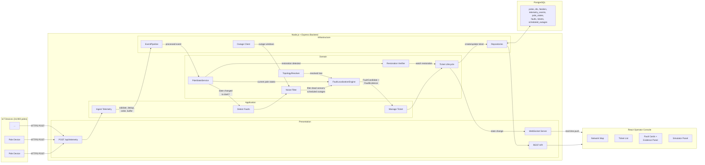
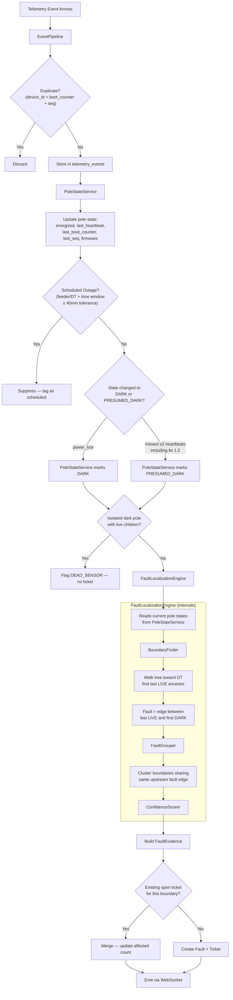
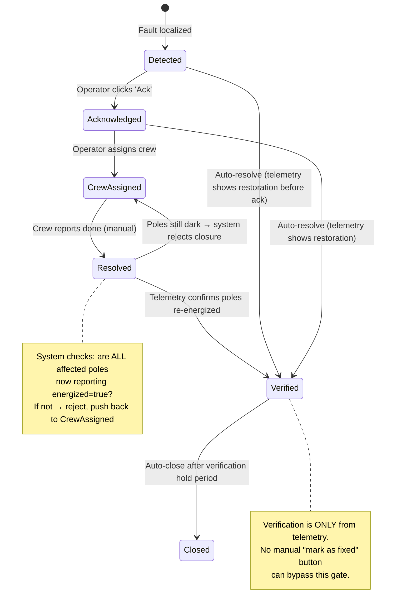
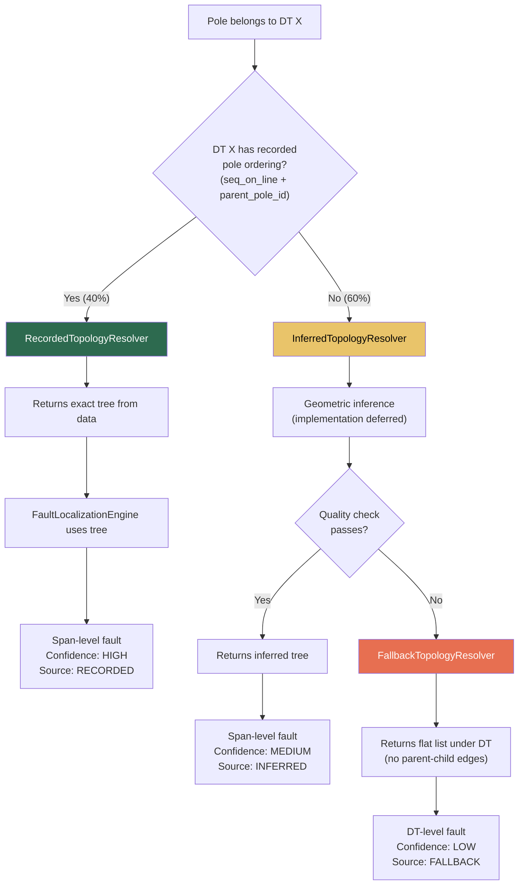
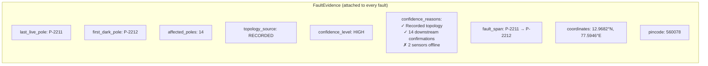
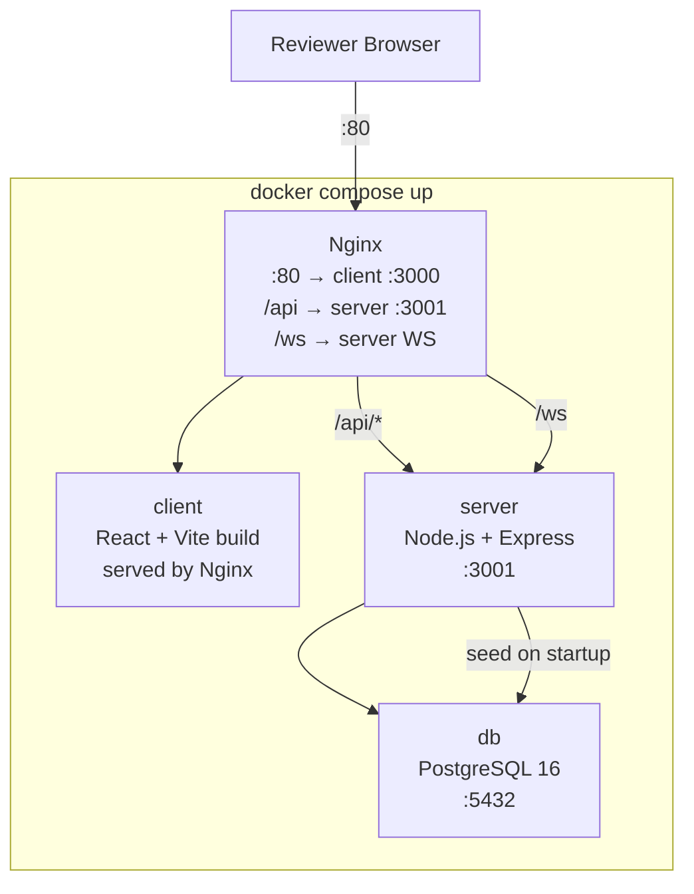

# ElectriFix — Architecture Design Document (Final)

> Architecture-only deliverable. No implementation code. Frozen on 2026-08-04 after review.

---

## Architectural Principles

1. **Domain logic is deterministic and framework-independent.** The localization engine, ticket lifecycle, and noise filters are pure functions with zero framework imports. They can be tested, explained, and reasoned about without running a server.

2. **The simulator exercises the same pipeline as production telemetry.** The simulator never creates faults or tickets directly. It only emits telemetry. All localization, ticket creation, verification, and UI updates occur through the same production pipeline used by real devices.

3. **Business decisions remain explainable through structured evidence.** Every detected fault carries a `FaultEvidence` record documenting *why* it was localized there — last live pole, first dark pole, topology source, confidence factors. This is deterministic engineering explainability, not AI.

4. **Unknown topology is handled through explicit degradation rather than hidden assumptions.** The system never silently assumes complete wiring data. Where topology is unknown, the system degrades visibly — from span-level to DT-level — and the operator always sees which kind of answer they are looking at.

5. **AI is used only where human-readable language generation adds value; deterministic graph algorithms remain deterministic.** The fault localization algorithm is a graph traversal — instant, free, and explainable. The LLM earns its keep by turning structured `FaultEvidence` into natural-language operator summaries.

---

## Revision Summary

| # | Change | Rationale |
|---|--------|-----------|
| R1 | `domain/fault-detection` → `domain/localization` with `FaultLocalizationEngine` | Aligns with assignment terminology; single entry point for the core capability |
| R2 | `TopologyResolver` abstraction (`Recorded`, `Inferred`, `Fallback`) | Keeps localization independent of how topology is obtained; makes 60% problem explicit |
| R3 | `TelemetryBuffer` → `EventPipeline` | Represents the full processing pipeline (validate, dedup, order, buffer, forward) |
| R4 | Structured explainability on every fault | Deterministic engineering explainability for operators — not AI |
| R5 | Reduce enterprise complexity | No factories, generic repos, repository managers. Clarity over extensibility |
| R6 | Confidence as `HIGH`/`MEDIUM`/`LOW` with reasons | Operator-friendly, not a meaningless percentage |
| R7 | All open questions resolved | See §8 for final decisions |
| R8 | `PoleStateService` introduced | Explicit owner of current network state — localization reads state, not raw telemetry |
| R9 | Architectural Principles section added | Five principles that guide every implementation decision |
| R10 | Known Limitations section added | Honest documentation of trade-offs, per assignment emphasis |

---

## 1. Recommended Repository Structure

```
ElectriFix/
├── docker-compose.yml              # Single-command orchestrator (G2)
├── .env.example                    # All env vars documented
├── README.md                       # Front door (deliverable)
├── ARCHITECTURE.md                 # Technical heart (deliverable)
├── DEPLOYMENT.md                   # Reproducibility doc (deliverable)
├── DECISIONS.md                    # Decision log (deliverable)
├── AI-WORKFLOW.md                  # AI usage journal (deliverable)
│
├── server/                         # Node.js + Express + TypeScript backend
│   ├── Dockerfile
│   ├── package.json
│   ├── tsconfig.json
│   ├── drizzle.config.ts
│   ├── src/
│   │   ├── index.ts                # Express app bootstrap
│   │   ├── config/
│   │   │   └── env.ts              # Validated env vars (zod schema)
│   │   │
│   │   ├── domain/                 # Pure domain logic — zero framework deps
│   │   │   ├── localization/
│   │   │   │   ├── fault-localization-engine.ts  # Single entry point
│   │   │   │   ├── boundary-finder.ts            # Internal: live/dark boundary
│   │   │   │   ├── fault-grouper.ts              # Internal: symptom → incident
│   │   │   │   ├── confidence-scorer.ts          # Internal: HIGH/MED/LOW + reasons
│   │   │   │   └── types.ts                      # FaultCandidate, FaultEvidence, etc.
│   │   │   ├── topology/
│   │   │   │   ├── topology-resolver.ts          # Interface (abstraction)
│   │   │   │   ├── recorded-topology-resolver.ts # Uses seq_on_line + parent_pole_id
│   │   │   │   ├── inferred-topology-resolver.ts # Geometric inference (impl later)
│   │   │   │   ├── fallback-topology-resolver.ts # DT-level only
│   │   │   │   ├── network-graph.ts              # Tree data structure (adjacency list)
│   │   │   │   └── types.ts                      # Pole, DT, Feeder, Span types
│   │   │   ├── pole-state/
│   │   │   │   ├── pole-state-service.ts         # Current state of every pole
│   │   │   │   └── types.ts                      # PoleState, DeviceHealth types
│   │   │   ├── noise-filter/
│   │   │   │   ├── dead-sensor-detector.ts
│   │   │   │   ├── scheduled-outage-filter.ts
│   │   │   │   └── debouncer.ts
│   │   │   └── ticket/
│   │   │       ├── ticket-lifecycle.ts            # State machine
│   │   │       ├── restoration-verifier.ts        # Telemetry-based auto-verify
│   │   │       └── types.ts
│   │   │
│   │   ├── application/            # Use-case orchestration — thin, no DB
│   │   │   ├── ingest-telemetry.ts
│   │   │   ├── localize-faults.ts
│   │   │   ├── manage-ticket.ts
│   │   │   ├── run-simulation.ts
│   │   │   └── get-dashboard-data.ts
│   │   │
│   │   ├── infrastructure/         # Framework + DB + external adapters
│   │   │   ├── db/
│   │   │   │   ├── schema.ts               # Drizzle ORM schema definitions
│   │   │   │   ├── migrations/
│   │   │   │   └── seed.ts                 # Synthetic network seed (G3)
│   │   │   ├── repositories/
│   │   │   │   ├── pole-repository.ts
│   │   │   │   ├── telemetry-repository.ts
│   │   │   │   ├── ticket-repository.ts
│   │   │   │   └── network-repository.ts   # DTs, feeders, outages combined
│   │   │   ├── event-pipeline.ts           # Validate → dedup → order → buffer → forward
│   │   │   ├── websocket-emitter.ts
│   │   │   ├── pincode-lookup.ts           # Offline reverse-geocode
│   │   │   └── scheduled-outage-client.ts  # Mock external API
│   │   │
│   │   ├── presentation/           # HTTP + WebSocket layer
│   │   │   ├── routes/
│   │   │   │   ├── telemetry.routes.ts
│   │   │   │   ├── tickets.routes.ts
│   │   │   │   ├── faults.routes.ts
│   │   │   │   ├── network.routes.ts
│   │   │   │   ├── simulator.routes.ts
│   │   │   │   └── scheduled-outages.routes.ts
│   │   │   ├── middleware/
│   │   │   │   ├── error-handler.ts
│   │   │   │   └── request-logger.ts
│   │   │   └── ws/
│   │   │       └── live-updates.ts
│   │   │
│   │   └── simulator/              # Fault simulation engine
│   │       ├── network-generator.ts
│   │       ├── fault-injector.ts
│   │       ├── telemetry-producer.ts
│   │       ├── noise-generator.ts
│   │       └── repair-executor.ts
│   │
│   └── __tests__/
│       ├── domain/
│       │   ├── fault-localization-engine.test.ts  # ← THE critical test
│       │   ├── boundary-finder.test.ts
│       │   ├── fault-grouper.test.ts
│       │   ├── pole-state-service.test.ts
│       │   ├── dead-sensor-detector.test.ts
│       │   ├── topology-resolver.test.ts
│       │   └── ticket-lifecycle.test.ts
│       └── integration/
│           └── ingest-to-ticket.test.ts
│
├── client/                         # React + TypeScript frontend
│   ├── Dockerfile
│   ├── package.json
│   ├── tsconfig.json
│   ├── vite.config.ts
│   ├── index.html
│   ├── public/
│   │   └── pincode-boundaries.json
│   └── src/
│       ├── main.tsx
│       ├── App.tsx
│       ├── styles/
│       │   └── index.css
│       ├── hooks/
│       │   ├── useWebSocket.ts
│       │   ├── useTickets.ts
│       │   └── useFaults.ts
│       ├── components/
│       │   ├── layout/
│       │   │   ├── AppShell.tsx
│       │   │   └── StatusBar.tsx
│       │   ├── map/
│       │   │   ├── NetworkMap.tsx
│       │   │   ├── FaultMarker.tsx
│       │   │   └── PoleLayer.tsx
│       │   ├── tickets/
│       │   │   ├── TicketList.tsx
│       │   │   ├── TicketDetail.tsx
│       │   │   └── TicketActions.tsx
│       │   ├── faults/
│       │   │   ├── FaultCard.tsx
│       │   │   ├── FaultEvidence.tsx        # "Why was this localized here?"
│       │   │   └── ConfidenceBadge.tsx
│       │   └── simulator/
│       │       ├── SimulatorPanel.tsx
│       │       └── FaultTypeSelector.tsx
│       ├── pages/
│       │   ├── DashboardPage.tsx
│       │   └── SimulatorPage.tsx
│       └── lib/
│           ├── api.ts
│           └── types.ts
│
├── docker/
│   ├── server.Dockerfile
│   ├── client.Dockerfile
│   └── nginx.conf
│
├── data/
│   └── seed/
│       ├── poles.csv
│       ├── transformers.csv
│       └── scheduled-outages.json
│
└── docs/
    └── diagrams/
```

> [!IMPORTANT]
> The `domain/` layer has **zero imports** from Express, Drizzle, or any framework. `FaultLocalizationEngine` is the single entry point for the core capability — `BoundaryFinder`, `FaultGrouper`, and `ConfidenceScorer` are its internal implementation details, not standalone services.

---

## 2. High-Level Module / Service Breakdown

### Services (Docker Compose)

| Service | Image | Port | Responsibility |
|---------|-------|------|----------------|
| `db` | `postgres:16-alpine` | 5432 | Persistent storage |
| `server` | Custom Node.js | 3001 | API, telemetry ingest, fault localization and incident management, simulator, WS |
| `client` | Vite build → Nginx | 3000 | Operator console SPA |

> [!NOTE]
> **Single backend service by design.** At 39 msg/s steady-state and one subdivision, a microservice split adds complexity without benefit. The internal layering provides the same separation of concerns without the operational overhead. The architecture doc should note where seams exist for a future split (e.g., ingest could become a separate service at 30 subdivisions).

### Internal Modules (Server)

| Module | Layer | Responsibility |
|--------|-------|----------------|
| `domain/localization` | Domain | **FaultLocalizationEngine** — single entry point. Internally orchestrates boundary detection, fault grouping, confidence scoring, and produces structured `FaultEvidence` for every detected fault |
| `domain/topology` | Domain | **TopologyResolver** interface with three implementations. `NetworkGraph` tree structure. All topology access goes through the resolver abstraction |
| `domain/pole-state` | Domain | **PoleStateService** — explicit owner of current network state. Maintains latest energized status, last heartbeat, the durable `(last_boot_counter, last_seq)` stream cursor, firmware version, and device health for every pole. Localization reads state from here, never from raw telemetry. |
| `domain/noise-filter` | Domain | Dead sensor detection, scheduled outage filtering, transient debouncing |
| `domain/ticket` | Domain | Ticket lifecycle state machine, telemetry-based restoration verification |
| `application/*` | Application | Thin orchestration — one file per use case, wires domain to infrastructure |
| `infrastructure/db` | Infrastructure | Drizzle schema, migrations, seed |
| `infrastructure/repositories` | Infrastructure | Data access — lean, no abstractions beyond what's needed |
| `infrastructure/event-pipeline` | Infrastructure | Telemetry processing pipeline: validate → dedup → order → buffer → forward |
| `presentation/routes` | Presentation | Express route handlers with zod validation |
| `presentation/ws` | Presentation | WebSocket server for real-time push |
| `simulator` | Standalone | Network generation, fault injection, telemetry production, noise, repair |

---

## 3. Architecture Diagrams

### 3a. Data Flow — Pole Device to Operator Screen



### 3b. Fault Localization Pipeline (Detailed)



### 3c. Ticket Lifecycle State Machine



### 3d. TopologyResolver Strategy



### 3e. Fault Evidence Structure



### 3f. Docker Compose Architecture



---

## 4. Responsibilities of Each Module

### Domain Layer (Pure Logic — No Dependencies)

#### `domain/localization` — The Core

| Component | Role | Visibility |
|-----------|------|------------|
| **`FaultLocalizationEngine`** | **Single entry point.** Accepts dark-pole data + resolved topology → returns `FaultCandidate[]` each with `FaultEvidence`. Internally orchestrates boundary finding, grouping, and confidence scoring. | Public — called by application layer |
| `BoundaryFinder` | Given a set of dark poles within one DT's tree, walks each toward root to find the edge between the last live pole and the first dark pole. | Internal to engine |
| `FaultGrouper` | Clusters multiple dark regions sharing the same fault edge into a single incident. Handles simultaneous faults by finding *all* distinct boundaries. | Internal to engine |
| `ConfidenceScorer` | Produces `HIGH` / `MEDIUM` / `LOW` with structured reasons. Factors: topology source, sensor coverage in affected area, count of confirming dark poles, temporal consistency. | Internal to engine |

> [!IMPORTANT]
> `BoundaryFinder`, `FaultGrouper`, and `ConfidenceScorer` are **implementation details** of `FaultLocalizationEngine`. They are separate files for testability and clarity, but the application layer only calls the engine.

**FaultEvidence type** — attached to every detected fault:

| Field | Description |
|-------|-------------|
| `last_live_pole` | The last pole reporting energized before the fault boundary |
| `first_dark_pole` | The first pole reporting de-energized after the fault boundary |
| `fault_span` | The edge (pair of pole IDs) where the fault is localized |
| `affected_poles` | List and count of all downstream dark poles |
| `topology_source` | `RECORDED` / `INFERRED` / `FALLBACK` |
| `confidence_level` | `HIGH` / `MEDIUM` / `LOW` |
| `confidence_reasons` | Structured list: `{ factor: string, positive: boolean, detail: string }[]` |
| `coordinates` | GPS of the fault midpoint (for navigation) |
| `pincode` | PIN code of the fault location |
| `suppressed_sensors` | List of poles flagged as dead sensors (excluded from analysis) |

#### `domain/topology` — The Resolver

| Component | Role |
|-----------|------|
| **`TopologyResolver`** | **Interface.** Given a `dt_id`, returns the resolved tree for that DT's poles. The localization engine depends only on this abstraction. |
| `RecordedTopologyResolver` | Uses `seq_on_line` + `parent_pole_id` from the registry. Returns exact tree. Tags source as `RECORDED`. |
| `InferredTopologyResolver` | Geometric inference from pole GPS + DT location. **Interface defined now, implementation deferred.** Will include quality check. Tags source as `INFERRED`. |
| `FallbackTopologyResolver` | Returns a flat structure (all poles directly under DT, no parent-child edges). Used when inference fails or is not yet implemented. Tags source as `FALLBACK`. |
| `NetworkGraph` | Tree data structure (adjacency list). Supports traversal: ancestors, descendants, siblings, subtree. Built per-DT, held in memory. |

> [!NOTE]
> The localization engine calls `TopologyResolver.resolve(dtId)` and receives a `NetworkGraph`. It never knows or cares *how* the topology was obtained. This is the key architectural seam for the 60% problem.

#### `domain/pole-state` — The State Owner

| Component | Role |
|-----------|------|
| **`PoleStateService`** | **Explicit owner of the current state of the network.** Maintains for every pole: current energized/de-energized status, last heartbeat timestamp, and the last processed `(boot_counter, seq)` cursor, plus firmware version and device health status. Updated by EventPipeline on every processed telemetry event. Queried by FaultLocalizationEngine and RestorationVerifier — they never read raw telemetry, they ask: "what is the current state of the poles?" |

> [!IMPORTANT]
> `PoleStateService` separates **event processing** (EventPipeline) from **state management** (PoleStateService) from **fault reasoning** (FaultLocalizationEngine). This is a critical architectural seam:
> - EventPipeline processes and stores raw events
> - PoleStateService maintains the mutable current-state view
> - FaultLocalizationEngine reasons over state snapshots, not event streams

**PoleState type** — maintained per pole:

| Field | Description |
|-------|-------------|
| `pole_id` | Primary key |
| `energized` | Current status: `LIVE` / `DARK` / `PRESUMED_DARK` / `UNKNOWN` |
| `last_heartbeat_at` | Timestamp of most recent heartbeat |
| `last_event_at` | Timestamp of most recent event of any type |
| `last_boot_counter` | Boot generation of the last processed telemetry event; paired with `last_seq` for stream ordering |
| `last_seq` | Sequence number of the last processed telemetry event within `last_boot_counter` |
| `firmware_version` | Device firmware (determines behavior — fw 1.2 doesn't send `power_lost`) |
| `device_health` | `NO_DEVICE` / `HEALTHY` / `OFFLINE` / `DEGRADED`. `NO_DEVICE` denotes no installed telemetry hardware; other states apply to installed devices and are based on heartbeat regularity and RSSI. |
| `has_device` | Whether a telemetry device is fitted on this pole |

#### `domain/noise-filter`

| Component | Role |
|-----------|------|
| `DeadSensorDetector` | A dark pole with all children live = sensor failure, not outage. Physically impossible as a line fault on a radial network. Flags and excludes from localization. |
| `ScheduledOutageFilter` | Cross-references dark poles against outage feed with ±40-minute tolerance. Suppresses with a TTL — if window expires and poles still dark, re-evaluates as potential fault. 10% cancelled outage rate means the feed is *not* gospel. |
| `Debouncer` | Requires sustained dark state (missed 2+ heartbeats or explicit `power_lost`) before triggering detection. Prevents transient false positives. Handles fw 1.2 devices that don't send `power_lost` — they trigger on missed heartbeats. |

#### `domain/ticket`

| Component | Role |
|-----------|------|
| `TicketLifecycle` | State machine: `detected → acknowledged → crew-assigned → resolved → verified → closed`. Enforces valid transitions. |
| `RestorationVerifier` | Watches for `power_restored`/`boot` from affected poles via `PoleStateService`. Moves to VERIFIED when threshold of affected poles report `LIVE`. **Rejects premature closure** — if crew marks resolved but `PoleStateService` says poles still dark, pushes back to `crew-assigned`. |

### Application Layer (Thin Orchestration)

| Module | Responsibilities |
|--------|-----------------|
| **`ingest-telemetry`** | Accept raw event → hand to EventPipeline → on processed event, call `PoleStateService.update()` → if state changed to dark, trigger fault detection |
| **`localize-faults`** | Load affected DT → call `TopologyResolver.resolve(dtId)` → get current pole states from `PoleStateService` → run noise filter → call `FaultLocalizationEngine.localize(poleStates, tree)` → create/merge fault + ticket → emit WS event |
| **`manage-ticket`** | Handle operator actions → delegate to `TicketLifecycle` → emit WS updates |
| **`run-simulation`** | Accept simulation commands → delegate to simulator → produce telemetry via the **same ingest pathway** (ensures full pipeline is exercised) |
| **`get-dashboard-data`** | Assemble read-model: active faults with evidence, open tickets, network status via `PoleStateService` |

### Infrastructure Layer

| Module | Responsibilities |
|--------|-----------------|
| **`db/schema`** | Drizzle schema: `poles`, `distribution_transformers`, `feeders`, `telemetry_events`, `pole_states`, `faults` (with `evidence` JSONB column), `tickets`, `scheduled_outages` |
| **`db/seed`** | Generates and inserts synthetic data on startup (G3). ~4,000 poles, ~60 DTs, ~5 feeders. 40% recorded topology, 60% missing. ~9% poles without devices. Idempotent. |
| **`repositories/*`** | Lean data access. 4 files total — not one per entity. `network-repository.ts` combines DTs, feeders, and outages. No factories, no generic base classes. |
| **`event-pipeline`** | The telemetry processing pipeline: (1) validate schema (zod), (2) deduplicate `(device_id, boot_counter, seq)` with `ON CONFLICT DO NOTHING`, (3) reject stale retries when `(boot_counter, seq)` is lower than the persisted cursor for that device stream, (4) buffer bursts (in-memory ring buffer, drain in batches), (5) forward accepted events to state management. For a device, `(boot_counter, seq)` is strictly monotonic in lexicographic order; `seq` is never compared across boot counters. |
| **`websocket-emitter`** | Manages WS connections, broadcasts fault/ticket/evidence updates. |
| **`pincode-lookup`** | Offline reverse-geocoding from lat/lon. Committed lookup table — no external API keys. Fallback: nearest pole's known pincode. |
| **`scheduled-outage-client`** | Mock implementation returning data from `data/seed/scheduled-outages.json`. |

### Presentation Layer

| Module | Responsibilities |
|--------|-----------------|
| **`routes/telemetry`** | `POST /api/telemetry` — single event or batch. Returns 202 Accepted. |
| **`routes/tickets`** | `GET /api/tickets`, `GET /api/tickets/:id`, `PATCH /api/tickets/:id/acknowledge`, `PATCH /api/tickets/:id/assign`, `PATCH /api/tickets/:id/resolve` |
| **`routes/faults`** | `GET /api/faults` — active faults with location, evidence, confidence |
| **`routes/network`** | `GET /api/network/poles`, `GET /api/network/dts`, `GET /api/network/topology/:dtId` |
| **`routes/simulator`** | `POST /api/simulator/inject-fault`, `POST /api/simulator/repair-fault`, `POST /api/simulator/inject-noise`, `GET /api/simulator/status` |
| **`routes/scheduled-outages`** | `GET /api/scheduled-outages` |
| **`ws/live-updates`** | WebSocket events: `fault:new`, `fault:updated`, `ticket:updated`, `pole:state-change` |

### Simulator Module

> [!IMPORTANT]
> **Architectural Principle:** The simulator never creates faults or tickets directly. It only emits telemetry. All localization, ticket creation, verification, and UI updates occur through the same production pipeline used by real devices. This is a deliberate design choice — the simulator exercises the exact same code path as a real deployment, which means every bug the simulator finds is a bug that would occur in production.

| Module | Responsibilities |
|--------|-----------------|
| `network-generator` | Synthetic pole/DT/feeder data. Realistic radial trees with branches, ~9% missing devices, ~60% missing topology. |
| `fault-injector` | Inject span, DT, feeder faults. Computes downstream dark poles via tree traversal. **Produces telemetry only** — never writes to faults or tickets tables. |
| `telemetry-producer` | Realistic telemetry: `power_lost` with 70% delivery, fw 1.2 silent death, ±90s clock skew, out-of-order arrival. |
| `noise-generator` | Dead sensors, scheduled outages, duplicate messages, stale retries. |
| `repair-executor` | Restoration: `boot` + `power_restored` from affected poles within 20s. **Produces telemetry only** — ticket verification emerges from the production pipeline. |

---

## 5. Clear Service Boundaries

```
┌─────────────────────────────────────────────────────────────────┐
│                    PRESENTATION BOUNDARY                         │
│  HTTP routes + WebSocket — the ONLY entry/exit point             │
│  • Validates input shapes (zod)                                  │
│  • Maps HTTP verbs to use cases                                  │
│  • Serializes responses                                          │
│  • Knows nothing about domain logic                              │
├─────────────────────────────────────────────────────────────────┤
│                    APPLICATION BOUNDARY                           │
│  Use-case orchestrators — the GLUE                               │
│  • Coordinates domain + infrastructure                           │
│  • Defines transaction boundaries                                │
│  • One file per use case, reads like a recipe                    │
│  • No SQL, no HTTP, no direct DB access                          │
├─────────────────────────────────────────────────────────────────┤
│                    DOMAIN BOUNDARY                                │
│  Pure business logic — the BRAIN                                 │
│  • PoleStateService: explicit owner of current network state     │
│  • FaultLocalizationEngine: single entry point for core algo     │
│  • TopologyResolver: abstraction, not implementation             │
│  • TicketLifecycle: state machine                                │
│  • Zero imports from Express, Drizzle, or any framework          │
│  • Fully unit-testable with plain objects                         │
├─────────────────────────────────────────────────────────────────┤
│                    INFRASTRUCTURE BOUNDARY                        │
│  External integrations — the PLUMBING                            │
│  • EventPipeline (validate → dedup → order → buffer → forward)   │
│  • Lean repositories (4 files, no factories)                     │
│  • WebSocket connection management                               │
│  • Seed data loading                                             │
└─────────────────────────────────────────────────────────────────┘
```

### Dependency Rule

Dependencies flow **inward only**: Presentation → Application → Domain ← Infrastructure

The Domain layer **never** imports from any other layer. Application orchestrates by depending on domain types and infrastructure adapters.

---

## 6. Recommended Package / Module Names

### Server (`@electrifix/server`)

| Import Path | Purpose |
|-------------|---------|
| `@/domain/localization` | FaultLocalizationEngine (entry point), BoundaryFinder, FaultGrouper, ConfidenceScorer, FaultEvidence |
| `@/domain/topology` | TopologyResolver interface, Recorded/Inferred/Fallback implementations, NetworkGraph |
| `@/domain/pole-state` | PoleStateService, PoleState types |
| `@/domain/noise-filter` | DeadSensorDetector, ScheduledOutageFilter, Debouncer |
| `@/domain/ticket` | TicketLifecycle, RestorationVerifier |
| `@/application/*` | One file per use case |
| `@/infrastructure/db` | Drizzle schema, migrations, seed |
| `@/infrastructure/repositories` | Lean data access (4 files) |
| `@/infrastructure/event-pipeline` | Telemetry processing pipeline |
| `@/presentation/routes` | Express route handlers |
| `@/presentation/ws` | WebSocket server |
| `@/simulator` | Network gen, fault injection, telemetry, noise, repair |

### Client (`@electrifix/client`)

| Import Path | Purpose |
|-------------|---------|
| `@/components/map` | NetworkMap, FaultMarker, PoleLayer |
| `@/components/tickets` | TicketList, TicketDetail, TicketActions |
| `@/components/faults` | FaultCard, FaultEvidence, ConfidenceBadge |
| `@/components/simulator` | SimulatorPanel, FaultTypeSelector |
| `@/components/layout` | AppShell, StatusBar |
| `@/hooks` | useWebSocket, useTickets, useFaults |
| `@/pages` | DashboardPage, SimulatorPage |
| `@/lib` | API client, shared types |

---

## 7. Internal Layering — Detailed

### Layer Rules & Constraints

| Layer | Allowed Dependencies | Forbidden | Test Strategy |
|-------|---------------------|-----------|---------------|
| **Domain** | Only built-in JS/TS; own types | Express, Drizzle, fetch, fs, any IO | Unit tests with plain objects. 80% of tests live here. |
| **Application** | Domain types + infrastructure interfaces | Direct DB, HTTP framework objects | Integration tests with mocked repos |
| **Infrastructure** | Domain types (for mapping), Drizzle, pg, ws | Application layer (no upward) | Integration tests against test DB |
| **Presentation** | Application use cases, zod | Domain logic directly, DB directly | Supertest HTTP tests (light) |

### Why This Layering

1. **Domain isolation = testable localization.** The rubric's #1 weight (25%) is fault localization correctness. `FaultLocalizationEngine` is a pure function: input topology + pole states → output `FaultCandidate[]` with `FaultEvidence`. Tested with known topologies and expected outputs — *exactly* what the rubric asks for.

2. **State separation = clean reasoning.** `PoleStateService` owns the mutable current-state view. `FaultLocalizationEngine` reasons over state snapshots, not event streams. This makes the localization algorithm deterministic and reproducible — given the same pole states and topology, it always produces the same result.

3. **Application thinness = explainable in interview.** Each use case reads like a recipe. "Ingest event → update pole state → resolve topology → filter noise → localize → create ticket → emit event." Easy to walk through line by line.

4. **Infrastructure isolation = swappable.** If Drizzle causes issues, only repository files change. If WebSocket deployment fails, switch one infrastructure file to SSE.

---

## 8. Architectural Decisions — Final

### All Open Questions Resolved

| # | Decision | Resolution | Rationale |
|---|----------|------------|-----------|
| **D1** | Missing topology strategy | **Hybrid.** Known → exact span. Unknown → try inference → quality check → if poor, DT-level. | Central design question. Assignment expects explicit handling of the 60% case. TopologyResolver abstraction makes this a pluggable concern. |
| **D2** | Real-time push | **WebSocket.** SSE as documented fallback if deployment fails. | Operator needs to see updates. WS gives bidirectional comms. Deployment risk documented in DEPLOYMENT.md. |
| **D3** | Telemetry stream identity | **`device_id` + `boot_counter` + `seq` unique constraint.** `ON CONFLICT DO NOTHING`; ordering uses lexicographic `(boot_counter, seq)`. | Firmware resets `seq` on reboot. The persistent boot counter makes duplicates, stale retries, reboot recovery, and restart recovery unambiguous. |
| **D4** | Burst absorption | **In-memory ring buffer in EventPipeline.** Batch drain every 50ms. No Redis/BullMQ. | Sufficient for 5,000 msg in 10s. Document that 30 subdivisions would need a queue. |
| **D5** | AI feature | **Natural-language incident summary.** LLM generates operator-friendly description from structured FaultEvidence. Fallback: templated string. ~$0.001/call. | LLM earns its keep on text generation from structured data. Not localization (deterministic, free, explainable). Graceful degradation if unavailable. |
| **D6** | Firmware 1.2 | **Detect via missed heartbeats.** If fw 1.2 device silent for >30 min (2+ missed heartbeats), mark PRESUMED_DARK. | 8% of fleet. Without this, 8% of faults are invisible. |
| **D7** | Confidence format | **`HIGH` / `MEDIUM` / `LOW` with structured reasons.** Not percentages. | Operator-friendly. Reasons list shows ✓/✗ factors: topology source, downstream confirmations, missing sensors. |
| **D8** | Seed data scale | **~4,000 poles, ~60 DTs, ~5 feeders.** | Assignment says "a few thousand." Exercises 60/40 split, missing devices, realistic spatial distribution. |
| **D9** | Scheduled outage handling | **±40-minute tolerance.** Suppress during window. Re-evaluate if window expired and poles still dark. | Outages start late, overrun, and 10% are cancelled without update. |
| **D10** | PIN code lookup | **Offline committed table.** Nearest-pole fallback. | "geocoding unavailable" = broken submission per assignment. |

### Additional Decisions

| # | Decision | Resolution | Rationale |
|---|----------|------------|-----------|
| **D11** | Map library | Leaflet + OpenStreetMap tiles | Free, no API key, well-supported |
| **D12** | Client state | React Query + WebSocket | No Redux — insufficient client-side state to justify it |
| **D13** | Validation | Zod (both client and server) | Type-safe, lightweight |
| **D14** | Logging | Pino (structured JSON) | Essential for DEPLOYMENT.md troubleshooting section |
| **D15** | Test runner | Vitest | Same toolchain as Vite client |

---

## 9. Self-Review — Inconsistencies and Alignment Check

After incorporating all revisions, I've checked the final architecture against the assignment requirements:

### ✅ Consistency Checks Passed

| Check | Status | Notes |
|-------|--------|-------|
| FaultLocalizationEngine is the sole public API for localization | ✅ | Application layer calls only the engine, never BoundaryFinder/FaultGrouper/ConfidenceScorer directly |
| TopologyResolver is an abstraction, not an implementation | ✅ | Engine depends on the interface. Three implementations exist as separate files but InferredTopologyResolver implementation is deferred |
| PoleStateService is the sole owner of current pole state | ✅ | EventPipeline updates it, FaultLocalizationEngine and RestorationVerifier read from it. No component reads raw telemetry for current state. |
| EventPipeline replaces TelemetryBuffer everywhere | ✅ | All references updated — data flow diagram, module table, infrastructure section |
| FaultEvidence is produced by the engine, not assembled elsewhere | ✅ | Engine output includes FaultEvidence. Application layer passes it to ticket creation and WS emission |
| Confidence is HIGH/MEDIUM/LOW with reasons, not percentages | ✅ | ConfidenceScorer returns `{ level: 'HIGH'|'MEDIUM'|'LOW', reasons: ConfidenceReason[] }` |
| No excessive enterprise abstractions | ✅ | 4 repository files (not one per entity). No factories, no generic base repo, no mapper layer |
| Simulator never writes faults or tickets directly | ✅ | Both fault-injector and repair-executor produce telemetry only. All downstream behavior emerges from the production pipeline. |
| Architectural Principles are reflected in design | ✅ | All 5 principles are implemented in the architecture, not just stated |

### ⚠️ Potential Risks to Watch During Implementation

| Risk | Impact | Mitigation |
|------|--------|------------|
| **InferredTopologyResolver is deferred** — if we run out of time, 60% of the network falls back to DT-level only | The rubric weights this as a central design question. A DT-level-only answer for 60% is acceptable *if documented*, but span-level for even some of the 60% scores much higher. | Implement `FallbackTopologyResolver` first (day 1). Attempt `InferredTopologyResolver` on day 2-3. The abstraction ensures the engine works either way. |
| **PoleStateService persistence** — must decide whether state is in-memory, in `pole_states` table, or both | In-memory is faster but lost on restart. DB is durable but adds latency. | Use `pole_states` table as persistent store. On startup, load into PoleStateService. Writes go to both memory and DB. |
| **FaultEvidence adds a field to every fault** — the `faults` table needs a JSONB `evidence` column, and the REST API must serialize it | Low risk, but if the evidence structure changes during implementation, both schema and API must be updated | Define the `FaultEvidence` type in `domain/localization/types.ts` as the single source of truth. Store as JSONB. |
| **EventPipeline is doing a lot** — validate, dedup, order, buffer, forward. If it becomes complex, it may need to be split | At this scale (39 msg/s), it should be manageable as one module. If it exceeds ~300 lines, split into pipeline stages. | Start as one file. Split only if complexity demands it. |
| **WebSocket deployment through Nginx + free tier** — the assignment explicitly warns about this | Broken WS on public URL = broken real-time demo | Test on deployed URL early (day 2). Document SSE fallback in DEPLOYMENT.md. |
| **AI feature (LLM summary) requires API key** — reviewer won't have one | If LLM is unavailable, operator sees raw FaultEvidence (which is already useful) instead of nothing | Implement templated fallback first. LLM summary is an enhancement, not a gate. Store API key in `.env`, never in repo. |

### ✅ Assignment Alignment Verification

| Assignment Requirement | Architecture Component |
|----------------------|----------------------|
| "the fault is on the span between pole P-2211 and P-2212" | `FaultEvidence.fault_span` + `FaultEvidence.coordinates` |
| "how confident you are, and why" | `FaultEvidence.confidence_level` + `FaultEvidence.confidence_reasons` |
| "how many poles are affected downstream" | `FaultEvidence.affected_poles` |
| "PIN code" | `FaultEvidence.pincode` (via offline lookup) |
| "Grouping is part of the problem" | `FaultGrouper` inside `FaultLocalizationEngine` |
| "Restoration must be verified from telemetry" | `RestorationVerifier` reads from `PoleStateService`, not manual input |
| "the system should not believe him" (premature closure) | `TicketLifecycle` checks `PoleStateService` — rejects if poles still dark |
| "Some poles go dark for reasons that are not faults" | `DeadSensorDetector` + `ScheduledOutageFilter` in `domain/noise-filter` |
| "There is scheduled load shedding" | `ScheduledOutageFilter` with ±40min tolerance |
| "8% of the fleet is on firmware 1.2.x" | `PoleStateService` tracks firmware; `Debouncer` detects via missed heartbeats |
| "what you do about the 60% of transformers" | `TopologyResolver` with three implementations |
| "A fault simulator" | `simulator/` module — telemetry only, same pipeline as production |
| "Everything must run from a clean clone with one command" | `docker-compose.yml` + `db/seed.ts` on startup |
| "An operator console" for a non-engineer at 2 AM | React client with map, ticket list, FaultEvidence panel, confidence badges |

---

## 10. Known Limitations

> [!WARNING]
> These are known, documented trade-offs — not bugs. Each reflects a deliberate scoping decision for this submission.

| Limitation | Impact | What We'd Do With More Time |
|------------|--------|----------------------------|
| **Topology inference is heuristic.** Geometric nearest-neighbor reconstruction may not perfectly reconstruct older networks with irregular pole placements, street crossings, or lines that double back. | Some faults in the 60% of DTs with missing topology may be localized to the wrong span. The confidence level will reflect this (`MEDIUM` or `LOW`). | Validate inference against known topologies. Use observed outage correlation to learn and correct inferred edges over time. |
| **Areas with insufficient topology information may degrade to DT-level localization.** Where inference quality is too poor, the system reports the fault at the DT level rather than the span level. | The operator gets "fault somewhere under DT D-0112" rather than "fault between P-2211 and P-2212." Still better than the current 2-hour process, but less precise. | Specify a pole-order survey for the department. Estimated cost and timeline documented in DECISIONS.md. |
| **EventPipeline uses an in-memory ring buffer suitable for a single subdivision.** No durable message broker. | A server crash during a burst could lose in-flight messages. At one subdivision (39 msg/s steady, 5,000 burst), this risk is acceptable. | For 30 subdivisions: introduce Redis or BullMQ as a durable buffer between ingest and processing. The EventPipeline abstraction makes this a contained change. |
| **WebSocket is the preferred real-time transport.** If hosting limitations prevent reliable WebSocket upgrades (common on free tiers behind reverse proxies), the architecture supports Server-Sent Events as a documented fallback. | Operators on the fallback path get one-way push (sufficient for this use case) but lose bidirectional capability. | Test WS on deployed URL early. Document exact Nginx `proxy_set_header Upgrade` configuration in DEPLOYMENT.md troubleshooting section. |
| **PoleStateService is rebuilt from DB on restart.** If the server crashes, the in-memory state is lost and must be reconstructed from `pole_states` table + recent `telemetry_events`. | Brief window after restart where state may be stale. Heartbeat cycle (15 min) will self-correct. | Add startup recovery procedure that replays recent telemetry to rebuild state. Document expected recovery time. |
