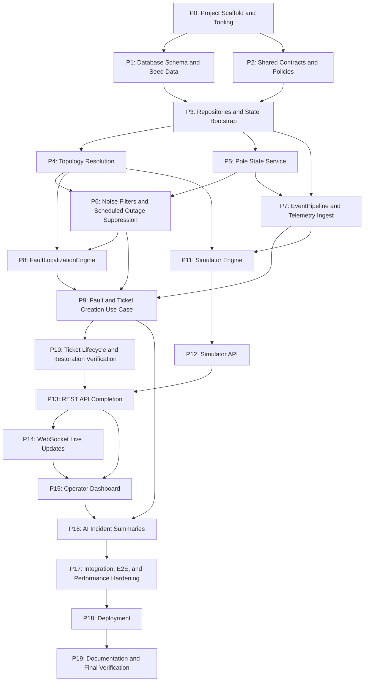

# 1. Purpose

This document is the engineering execution plan for implementing ElectriFix after the system design phase. It is not a project schedule, sprint backlog, staffing plan, or task tracker. It defines the implementation order, dependency structure, checkpoints, completion criteria, testing milestones, documentation milestones, and commit strategy that should guide the project from the first line of application code through final submission.

The frozen specifications are authoritative:

- `ARCHITECTURE.md`
- `DATABASE-DESIGN.md`
- `LOCALIZATION-SPECIFICATION.md`
- `API-SPECIFICATION.md`

This plan explains when and how to implement those specifications. It does not redesign them. If this plan appears to conflict with a frozen specification, the frozen specification wins and the inconsistency must be recorded in `DECISIONS.md` before implementation continues.

The assignment documents remain the product source of truth:

- `assignmentDocs/00-candidate-brief.md`
- `assignmentDocs/01-problem-context.md`
- `assignmentDocs/02-data-and-systems.md`
- `assignmentDocs/03-deliverables-and-submission.md`
- `assignmentDocs/04-evaluation.md`
- `assignmentDocs/05-faq.md`

Source document note: the implementation request names `assignmentDocs/00-take-home-assignment.md`, but the repository contains `assignmentDocs/00-candidate-brief.md`, whose title is "Take-Home Assignment - AI Product Engineer Intern". Treat `00-candidate-brief.md` as the available assignment brief unless a corrected source file is added. Do not rename source files or alter behavior for this mismatch without recording the decision.

Implementation documentation must evolve alongside the code. `README.md`, `DEPLOYMENT.md`, `DECISIONS.md`, and `AI-WORKFLOW.md` are live implementation documents. The frozen specifications should not be edited unless implementation reveals a genuine design issue that cannot be resolved within the existing contracts.

# 2. Implementation Principles

1. Specifications are authoritative. Implement behavior exactly as defined in the frozen documents.
2. Build one bounded capability at a time. Each phase must produce a reviewable, runnable increment.
3. Infrastructure precedes business logic. The project must boot, connect to storage, run tests, and seed data before domain workflows depend on it.
4. Deterministic behavior precedes AI enhancements. Localization, confidence, ticketing, verification, and noise handling must work without an LLM.
5. Domain logic remains framework-independent. The domain layer must not import Express, Drizzle, React, filesystem APIs, network clients, or transport code.
6. State ownership must remain explicit. `PoleStateService` is the sole owner of mutable pole state. `EventPipeline` owns telemetry processing. `FaultLocalizationEngine` stays stateless.
7. The simulator must exercise the production pipeline. It must emit telemetry and must never create faults or tickets directly.
8. Tests follow business logic closely. Unit tests are introduced as soon as pure domain modules exist; integration and end-to-end tests are added when real boundaries are connected.
9. Documentation follows implementation. Each phase updates the non-frozen docs needed to keep a future engineer oriented.
10. Dependency order is mandatory. Do not implement future phases early to make a demo pass.
11. Performance claims require measurements. Do not claim assignment targets without benchmark or load-test evidence.
12. Reviewability matters. Commits must remain small enough to understand, test, and revert independently.

# 3. Global Dependency Graph

# 4. Phase Overview

| Phase | Phase Name | Purpose | Dependencies | Primary Specifications | Definition of Done | Estimated Commit Range |
|---:|---|---|---|---|---|---|
| 0 | Project Scaffold and Tooling | Create the runnable TypeScript, React, Docker, lint, test, and config foundation. | None | `ARCHITECTURE.md` sections 1, 2, 3f | `docker compose up` starts the skeleton stack, health check works, lint/test commands exist. | 2-3 commits |
| 1 | Database Schema and Seed Data | Implement PostgreSQL schema, migrations, and idempotent synthetic seed data. | 0 | `DATABASE-DESIGN.md`, assignment data scale | Database boots with feeders, DTs, poles, pole states, scheduled outages, and the telemetry stream identity constraint seeded. | 2-4 commits |
| 2 | Shared Contracts and Policies | Define domain enums, DTOs, product policies, validation primitives, and test harness. | 0 | All frozen specs | Shared types compile and encode documented enums, policies, and evidence shapes. | 1-2 commits |
| 3 | Repositories and State Bootstrap | Add lean repository adapters and startup loading for registry and current state. | 1, 2 | `ARCHITECTURE.md`, `DATABASE-DESIGN.md` ownership model | Repositories read/write only owned tables; app can load seed network and pole state at startup. | 2-3 commits |
| 4 | Topology Resolution | Implement recorded and fallback topology, define inferred topology path with quality-gated implementation. | 2, 3 | `ARCHITECTURE.md` topology, `LOCALIZATION-SPECIFICATION.md` section 11 | `GET /api/network/topology/:dtId` can return recorded and fallback graphs through resolver tests or adapter tests. | 2-4 commits |
| 5 | Pole State Service | Implement current-state ownership, device health updates, heartbeat state transitions, and persistence sync. | 2, 3 | `ARCHITECTURE.md` pole state, `DATABASE-DESIGN.md` `pole_states` | Pole states update deterministically from processed events and can rebuild from DB on restart. | 2-3 commits |
| 6 | Noise Filters and Scheduled Outage Suppression | Implement debouncing, dead sensor detection, scheduled outage filter, and suppression re-evaluation rules. | 4, 5 | `LOCALIZATION-SPECIFICATION.md` product policies and section 10 | Noise scenarios suppress or pass events according to spec and are unit-tested. | 2-3 commits |
| 7 | EventPipeline and Telemetry Ingest | Accept telemetry, validate, deduplicate, store, update pole state, and expose ingest endpoints. | 1, 3, 5 | `API-SPECIFICATION.md` telemetry, `DATABASE-DESIGN.md` telemetry | Single and batch telemetry requests return documented responses and update state idempotently. | 3-4 commits |
| 8 | FaultLocalizationEngine | Implement pure deterministic boundary detection, grouping, confidence, and evidence assembly. | 2, 4, 6 | `LOCALIZATION-SPECIFICATION.md` sections 1-8, 11, 13 | Core acceptance scenarios pass as unit tests without DB or HTTP. | 3-5 commits |
| 9 | Fault and Ticket Creation Use Case | Connect state transitions to localization and persist faults plus one ticket per fault. | 6, 7, 8 | `ARCHITECTURE.md` application layer, `API-SPECIFICATION.md` invariants | Telemetry-driven localization creates or merges faults and creates exactly one ticket per fault. | 2-4 commits |
| 10 | Ticket Lifecycle and Restoration Verification | Implement ticket state machine, operator actions, premature closure rejection, auto-verification, and auto-close. | 5, 9 | `LOCALIZATION-SPECIFICATION.md` section 9, `API-SPECIFICATION.md` ticket lifecycle | Ticket workflow follows all valid and invalid transitions, including telemetry-based verification. | 3-4 commits |
| 11 | Simulator Engine | Generate realistic networks, faults, noise, telemetry, and repairs without bypassing ingest. | 4, 7, 10 | `ARCHITECTURE.md` simulator, assignment simulator requirements | Simulator can produce span, DT, feeder, repair, duplicate, stale, out-of-order, and dead-sensor telemetry. | 3-5 commits |
| 12 | Simulator API | Expose simulator commands and scenarios through documented endpoints. | 11 | `API-SPECIFICATION.md` simulator endpoints | Simulator endpoints return documented responses and drive the production telemetry path. | 2-3 commits |
| 13 | REST API Completion | Implement remaining read/command endpoints, error contract, health, config, filters, and pagination. | 9, 10, 12 | `API-SPECIFICATION.md` complete endpoint catalogue | REST surface conforms to request, response, error, and status-code contracts. | 3-5 commits |
| 14 | WebSocket Live Updates | Implement `/ws`, event payloads, batching, reconnect behavior, and polling fallback hooks. | 9, 10, 13 | `API-SPECIFICATION.md` WebSocket contract | Fault, ticket, pole, and simulation events are pushed and REST remains source of truth. | 2-3 commits |
| 15 | Operator Dashboard | Build the non-engineer operator console with map, tickets, fault evidence, status, and simulator controls. | 12, 13, 14 | `ARCHITECTURE.md` client structure, assignment operator console | A reviewer can see, inject, localize, manage, repair, and verify faults from the UI. | 4-6 commits |
| 16 | AI Incident Summaries | Add optional non-blocking LLM summaries with deterministic fallback and UI rendering of null summaries. | 9, 15 | `ARCHITECTURE.md` decision D5, `API-SPECIFICATION.md` AI principles | Faults remain correct without AI; summaries enhance evidence only when available. | 1-3 commits |
| 17 | Integration, E2E, and Performance Hardening | Validate full flows, performance targets, Docker reproducibility, and edge cases. | 15, 16 | Assignment gates, all frozen specs | Core acceptance scenarios, E2E tests, and measured performance targets are documented. | 3-6 commits |
| 18 | Deployment | Deploy public URL, verify production Docker/proxy/WebSocket behavior, and document operational setup. | 17 | `03-deliverables-and-submission.md`, `DEPLOYMENT.md` requirements | Public URL works without login or reviewer API keys; cold start and troubleshooting are documented. | 2-4 commits |
| 19 | Documentation and Final Verification | Finalize README, DEPLOYMENT, DECISIONS, AI-WORKFLOW, demo video support, and submission self-check. | 18 | Assignment deliverables and evaluation docs | A fresh clone, public URL, simulator, docs, and final checklist pass without hidden steps. | 2-4 commits |

The definition of done for each phase is the formal checkpoint for that phase. A later phase must not begin until the current phase's acceptance criteria, required tests, documentation updates, and suggested commit boundaries have been satisfied or an explicit exception has been recorded in `DECISIONS.md`.

# 5. Detailed Phase Specifications

## Phase 0: Project Scaffold and Tooling

**Purpose**

Establish the runnable project skeleton specified by the architecture before business logic exists.

**Scope**

- Server package with TypeScript, Express bootstrap, config validation, lint, format, and tests.
- Client package with React, Vite, TypeScript, base routing shell, lint, format, and tests.
- Docker Compose services for `db`, `server`, `client`, and Nginx routing.
- `.env.example` with safe defaults and no secrets.
- Basic health endpoint and startup logging.

**Out of Scope**

- Database schema beyond connection validation.
- Domain logic, telemetry ingest, simulator behavior, and UI features.

**Inputs**

- `ARCHITECTURE.md` repository structure and Docker service model.
- Empty `server/`, `client/`, `docker/`, and `data/` directories.

**Dependencies**

- None.

**Modules Implemented**

- `server/src/index.ts`
- `server/src/config/env.ts`
- `server/src/presentation/middleware/error-handler.ts`
- `client/src/main.tsx`
- `client/src/App.tsx`
- Docker and Nginx bootstrap files.

**Files Expected**

- `server/package.json`
- `server/tsconfig.json`
- `server/Dockerfile` or `docker/server.Dockerfile`
- `client/package.json`
- `client/tsconfig.json`
- `client/vite.config.ts`
- `client/Dockerfile` or `docker/client.Dockerfile`
- `docker/nginx.conf`
- `docker-compose.yml`
- `.env.example`

**Specifications Referenced**

- `ARCHITECTURE.md` sections 1, 2, 3f, 5.
- `API-SPECIFICATION.md` health endpoint contract.
- `03-deliverables-and-submission.md` gates G2 and G3.

**Acceptance Criteria**

- `docker compose up` starts database, server, client, and Nginx.
- `GET /api/health` returns structured health JSON.
- The client loads a minimal operator shell through Nginx.
- `npm test`, `npm run lint`, and build commands exist for server and client.
- No secrets or machine-local paths are required.

**Definition of Done**

- A clean clone can start the skeleton stack with one command.
- All configured lint and test commands pass.
- The implementation docs explain the basic local start path.

**Testing Required**

- Server health route smoke test.
- Client render smoke test.
- Docker Compose startup smoke check.

**Documentation Updates Required**

- Add initial run command to `README.md`.
- Add prerequisites, env vars, and basic troubleshooting to `DEPLOYMENT.md`.
- Record any toolchain choices not already captured in `DECISIONS.md`.
- Record AI assistance for scaffolding in `AI-WORKFLOW.md`.

**Suggested Commit Boundaries**

- Commit 1: server/client package scaffolds and tooling.
- Commit 2: Docker Compose, Nginx, env example, and health smoke.
- Commit 3 if needed: docs for local startup and tooling decisions.

**Implementation Risks**

- Overbuilding before the stack runs.
- Nginx proxy paths diverging from `/api` and `/ws` contracts.
- Missing script consistency between local and Docker execution.

**Notes for Future Phases**

- Keep bootstrap thin. Do not add placeholder domain behavior that later phases must unwind.

## Phase 1: Database Schema and Seed Data

**Purpose**

Implement the frozen logical database model and idempotent startup seed so the rest of the system has realistic data.

**Scope**

- Drizzle schema and migrations for all tables in `DATABASE-DESIGN.md`.
- Constraints, indexes, ownership-aligned fields, and JSONB evidence column.
- Seed generator for realistic subdivision data: feeders, DTs, poles, missing devices, missing topology, scheduled outages, and initial pole states.
- Idempotent startup seed behavior.

**Out of Scope**

- Repository business methods beyond migration and seed helpers.
- Fault localization or telemetry processing.
- Full 38,400-pole production-scale seed; the assignment allows a realistic few thousand poles.

**Inputs**

- `DATABASE-DESIGN.md`.
- Assignment scale and dirty-data rules from `02-data-and-systems.md`.

**Dependencies**

- Phase 0.

**Modules Implemented**

- `server/src/infrastructure/db/schema.ts`
- `server/src/infrastructure/db/migrations/`
- `server/src/infrastructure/db/seed.ts`
- `data/seed/scheduled-outages.json`
- Optional generated `data/seed/poles.csv` and `data/seed/transformers.csv` if seed artifacts are committed.

**Files Expected**

- Drizzle config.
- Migration files for all database tables.
- Seed script and seed data.
- Startup hook that runs migrations and seed safely.

**Specifications Referenced**

- `DATABASE-DESIGN.md` all sections.
- `02-data-and-systems.md` sections 1, 3, 4, 5.
- `ARCHITECTURE.md` decision D8.

**Acceptance Criteria**

- Database has all Tier 1, Tier 2, and Tier 3 tables with documented columns.
- Unique constraints, check constraints, foreign keys, and indexes match the design.
- Seed creates approximately the specified demo scale with about 40 percent recorded topology, 60 percent missing topology, about 9 percent poles without devices, and realistic DT/feeder distribution.
- Every pole has one initialized `pole_states` row.
- Re-running the seed does not duplicate registry or outage data.

**Definition of Done**

- Migrations run automatically in Docker.
- Seeded data can be queried from a fresh database.
- Schema drift from `DATABASE-DESIGN.md` is either absent or documented as a genuine design issue.

**Testing Required**

- Migration smoke test against test database.
- Seed idempotency test.
- Constraint tests for key enums, `last_boot_counter`, and the `(device_id, boot_counter, seq)` duplicate telemetry key.
- Seed-shape assertions for recorded topology ratio, missing devices, and row counts.

**Documentation Updates Required**

- Add database startup and reset notes to `DEPLOYMENT.md`.
- Add seed data description to `README.md`.
- Record seed scale assumptions in `DECISIONS.md` if implementation differs from architecture decision D8.

**Suggested Commit Boundaries**

- Commit 1: schema and migrations.
- Commit 2: seed generator/data and startup hook.
- Commit 3: database tests and docs.

**Implementation Risks**

- Accidentally making registry data mutable at runtime.
- Missing `tickets.fault_id` uniqueness.
- Storing duplicate telemetry instead of dropping it.
- Creating schema fields not present in the frozen design.

**Notes for Future Phases**

- Later repository phases must respect table ownership. Do not let convenience writes leak around domain services.

## Phase 2: Shared Contracts and Policies

**Purpose**

Create the shared TypeScript contracts that encode documented domain language before behavior is implemented.

**Scope**

- Domain enums and types for telemetry, pole state, topology, faults, evidence, confidence, tickets, scheduled outages, WebSocket messages, and API models.
- Canonical telemetry stream contracts for required `boot_counter`, `seq`, and the lexicographic `(boot_counter, seq)` ordering invariant.
- Product policy defaults from `LOCALIZATION-SPECIFICATION.md`.
- Zod schemas for request validation where useful.
- Test harness and fixtures for pure domain tests.

**Out of Scope**

- Algorithm implementations.
- Database access.
- HTTP route behavior.

**Inputs**

- Frozen specification enums, request/response shapes, and policy tables.

**Dependencies**

- Phase 0.

**Modules Implemented**

- `server/src/domain/*/types.ts`
- `server/src/config/policies.ts`
- Shared server-side API schemas under presentation or library modules.
- Test fixtures under `server/__tests__/fixtures/`.

**Files Expected**

- Domain type files aligned to the architecture module structure.
- Policy module exposing runtime-configurable values with defaults.
- Test utilities for known recorded, inferred, and fallback topologies.

**Specifications Referenced**

- `LOCALIZATION-SPECIFICATION.md` product policies, inputs, outputs, confidence, evidence.
- `API-SPECIFICATION.md` request/response models and WebSocket contract.
- `DATABASE-DESIGN.md` enum constraints.

**Acceptance Criteria**

- Every documented enum value exists exactly once in shared contracts.
- Telemetry input contracts and Zod schemas require `boot_counter`; no contract defines ordering or idempotency with `seq` alone.
- `FaultEvidence` shape matches localization, database JSONB, and API response expectations.
- Product policies are centrally defined and exposed for `GET /api/config` later.
- Domain tests can import contracts without importing infrastructure.

**Definition of Done**

- Type checks pass.
- Unit test harness can run one placeholder domain fixture test.
- No framework imports are introduced into domain types.

**Testing Required**

- Type-level or runtime schema tests for enum and policy defaults.
- Fixture integrity tests for small known topologies.

**Documentation Updates Required**

- Record any naming resolution in `DECISIONS.md`.
- Update `AI-WORKFLOW.md` with contract-generation assistance.

**Suggested Commit Boundaries**

- Commit 1: domain contracts and policies.
- Commit 2: validation schemas and test fixtures.

**Implementation Risks**

- Duplicating enum definitions across layers.
- Drift between API snake_case fields and domain naming.
- Hardcoding policy values in use cases instead of centralizing them.

**Notes for Future Phases**

- Later code should import these contracts rather than inventing local shapes.

## Phase 3: Repositories and State Bootstrap

**Purpose**

Implement lean persistence adapters and startup loading while preserving ownership boundaries.

**Scope**

- `pole-repository.ts`
- `telemetry-repository.ts`
- `ticket-repository.ts`
- `network-repository.ts`
- Startup loading for registry data and existing pole states.
- Persistence of the nullable `(last_boot_counter, last_seq)` telemetry stream cursor owned by `PoleStateService`.
- Transaction helpers needed by application use cases.

**Out of Scope**

- Generic repository base classes.
- Domain logic in repositories.
- API routes beyond health.

**Inputs**

- Phase 1 schema and seed.
- Phase 2 types.

**Dependencies**

- Phases 1 and 2.

**Modules Implemented**

- `server/src/infrastructure/repositories/*`
- DB connection pooling module.
- Startup bootstrap module for loading registry/state.

**Files Expected**

- Four repository files only unless a clear local need appears.
- Integration test setup for a disposable test database.

**Specifications Referenced**

- `ARCHITECTURE.md` infrastructure layer.
- `DATABASE-DESIGN.md` ownership and query patterns.

**Acceptance Criteria**

- Repositories map tables to documented read/write use cases.
- Registry repositories do not expose runtime mutation methods.
- Fault and ticket writes can be composed transactionally.
- Pole state writes are available only for `PoleStateService` use.

**Definition of Done**

- Repository integration tests pass against seeded test DB.
- Startup can load seeded network and current pole states.
- Telemetry repository supports the documented `(device_id, boot_counter, seq)` insert identity without embedding stale-retry policy.
- No repository contains business branching for localization or ticket workflow.

**Testing Required**

- Repository CRUD/read tests for owned access paths.
- Startup bootstrap test with seeded database.
- Transaction rollback test for fault plus ticket creation preparation.

**Documentation Updates Required**

- Add database troubleshooting notes learned during implementation to `DEPLOYMENT.md`.
- Update `DECISIONS.md` only for deviations from lean repository structure.

**Suggested Commit Boundaries**

- Commit 1: repository adapters and DB connection.
- Commit 2: startup loading and integration tests.

**Implementation Risks**

- Repositories becoming hidden services.
- Exposing write methods that violate table ownership.
- Creating one repository per entity despite the architecture's lean design.

**Notes for Future Phases**

- Application use cases should orchestrate repositories; route handlers should not call them directly.

## Phase 4: Topology Resolution

**Purpose**

Implement the topology abstraction that lets localization operate on recorded, inferred, or fallback network graphs without knowing the source.

**Scope**

- `TopologyResolver` interface.
- `NetworkGraph` data structure.
- `RecordedTopologyResolver` using `parent_pole_id` and `seq_on_line`.
- `FallbackTopologyResolver` returning flat DT-level structure.
- `InferredTopologyResolver` implementation if feasible within the frozen strategy, with deterministic quality checks.
- Topology cache for static registry data.

**Out of Scope**

- Fault detection or boundary localization.
- UI rendering of topology.
- Survey workflows or topology editing.

**Inputs**

- Seeded poles and DTs.
- Domain topology contracts.

**Dependencies**

- Phase 3.

**Modules Implemented**

- `server/src/domain/topology/topology-resolver.ts`
- `server/src/domain/topology/network-graph.ts`
- `server/src/domain/topology/recorded-topology-resolver.ts`
- `server/src/domain/topology/inferred-topology-resolver.ts`
- `server/src/domain/topology/fallback-topology-resolver.ts`

**Files Expected**

- Unit tests for graph traversal helpers.
- Resolver tests for recorded, inferred if implemented, and fallback cases.

**Specifications Referenced**

- `ARCHITECTURE.md` topology resolver strategy.
- `LOCALIZATION-SPECIFICATION.md` section 11.
- `02-data-and-systems.md` missing topology problem.

**Acceptance Criteria**

- Recorded topology validates connected, acyclic trees.
- Fallback topology explicitly returns no pole-to-pole edges.
- Inferred topology, if implemented, is deterministic and falls back on failed quality checks.
- Resolver output includes topology source: `RECORDED`, `INFERRED`, or `FALLBACK`.

**Definition of Done**

- Resolver tests cover all topology sources available in implementation.
- Graph APIs support ancestors, descendants, children, root, and subtree operations needed by localization.
- Unknown topology never masquerades as recorded topology.

**Testing Required**

- Unit tests for graph traversal.
- Resolver fixture tests for complete topology, missing topology, disconnected/cyclic invalid data, and fallback.
- Optional inferred resolver tests comparing known topology against geometric reconstruction.

**Documentation Updates Required**

- Record inferred topology implementation details or deferral in `DECISIONS.md`.
- Add known limitations discovered during resolver implementation to `README.md` or `DECISIONS.md`.

**Suggested Commit Boundaries**

- Commit 1: graph structure and resolver interface.
- Commit 2: recorded and fallback resolvers with tests.
- Commit 3 if implemented: inferred resolver and quality checks.

**Implementation Risks**

- Treating fallback as span-level topology.
- Making inference nondeterministic.
- Letting resolver mutate registry data.

**Notes for Future Phases**

- `FaultLocalizationEngine` must depend on the resolver output shape, not on repository or seed details.

## Phase 5: Pole State Service

**Purpose**

Implement the single owner of current network state.

**Scope**

- In-memory pole state cache backed by `pole_states`.
- Event application rules for `heartbeat`, `power_lost`, `power_restored`, and `boot`.
- Device metadata tracking: the durable `(last_boot_counter, last_seq)` stream cursor, firmware, RSSI, battery, heartbeat timestamps, and health.
- Startup rebuild from `pole_states`.
- State transition publication for downstream use cases.

**Out of Scope**

- Event validation and deduplication, owned by `EventPipeline`.
- Dead sensor and outage decisions, implemented in Phase 6.
- Fault localization.

**Inputs**

- Phase 2 contracts.
- Phase 3 repository access.

**Dependencies**

- Phase 3.

**Modules Implemented**

- `server/src/domain/pole-state/pole-state-service.ts`
- `server/src/domain/pole-state/types.ts`
- Persistence adapter usage for `pole_states`.

**Files Expected**

- Pole state domain tests.
- Startup cache rebuild test.

**Specifications Referenced**

- `ARCHITECTURE.md` `domain/pole-state`.
- `DATABASE-DESIGN.md` `pole_states`.
- `LOCALIZATION-SPECIFICATION.md` input states and localization triggers.

**Acceptance Criteria**

- Only `PoleStateService` updates `pole_states`.
- Duplicate same-state events do not create meaningful state transitions.
- `power_lost` maps to `DARK`; `boot` and `power_restored` map to `LIVE`; missing heartbeat handling can mark `PRESUMED_DARK` when Phase 6 debouncer asks it to.
- State changes are persisted and reflected in the in-memory cache.

**Definition of Done**

- PoleStateService tests pass without HTTP.
- Service can load all seeded states on startup.
- State transition events are available for later localization and WebSocket phases.

**Testing Required**

- Unit tests for each telemetry event type.
- Tests for same-state idempotency.
- Tests for cache and DB consistency.

**Documentation Updates Required**

- Add state ownership notes to `DECISIONS.md` only if implementation requires clarification.
- Add restart behavior notes to `DEPLOYMENT.md` if any recovery caveats appear.

**Suggested Commit Boundaries**

- Commit 1: state cache and update rules.
- Commit 2: persistence sync, startup rebuild, and tests.

**Implementation Risks**

- Reading raw telemetry from localization later instead of state snapshots.
- Allowing repositories or routes to update pole state directly.
- Comparing `seq` values across reboot generations instead of using the lexicographic `(boot_counter, seq)` cursor.

**Notes for Future Phases**

- `EventPipeline` will call this service after deduplication; localization will read snapshots from it.

## Phase 6: Noise Filters and Scheduled Outage Suppression

**Purpose**

Implement deterministic false-positive controls before localization creates operational tickets.

**Scope**

- `Debouncer` using heartbeat policies.
- `DeadSensorDetector` for isolated dark pole with live children.
- `ScheduledOutageFilter` with feeder/DT scope and `OUTAGE_TOLERANCE_MINUTES`.
- Re-evaluation behavior when outage windows expire and poles remain dark.
- Scheduled outage data loading from mock feed/seed.

**Out of Scope**

- Creating faults or tickets.
- Operator UI for scheduled outages.
- Historical analytics of sensor reliability.

**Inputs**

- Topology graphs.
- Pole state snapshots.
- Scheduled outage records.
- Product policies.

**Dependencies**

- Phases 4 and 5.

**Modules Implemented**

- `server/src/domain/noise-filter/debouncer.ts`
- `server/src/domain/noise-filter/dead-sensor-detector.ts`
- `server/src/domain/noise-filter/scheduled-outage-filter.ts`
- `server/src/infrastructure/scheduled-outage-client.ts`

**Files Expected**

- Noise filter tests.
- Scheduled outage seed or mock client fixture.

**Specifications Referenced**

- `LOCALIZATION-SPECIFICATION.md` product policies and section 10.
- `02-data-and-systems.md` scheduled outage caveats and device behavior.
- `DATABASE-DESIGN.md` `scheduled_outages`.

**Acceptance Criteria**

- Single missed heartbeat does not mark a pole dark.
- Firmware 1.2 and failed `power_lost` paths can become `PRESUMED_DARK` after policy threshold.
- Isolated dark pole with live children is suppressed as dead sensor.
- Scheduled outages suppress matching DT/feeder dark events inside the tolerance window.
- Expired outage windows allow re-evaluation when poles remain dark.

**Definition of Done**

- False-positive scenarios from the localization spec are covered by tests.
- Filters return structured reasons suitable for evidence or logs.
- No filter writes faults or tickets.

**Testing Required**

- Unit tests for all noise scenarios.
- Integration-style tests using topology and pole state fixtures.
- Scheduled outage time-window tests, including overrun and cancelled-feed caveat behavior.

**Documentation Updates Required**

- Add documented false-positive behavior to `README.md` once implemented.
- Record any policy value override approach in `DEPLOYMENT.md`.

**Suggested Commit Boundaries**

- Commit 1: debouncer and device health scenarios.
- Commit 2: dead sensor detector.
- Commit 3: scheduled outage filter and tests.

**Implementation Risks**

- Treating scheduled outage feed as absolute truth.
- Delaying all faults by debounce even when explicit `power_lost` arrives.
- Suppressing too broadly at feeder scope.

**Notes for Future Phases**

- `localize-faults` must call filters before the engine and preserve suppression reasons for evidence/logging.

## Phase 7: EventPipeline and Telemetry Ingest

**Purpose**

Build the production ingestion path for real devices and simulator telemetry.

**Scope**

- `POST /api/telemetry`.
- `POST /api/telemetry/batch`.
- Zod validation for telemetry payloads.
- Deduplication by `(device_id, boot_counter, seq)` with `ON CONFLICT DO NOTHING`.
- Stale retry rejection using the persisted lexicographic `(last_boot_counter, last_seq)` cursor; never compare `seq` values across boot counters.
- In-memory burst buffer with documented batch drain behavior.
- Forwarding accepted events to `PoleStateService`.

**Out of Scope**

- Fault creation, ticket creation, and simulator generation.
- WebSocket delivery beyond optional internal event hooks.

**Inputs**

- Phase 3 repositories.
- Phase 5 pole state service.
- Phase 2 validation schemas.

**Dependencies**

- Phases 1, 3, and 5.

**Modules Implemented**

- `server/src/infrastructure/event-pipeline.ts`
- `server/src/application/ingest-telemetry.ts`
- `server/src/presentation/routes/telemetry.routes.ts`

**Files Expected**

- Telemetry route tests.
- Pipeline tests for duplicates, stale retries, reboot recovery after a lost boot event, tuple ordering, database restart recovery, and batch limits.

**Specifications Referenced**

- `API-SPECIFICATION.md` sections 5.1, 5.2, 11, 12.
- `DATABASE-DESIGN.md` `telemetry_events`.
- `02-data-and-systems.md` telemetry behavior.

**Acceptance Criteria**

- Valid telemetry returns `202 Accepted`.
- Unknown `pole_id` returns `422`.
- Duplicate `(device_id, boot_counter, seq)` telemetry returns `202` but does not update state or create duplicate rows.
- A higher `boot_counter` accepts a rebooted device stream; a lower tuple is rejected as stale without updating state.
- Batch endpoint accepts up to documented batch size and reports accepted/rejected counts.
- Event processing updates `pole_states` through `PoleStateService`.

**Definition of Done**

- Telemetry ingest works through HTTP and through internal pipeline calls.
- The pipeline can process a controlled burst without data loss in tests.
- The ingestion path still works if localization is not yet connected.

**Testing Required**

- Route tests for success and validation failures.
- Integration tests against test DB for tuple deduplication, stale retries, reboot recovery, and restart recovery.
- Burst smoke test at a small CI-safe scale.

**Documentation Updates Required**

- Add telemetry ingest examples to `README.md`.
- Add duplicate/stale retry troubleshooting to `DEPLOYMENT.md` if useful.

**Suggested Commit Boundaries**

- Commit 1: event pipeline validation/dedup/store.
- Commit 2: HTTP routes and batch ingest.
- Commit 3: burst/idempotency tests and docs.

**Implementation Risks**

- Blocking HTTP response on full localization work.
- Trusting device timestamps for ordering.
- Treating duplicates as client errors.

**Notes for Future Phases**

- Phase 9 will subscribe to state transitions from this path to run localization.

## Phase 8: FaultLocalizationEngine

**Purpose**

Implement the core deterministic localization capability as pure domain logic.

**Scope**

- `FaultLocalizationEngine` public entry point.
- Internal `BoundaryFinder`, `FaultGrouper`, and `ConfidenceScorer`.
- Span fault detection for recorded and inferred graphs.
- DT-level fallback behavior.
- Feeder-level classification support where input includes feeder-wide state.
- Fault evidence assembly.
- PIN code resolution interface usage, with offline fallback integrated through caller boundary if needed.

**Out of Scope**

- Database writes.
- HTTP endpoints.
- Ticket lifecycle.
- LLM summaries.

**Inputs**

- Pole state snapshots.
- `NetworkGraph`.
- Product policies.
- Suppressed sensor context from noise filters.

**Dependencies**

- Phases 2, 4, and 6.

**Modules Implemented**

- `server/src/domain/localization/fault-localization-engine.ts`
- `server/src/domain/localization/boundary-finder.ts`
- `server/src/domain/localization/fault-grouper.ts`
- `server/src/domain/localization/confidence-scorer.ts`
- `server/src/domain/localization/types.ts`
- `server/src/infrastructure/pincode-lookup.ts` if not deferred to Phase 9.

**Files Expected**

- Domain unit tests for all acceptance scenarios in `LOCALIZATION-SPECIFICATION.md` section 13.

**Specifications Referenced**

- `LOCALIZATION-SPECIFICATION.md` sections 1-8, 11, 13, 14.
- `ARCHITECTURE.md` principles and `domain/localization`.
- `04-evaluation.md` localization rubric.

**Acceptance Criteria**

- One physical boundary produces one fault candidate.
- Multiple distinct boundaries produce multiple fault candidates.
- Fallback topology produces DT-level `LOW` confidence result, never fake span precision.
- Confidence rules are deterministic and include structured reasons.
- Evidence contains required fields and remains immutable from the engine's perspective.
- The same inputs produce identical outputs.

**Definition of Done**

- All localization unit scenarios pass without database, HTTP, or AI.
- Engine has no imports from infrastructure or presentation layers.
- Complexity remains linear in DT size for normal cases.

**Testing Required**

- Unit tests for recorded span, DT fault, feeder fault, simultaneous faults, fallback topology, unknown poles in boundary, dead sensor exclusion, firmware-presumed dark evidence, duplicate idempotency assumptions, and confidence downgrades.
- Property-style or table-driven tests for confidence rules.

**Documentation Updates Required**

- Add implementation notes or limitations to `DECISIONS.md` if inferred topology or confidence behavior differs from expectation.
- Keep frozen localization spec unchanged unless a genuine defect is found.

**Suggested Commit Boundaries**

- Commit 1: boundary finder and graph fixture tests.
- Commit 2: grouping and affected-pole calculation.
- Commit 3: confidence scorer and evidence assembly.
- Commit 4 if needed: feeder/fallback cases and full engine integration tests.

**Implementation Risks**

- Letting the engine own debounce or outage filtering.
- Mutating state inside the engine.
- Producing percentage confidence instead of `HIGH` / `MEDIUM` / `LOW`.
- Treating AI output as evidence.

**Notes for Future Phases**

- Phase 9 will own deduplicating engine outputs against existing active faults.

## Phase 9: Fault and Ticket Creation Use Case

**Purpose**

Connect telemetry-driven state transitions to localization, fault persistence, ticket creation, merging, and notifications.

**Scope**

- `localize-faults` application use case.
- Loading affected DT/feeder state snapshots.
- Applying noise filters before engine invocation.
- Persisting new faults and tickets transactionally.
- Merging repeated symptoms into existing active faults.
- Writing `FaultEvidence` JSONB.
- Non-blocking hook point for AI summary generation, implemented later.

**Out of Scope**

- Ticket operator actions.
- Restoration verification.
- Dashboard UI.

**Inputs**

- State transition events from `PoleStateService`.
- Phase 8 engine outputs.
- Fault and ticket repositories.

**Dependencies**

- Phases 6, 7, and 8.

**Modules Implemented**

- `server/src/application/localize-faults.ts`
- Fault/ticket repository methods needed for creation and merge.
- Internal event publication for `fault.created`, `fault.updated`, and `ticket.created`.

**Files Expected**

- Integration tests for ingest-to-fault-to-ticket.
- Fixture telemetry for span, DT, feeder, and fallback cases.

**Specifications Referenced**

- `ARCHITECTURE.md` application flow.
- `DATABASE-DESIGN.md` `faults` and `tickets`.
- `API-SPECIFICATION.md` invariants and interaction flows.
- `LOCALIZATION-SPECIFICATION.md` idempotency and evidence immutability.

**Acceptance Criteria**

- A dark state transition can create a localized fault and one ticket.
- Reprocessing the same state does not create duplicate faults or tickets.
- Existing active fault at the same boundary is updated or merged according to spec.
- `tickets.fault_id` uniqueness is respected.
- Fault evidence is stored in `faults.evidence` and top-level fields are denormalized correctly.

**Definition of Done**

- Ingest-to-ticket integration test passes without simulator UI.
- Fault creation remains independent of HTTP route logic.
- AI summary field is nullable and unused on the critical path.

**Testing Required**

- Integration tests for span fault, DT fault, fallback DT-level fault, and duplicate telemetry.
- Transaction failure test ensuring no orphan ticket without fault.
- Test that one physical fault produces exactly one active ticket.

**Documentation Updates Required**

- Update `README.md` with minimal telemetry-to-ticket demonstration.
- Record any merge-rule implementation nuance in `DECISIONS.md`.

**Suggested Commit Boundaries**

- Commit 1: localize use case and persistence.
- Commit 2: merge/idempotency behavior.
- Commit 3: integration tests and docs.

**Implementation Risks**

- Creating tickets directly from telemetry events instead of engine output.
- Overwriting immutable evidence during later merges.
- Letting faults know about tickets via reverse fields not in schema.

**Notes for Future Phases**

- Ticket lifecycle will operate on tickets created here. Simulator and dashboard should not bypass this use case.

## Phase 10: Ticket Lifecycle and Restoration Verification

**Purpose**

Implement the operational workflow and telemetry-based restoration gate.

**Scope**

- `TicketLifecycle` state machine.
- `RestorationVerifier`.
- Operator commands: acknowledge, assign, resolve.
- Premature closure rejection with `rejection_count` and `rejection_reason`.
- Auto-verification from telemetry for detected, acknowledged, and crew-assigned tickets.
- Auto-close after verification hold period if implemented within the documented lifecycle.

**Out of Scope**

- Crew routing, crew availability, authentication, and manual override.
- AI-generated workflow decisions.

**Inputs**

- Persisted faults with affected poles.
- Current pole states from `PoleStateService`.
- `VERIFICATION_THRESHOLD` policy.

**Dependencies**

- Phases 5 and 9.

**Modules Implemented**

- `server/src/domain/ticket/ticket-lifecycle.ts`
- `server/src/domain/ticket/restoration-verifier.ts`
- `server/src/application/manage-ticket.ts`
- Ticket command routes if not deferred to Phase 13.

**Files Expected**

- Ticket lifecycle unit tests.
- Restoration verifier integration tests with pole state fixtures.

**Specifications Referenced**

- `ARCHITECTURE.md` ticket lifecycle diagram.
- `LOCALIZATION-SPECIFICATION.md` section 9.
- `API-SPECIFICATION.md` ticket endpoints and state machine.
- `DATABASE-DESIGN.md` `tickets`.

**Acceptance Criteria**

- Valid transitions succeed and set expected timestamps.
- Invalid transitions return conflict through the application/API boundary.
- Resolving while affected poles remain below verification threshold returns the ticket to `crew_assigned`.
- Restoration telemetry can move ticket directly to `verified` without operator action.
- Rejection reason reports restored versus affected monitored pole counts.

**Definition of Done**

- Unit and integration tests cover all documented transition classifications.
- No manual action can move a ticket to `verified` without telemetry evidence.
- Ticket writes go through lifecycle logic.

**Testing Required**

- Full lifecycle tests.
- Invalid transition tests.
- Premature closure rejection tests.
- Auto-restore before acknowledgment tests.
- Verification threshold edge tests.

**Documentation Updates Required**

- Add workflow behavior to `README.md`.
- Add troubleshooting notes for stuck verification to `DEPLOYMENT.md`.

**Suggested Commit Boundaries**

- Commit 1: ticket state machine.
- Commit 2: restoration verifier and auto-verification.
- Commit 3: command use case/routes and tests.

**Implementation Risks**

- Treating `resolved` as final.
- Requiring 100 percent restoration instead of policy threshold.
- Failing to exclude unmonitored poles from verification denominator.

**Notes for Future Phases**

- Simulator repair and dashboard workflow depend on this phase.

## Phase 11: Simulator Engine

**Purpose**

Build a realistic simulator that generates telemetry through the production pipeline.

**Scope**

- Synthetic network generation if seed generation needs reusable simulator support.
- Span, DT, and feeder fault injection.
- Repair event generation.
- Firmware 1.2 silence behavior.
- `power_lost` delivery rate, clock skew, boot-counter increments, duplicate tuples, stale retries, out-of-order delivery, and dead sensor noise.
- Simulation status tracking.

**Out of Scope**

- Simulator UI.
- Direct fault or ticket writes.
- Full production-scale generation beyond assignment demo needs.

**Inputs**

- Seeded network registry.
- Topology resolver.
- Telemetry ingest pipeline.
- Ticket/fault state for repair lookup.

**Dependencies**

- Phases 4, 7, and 10.

**Modules Implemented**

- `server/src/simulator/network-generator.ts`
- `server/src/simulator/fault-injector.ts`
- `server/src/simulator/telemetry-producer.ts`
- `server/src/simulator/noise-generator.ts`
- `server/src/simulator/repair-executor.ts`
- `server/src/application/run-simulation.ts`

**Files Expected**

- Simulator engine tests.
- Realistic scenario fixtures.

**Specifications Referenced**

- `ARCHITECTURE.md` simulator module.
- `02-data-and-systems.md` section 6.
- `API-SPECIFICATION.md` simulator behavioral contracts.

**Acceptance Criteria**

- Span fault simulation computes affected downstream poles using topology.
- DT and feeder faults produce physically plausible telemetry.
- Repair simulation increments `boot_counter` and emits `boot` followed by `power_restored` events in the new device generation.
- Noise scenarios can be injected independently.
- All generated telemetry enters the same pipeline as real telemetry.

**Definition of Done**

- Simulator can drive an ingest-to-ticket-to-verification flow in integration tests.
- Tests prove simulator never writes directly to `faults` or `tickets`.
- Simulation randomness is controllable by seed or test hooks for reproducibility.

**Testing Required**

- Unit tests for affected-pole calculation.
- Integration tests for span fault, DT fault, feeder fault, dead sensor, duplicate telemetry tuples, stale retries, reboot recovery, out-of-order messages, and repair.

**Documentation Updates Required**

- Add simulator command/API notes to `README.md`.
- Record any simulator simplifications in `DECISIONS.md`.

**Suggested Commit Boundaries**

- Commit 1: fault injection and telemetry producer.
- Commit 2: noise and repair generation.
- Commit 3: integration tests through production pipeline.

**Implementation Risks**

- Building a simulator backdoor that masks production pipeline bugs.
- Generating physically impossible telemetry that invalidates test confidence.
- Non-reproducible random scenarios making tests flaky.

**Notes for Future Phases**

- Simulator API and UI should call this engine, not duplicate simulation logic.

## Phase 12: Simulator API

**Purpose**

Expose simulator controls in the documented REST contract so reviewers can drive evaluation easily.

**Scope**

- `POST /api/simulator/inject-fault`
- `POST /api/simulator/repair`
- `POST /api/simulator/inject-noise`
- `GET /api/simulator/scenarios`
- Validation and conflict handling for active simulations.
- Simulation started/completed internal events for WebSocket phase.

**Out of Scope**

- Dashboard UI controls.
- WebSocket transport implementation unless already available.

**Inputs**

- Phase 11 simulator engine.
- Phase 2 API validation contracts.

**Dependencies**

- Phase 11.

**Modules Implemented**

- `server/src/presentation/routes/simulator.routes.ts`
- Additional `run-simulation` use case wiring.

**Files Expected**

- API route tests for simulator endpoints.
- Scenario response fixtures.

**Specifications Referenced**

- `API-SPECIFICATION.md` sections 5.17-5.20, 11, 14.
- `03-deliverables-and-submission.md` gate G5.

**Acceptance Criteria**

- Endpoint request and response shapes match the API spec.
- Invalid targets return documented `404` or `422`.
- Active duplicate simulation returns `409`.
- Injecting a fault visibly creates telemetry that later creates a fault and ticket through normal pipeline.

**Definition of Done**

- Simulator can be driven from documented HTTP calls.
- Contract tests cover successful and failing cases.
- No endpoint creates faults or tickets directly.

**Testing Required**

- Supertest/API tests.
- Integration tests from simulator endpoint to fault/ticket creation.

**Documentation Updates Required**

- Add documented simulator commands to `README.md`.
- Add simulator troubleshooting to `DEPLOYMENT.md`.

**Suggested Commit Boundaries**

- Commit 1: simulator routes and validation.
- Commit 2: integration tests and docs.

**Implementation Risks**

- Returning success before the simulation is actually accepted.
- Hiding async failures from the reviewer.
- Mixing command status with final localization result.

**Notes for Future Phases**

- Dashboard simulator controls should use these endpoints exactly.

## Phase 13: REST API Completion

**Purpose**

Complete the documented REST surface and error behavior for backend/frontend integration.

**Scope**

- Fault list and detail endpoints.
- Ticket list and detail endpoints if not already completed.
- Pole state endpoints.
- Network poles, DTs, feeders, and topology endpoints.
- Scheduled outage endpoint.
- Dashboard summary endpoint.
- Health and config endpoints.
- Filtering, pagination, sorting where documented.
- Unified error middleware and response shape.

**Out of Scope**

- UI.
- WebSocket.
- New endpoints not defined in `API-SPECIFICATION.md`.

**Inputs**

- Persisted faults/tickets.
- Repositories and domain services.
- Product policies.

**Dependencies**

- Phases 9, 10, and 12.

**Modules Implemented**

- `server/src/presentation/routes/faults.routes.ts`
- `server/src/presentation/routes/tickets.routes.ts`
- `server/src/presentation/routes/network.routes.ts`
- `server/src/presentation/routes/scheduled-outages.routes.ts`
- `server/src/presentation/routes/dashboard.routes.ts`
- `server/src/presentation/routes/config.routes.ts`
- Shared response serializers.

**Files Expected**

- API contract tests for every endpoint.
- Error contract tests for representative failures.

**Specifications Referenced**

- `API-SPECIFICATION.md` full endpoint catalogue, error contract, response models.
- `ARCHITECTURE.md` presentation boundary.

**Acceptance Criteria**

- Every documented REST endpoint is implemented or explicitly documented as intentionally deferred in `DECISIONS.md`.
- Routes validate and delegate; they do not contain business logic.
- Error responses match the unified error shape.
- Duplicate telemetry remains accepted.
- Invalid ticket transitions return `409`.
- `GET /api/config` exposes product policies.

**Definition of Done**

- Backend API contract tests pass.
- Endpoint behavior is deterministic.
- No undocumented API behavior is required by the frontend.

**Testing Required**

- Route tests for list/detail/filter/pagination.
- Error code tests for `400`, `404`, `409`, `422`, and `503` where feasible.
- Dashboard summary structure/performance smoke test.

**Documentation Updates Required**

- Update `README.md` with API map or link to `API-SPECIFICATION.md`.
- Add API troubleshooting notes to `DEPLOYMENT.md`.

**Suggested Commit Boundaries**

- Commit 1: read endpoints and serializers.
- Commit 2: ticket/network/scheduled/config endpoints.
- Commit 3: error contract and API tests.

**Implementation Risks**

- Routes calling repositories directly for state-changing behavior.
- Database entities leaking as response models.
- Pagination behavior becoming inconsistent across endpoints.

**Notes for Future Phases**

- The client should consume only this contract. Do not patch client behavior around undocumented backend responses.

## Phase 14: WebSocket Live Updates

**Purpose**

Add real-time operator updates while keeping REST as the source of truth.

**Scope**

- WebSocket server on `/ws`.
- Event emitter for `fault.created`, `fault.updated`, `ticket.created`, `ticket.updated`, `pole.state_changed`, `simulation.started`, and `simulation.completed`.
- Entity-level ordering guarantees.
- `pole.state_changed` batching per DT.
- Client reconnection contract support and REST refetch fallback.
- Nginx proxy configuration for local WebSocket upgrades.

**Out of Scope**

- Frontend visual design.
- Durable event replay.
- Authentication.

**Inputs**

- Internal events from Phases 9, 10, and 12.
- API event payload contracts.

**Dependencies**

- Phase 13.

**Modules Implemented**

- `server/src/infrastructure/websocket-emitter.ts`
- `server/src/presentation/ws/live-updates.ts`
- Client `useWebSocket` hook if useful before full UI.

**Files Expected**

- WebSocket tests or integration smoke tests.
- Nginx WS proxy config.

**Specifications Referenced**

- `API-SPECIFICATION.md` section 9.
- `ARCHITECTURE.md` decision D2 and Docker/Nginx diagram.

**Acceptance Criteria**

- Clients can connect to `/ws`.
- Event payloads match documented shapes.
- Missed WS events do not lose data because REST refetch remains authoritative.
- Local Nginx routes `/ws` to backend successfully.
- Polling fallback is available for client use if WS fails.

**Definition of Done**

- Real-time updates work locally through Docker/Nginx.
- WebSocket behavior is tested or covered by repeatable smoke script.
- Deployment risks are noted for Phase 18.

**Testing Required**

- Event delivery smoke tests.
- Reconnect/refetch behavior tests where practical.
- Test that backend state remains correct without WS client connected.

**Documentation Updates Required**

- Add WebSocket troubleshooting notes to `DEPLOYMENT.md`.
- Record fallback decision if SSE or polling is used instead of WS.

**Suggested Commit Boundaries**

- Commit 1: server WS emitter and events.
- Commit 2: Nginx integration and client hook/fallback.
- Commit 3: tests and docs.

**Implementation Risks**

- Treating WS as a durable event store.
- Breaking free-tier deployment through missing proxy upgrade headers.
- Flooding UI with per-pole events.

**Notes for Future Phases**

- Dashboard should refetch on reconnect and should not assume every WS event was delivered.

## Phase 15: Operator Dashboard

**Purpose**

Build the reviewer-facing and operator-facing console for seeing, understanding, and acting on faults.

**Scope**

- App shell and status bar.
- Dashboard summary.
- Active fault list and fault detail panel.
- Ticket list, ticket detail, and action controls.
- Map with poles, DTs, topology edges, fault markers, confidence styling, and fallback DT-area display.
- Fault evidence panel explaining last live pole, first dark pole, affected count, confidence reasons, PIN code, and topology source.
- Simulator panel using simulator API.
- Client REST and WebSocket integration with polling fallback.

**Out of Scope**

- Authentication and role-based permissions.
- Crew routing or scheduling optimization.
- Historical analytics.
- Mobile app.

**Inputs**

- REST API.
- WebSocket events.
- Simulator endpoints.
- UI reasoning from frozen architecture.

**Dependencies**

- Phases 12, 13, and 14.

**Modules Implemented**

- `client/src/components/layout/*`
- `client/src/components/map/*`
- `client/src/components/tickets/*`
- `client/src/components/faults/*`
- `client/src/components/simulator/*`
- `client/src/pages/DashboardPage.tsx`
- `client/src/pages/SimulatorPage.tsx`
- `client/src/hooks/useWebSocket.ts`
- `client/src/hooks/useTickets.ts`
- `client/src/hooks/useFaults.ts`
- `client/src/lib/api.ts`
- `client/src/lib/types.ts`

**Files Expected**

- Client tests for critical components and hooks.
- Visual smoke checks or Playwright screenshots for key flows.

**Specifications Referenced**

- `ARCHITECTURE.md` client structure and UI reasoning.
- `API-SPECIFICATION.md` response models and WS contract.
- Assignment operator console requirements and evaluation rubric.

**Acceptance Criteria**

- A non-engineer can see where the fault is, how severe it is, confidence level, affected poles, PIN code, and next action.
- The UI distinguishes recorded, inferred, and fallback localization.
- Ticket actions follow the lifecycle and show rejection when closure is premature.
- Simulator controls can inject and repair faults from the UI.
- UI renders correctly when `ai_summary` is null.
- Page load for incident list meets assignment target locally before Phase 17 measurement.

**Definition of Done**

- Reviewer can complete the main demo flow from the browser.
- UI does not require API keys or login.
- UI remains usable if WebSocket fails and polling is used.

**Testing Required**

- Component tests for evidence rendering, confidence badge, ticket actions, and simulator controls.
- End-to-end smoke test for inject -> detected -> acknowledged -> assigned -> repaired -> verified.
- Browser screenshot checks for desktop and practical responsive widths.

**Documentation Updates Required**

- Add operator walkthrough to `README.md`.
- Update `AI-WORKFLOW.md` with UI assistance and review notes.
- Record UI trade-offs in `DECISIONS.md`.

**Suggested Commit Boundaries**

- Commit 1: API client/hooks and dashboard shell.
- Commit 2: map/fault/evidence views.
- Commit 3: ticket workflow controls.
- Commit 4: simulator controls.
- Commit 5 if needed: visual polish, tests, and docs.

**Implementation Risks**

- Building a landing page instead of the actual console.
- Hiding uncertainty or fallback topology from the operator.
- Creating UI-only state that disagrees with REST source of truth.
- Spending time on decorative UI instead of operator clarity.

**Notes for Future Phases**

- AI summaries should be additive and never replace structured evidence.

## Phase 16: AI Incident Summaries

**Purpose**

Implement the optional AI feature where it adds value: natural-language summaries from structured deterministic evidence.

**Scope**

- Async summary generation after fault persistence.
- Prompt built only from `FaultEvidence` and stable fault metadata.
- Strict timeout and failure handling.
- Templated deterministic fallback.
- Storage in nullable `faults.ai_summary`.
- UI display when present and graceful null rendering when absent.
- Environment variable configuration with safe disabled default.

**Out of Scope**

- AI localization.
- AI confidence scoring.
- AI ticket decisions.
- Requiring reviewer-provided API keys.

**Inputs**

- Persisted fault evidence.
- Phase 15 UI rendering.
- Optional LLM provider configuration.

**Dependencies**

- Phases 9 and 15.

**Modules Implemented**

- AI summary service in application or infrastructure layer.
- Background task or async hook from `localize-faults`.
- Frontend summary display.

**Files Expected**

- Tests for fallback behavior and disabled-provider behavior.
- `.env.example` entries for optional AI configuration.

**Specifications Referenced**

- `ARCHITECTURE.md` decision D5.
- `API-SPECIFICATION.md` AI API principles.
- `LOCALIZATION-SPECIFICATION.md` engine invariant that localization never depends on LLM output.
- `03-deliverables-and-submission.md` AI feature documentation expectations.

**Acceptance Criteria**

- Fault and ticket creation complete before any LLM call.
- If LLM is unavailable, slow, or disabled, the system still works and `ai_summary` is null or templated.
- AI output cannot change fault fields, evidence, confidence, ticket state, or topology source.
- AI summary cost, failure mode, and rationale are documented.

**Definition of Done**

- AI feature is demonstrable but non-critical.
- Tests prove localization works with AI disabled.
- No secrets are committed.

**Testing Required**

- Unit tests for prompt input mapping and fallback summary.
- Integration test with mocked LLM failure.
- Regression test confirming `FaultLocalizationEngine` has no AI dependency.

**Documentation Updates Required**

- Update `AI-WORKFLOW.md` with product AI rationale and implementation usage.
- Update `README.md` with AI configuration and disabled behavior.
- Update `DEPLOYMENT.md` with optional env vars.
- Record any provider choice or fallback nuance in `DECISIONS.md`.

**Suggested Commit Boundaries**

- Commit 1: AI summary service and fallback.
- Commit 2: async integration and storage.
- Commit 3: UI rendering, tests, and docs.

**Implementation Risks**

- Accidentally blocking ticket creation on AI response.
- Letting summaries contradict structured evidence.
- Exposing secrets in repo or logs.

**Notes for Future Phases**

- Performance and E2E tests should run with AI disabled and, optionally, with mocked AI.

## Phase 17: Integration, E2E, and Performance Hardening

**Purpose**

Prove the full system meets assignment gates and documented performance targets before deployment.

**Scope**

- End-to-end test suite for critical flows.
- Performance tests for ingest throughput, burst handling, dashboard load, and restoration verification latency.
- Docker fresh-clone rehearsal.
- Failure-mode rehearsal: DB startup race, CORS/proxy, WebSocket disconnect, stale telemetry, reboot recovery after lost boot, scheduled outage, duplicate telemetry tuples, and database restart recovery.
- Bug fixes discovered by integration.

**Out of Scope**

- New product features.
- Architecture redesign.
- Cosmetic-only UI work unless it affects operator comprehension.

**Inputs**

- Completed app, simulator, API, WS, UI, and AI fallback.

**Dependencies**

- Phase 16.

**Modules Implemented**

- Test scripts and fixtures.
- E2E test configuration.
- Performance/load scripts.
- Minor fixes to existing modules as required.

**Files Expected**

- E2E test files.
- Performance test script or documented command.
- Test result notes for documentation.

**Specifications Referenced**

- `02-data-and-systems.md` performance targets.
- `03-deliverables-and-submission.md` gates and self-check.
- `04-evaluation.md` scoring priorities.
- All frozen specs for acceptance scenarios.

**Acceptance Criteria**

- Span fault creates exactly one localized ticket.
- Three simultaneous faults create three tickets.
- Dead sensor produces no fault ticket.
- Scheduled outage produces no fault ticket during tolerance window.
- Repair auto-verifies from telemetry.
- Premature closure is rejected.
- Duplicate telemetry tuples are idempotent, and a rebooted stream recovers correctly after a lost boot event.
- Performance measurements are captured for assignment targets.

**Definition of Done**

- E2E and integration tests pass in Docker or documented local environment.
- Performance results are measured, not guessed.
- Known misses are documented honestly.

**Testing Required**

- Full E2E suite.
- Simulator-driven tests.
- API contract regression tests.
- Ingest load test for sustained and burst targets.
- Dashboard load timing test.
- Restoration latency test.

**Documentation Updates Required**

- Add measured performance results to `README.md` or `DEPLOYMENT.md`.
- Add known limitations and cuts to `DECISIONS.md`.
- Update troubleshooting based on real failures.

**Suggested Commit Boundaries**

- Commit 1: E2E suite and fixtures.
- Commit 2: performance scripts and measurement docs.
- Commit 3+: focused fixes discovered by hardening, each independently reviewable.

**Implementation Risks**

- Treating flaky tests as acceptable.
- Claiming performance targets without recorded evidence.
- Fixing integration issues by bypassing architecture.

**Notes for Future Phases**

- Deployment should happen only after fresh-clone Docker rehearsal succeeds.

## Phase 18: Deployment

**Purpose**

Make the system publicly reachable and verify it works in the deployed environment.

**Scope**

- Select and configure hosting for server, client, database, and reverse proxy.
- Configure environment variables and secrets outside git.
- Verify public URL in private browsing without login, invite, VPN, or reviewer API key.
- Verify simulator from public URL.
- Verify WebSocket or documented polling fallback behind production proxy.
- Record cold-start expectations and host limitations.

**Out of Scope**

- Production-grade auth.
- Multi-region deployment.
- Real IoT broker integration.

**Inputs**

- Hardened Docker stack and docs.

**Dependencies**

- Phase 17.

**Modules Implemented**

- Deployment configuration files required by chosen platform.
- Production env var docs.
- Optional health/probe configuration.

**Files Expected**

- Platform config if needed.
- Updated `DEPLOYMENT.md`.
- Updated `.env.example` if deployment reveals missing vars.

**Specifications Referenced**

- `03-deliverables-and-submission.md` gates G2, G4, G5.
- `ARCHITECTURE.md` Docker and WebSocket decisions.
- `API-SPECIFICATION.md` health and WS behavior.

**Acceptance Criteria**

- Public URL loads operator console.
- Public URL health endpoint reports healthy.
- Public URL simulator can inject a fault and the dashboard shows localized ticket.
- Public URL repair flow can auto-verify ticket.
- No reviewer-owned API key is required.
- WebSocket works or polling fallback is confirmed and documented.

**Definition of Done**

- Deployment is reproducible from documented commands.
- Troubleshooting section includes actual deployment issues encountered.
- Secrets are not committed.

**Testing Required**

- Private-browser public URL smoke test.
- Public simulator full-flow test.
- WebSocket/proxy test or fallback test.
- Docker clean reset after deployment config changes.

**Documentation Updates Required**

- Complete `DEPLOYMENT.md` with commands, env vars, verification, troubleshooting, and reset.
- Update `README.md` with public URL and cold-start note.
- Record deployment trade-offs in `DECISIONS.md`.

**Suggested Commit Boundaries**

- Commit 1: deployment configuration.
- Commit 2: docs and env example.
- Commit 3: deployment fixes, each separate if behavior changes.

**Implementation Risks**

- Deployment drift from local Docker.
- WebSocket upgrade failure behind proxy.
- Free-tier cold starts being mistaken for broken app.
- Missing seeded data in deployed environment.

**Notes for Future Phases**

- Final verification should be performed from a fresh clone and public URL, not only local dev.

## Phase 19: Submission Readiness

**Purpose**

Close the project with reproducible docs, an honest decision/AI record, demo readiness, and final assignment self-check.

**Scope**

- Final `README.md`.
- Final `DEPLOYMENT.md`.
- Final `DECISIONS.md`.
- Final `AI-WORKFLOW.md`.
- Demo video support checklist and script.
- Fresh-clone `docker compose up` validation.
- Public URL validation.
- Submission note source material.

**Out of Scope**

- New implementation features unless required to fix a failed acceptance gate.
- Editing frozen specifications for polish.

**Inputs**

- Deployed, tested system.
- Test and performance results.
- Known limitations and cut scope.

**Dependencies**

- Phase 18.

**Modules Implemented**

- Documentation only, plus final bug fixes if gates fail.

**Files Expected**

- `README.md`
- `DEPLOYMENT.md`
- `DECISIONS.md`
- `AI-WORKFLOW.md`
- Optional demo notes in `docs/`.

**Specifications Referenced**

- `03-deliverables-and-submission.md` deliverables and self-check.
- `04-evaluation.md` scoring categories.
- `05-faq.md` scope and logistics.

**Acceptance Criteria**

- A reviewer can run the system from `README.md` alone.
- A stranger can deploy or troubleshoot from `DEPLOYMENT.md`.
- `DECISIONS.md` includes meaningful choices, assumptions, rejected alternatives, known fragility, and what would be done with more time.
- `AI-WORKFLOW.md` honestly documents AI use, rejected AI output, and understanding boundaries.
- Demo video can show fault injected, detected, localized, ticketed, repaired, and auto-verified in under five minutes.

**Definition of Done**

- Assignment self-check passes.
- All required docs are present and match the implementation.
- Known failures are documented rather than hidden.
- No secrets appear in git history.

**Testing Required**

- Fresh clone test: `git clone`, `docker compose up`, open UI, inject span fault, repair, verify.
- Public URL test in private browsing.
- Final E2E suite.
- Final lint, typecheck, unit, integration, and performance smoke.

**Documentation Updates Required**

- Complete all non-frozen docs.
- Do not alter frozen specs unless a genuine design issue is recorded and resolved.

**Suggested Commit Boundaries**

- Commit 1: final README and deployment docs.
- Commit 2: final decisions and AI workflow.
- Commit 3: final verification fixes and checklist evidence.

**Implementation Risks**

- Documentation describing aspirational behavior rather than shipped behavior.
- Last-minute feature work destabilizing core flows.
- Missing public URL or demo-video details.

**Notes for Future Phases**

- This is the terminal phase. Remaining work after this phase should be only submission packaging.

# 6. Testing Timeline

| Testing Type | Introduced In | Expanded In | Completion Standard |
|---|---:|---:|---|
| Tooling smoke tests | Phase 0 | All phases | Lint, typecheck, and test scripts run locally and in Docker where practical. |
| Database integration tests | Phase 1 | Phases 3, 9, 13 | Schema, seed, constraints, repositories, and transactional writes are validated. |
| Unit tests | Phase 2 | Phases 4, 5, 6, 8, 10 | Pure domain behavior is covered with fixture-driven tests. Most correctness tests live here. |
| Topology tests | Phase 4 | Phase 8 | Recorded, fallback, and inferred-if-implemented resolver behavior is deterministic. |
| Pole state and noise tests | Phase 5 | Phases 6, 7 | State transitions, debounce, dead sensor, scheduled outage, stale retry, and duplicate behavior are covered. |
| API contract tests | Phase 7 | Phases 12, 13 | Endpoints match documented request/response/error contracts. |
| Localization correctness tests | Phase 8 | Phases 9, 17 | Acceptance scenarios from `LOCALIZATION-SPECIFICATION.md` pass without infrastructure dependencies first, then through the pipeline. |
| Ticket workflow tests | Phase 10 | Phase 17 | Valid transitions, invalid transitions, restoration verification, and premature closure rejection pass. |
| Simulator testing | Phase 11 | Phases 12, 17 | Simulator drives production telemetry path for fault, repair, and noise scenarios. |
| WebSocket tests | Phase 14 | Phases 15, 18 | Events are emitted correctly, local proxy works, and fallback refetch keeps UI correct. |
| End-to-end testing | Phase 15 | Phase 17 | Browser flow covers inject -> detect -> localize -> ticket -> assign -> repair -> verify. |
| Performance validation | Phase 17 | Phase 18 | Measurements exist for ingest sustained throughput, burst tolerance, ticket visibility latency, dashboard load, and restoration verification latency. |
| Deployment smoke tests | Phase 18 | Phase 19 | Public URL, private browsing, health, simulator, WS or fallback, and repair flow all pass. |
| Final acceptance tests | Phase 19 | None | Assignment self-check passes from fresh clone and public URL. |

# 7. Documentation Timeline

| Document | Starts | Updated When | Final Contents |
|---|---:|---|---|
| `README.md` | Phase 0 | Every user-visible capability: seed, telemetry demo, simulator, dashboard, deployment URL, performance results | What the app does, one-command start, public URL, demo video link, simulator instructions, docs map, known caveats. |
| `DEPLOYMENT.md` | Phase 0 | Database setup, Docker changes, env vars, WebSocket/proxy setup, deployment issues, reset procedure | Prerequisites, exact commands, env vars, verification steps, troubleshooting from real failures, clean reset. |
| `DECISIONS.md` | Phase 1 onward | Whenever implementation makes a meaningful trade-off, deviates from expectation, cuts scope, or discovers fragility | Newest-first decisions, rejected alternatives, assumptions, known limitations, what to do with more time. |
| `AI-WORKFLOW.md` | Every AI-assisted phase | After each substantial AI-assisted implementation/review session | Tools used, delegated work, rejected AI outputs, AI mistakes caught, estimate of AI-generated code, best prompts/excerpts. |
| Frozen specs | Only if required | Only if implementation reveals a genuine design issue in a frozen contract | Any change must be recorded in `DECISIONS.md` and reconciled across all affected specs. |
| `IMPLEMENTATION-PLAN.md` | Current phase | Only if execution discovers a dependency error in this plan | Should remain stable; update only to correct plan/spec mismatch, not to track progress minute by minute. |

Documentation checkpoints:

- End of Phase 0: A reviewer can start the skeleton stack.
- End of Phase 7: Telemetry ingestion behavior is documented.
- End of Phase 12: Simulator can be driven from documented commands.
- End of Phase 15: Operator workflow is documented with UI walkthrough.
- End of Phase 17: Performance results and known misses are documented.
- End of Phase 18: Public URL, deployment caveats, and troubleshooting are documented.
- End of Phase 19: All submission-facing docs match shipped behavior.

# 8. Commit Strategy

Commit by logical capability, not by elapsed time. A phase may require multiple commits, and a commit may be smaller than a phase when reviewability benefits.

Recommended frequency:

- Commit after each independently testable module or behavior.
- Commit documentation updates with the implementation they explain when the documentation is specific to that behavior.
- Commit final documentation sweeps separately from code unless the code change is only a small correction discovered during documentation verification.

Good commit boundaries:

- Tooling and Docker scaffold.
- Schema and migration.
- Seed generator.
- A single domain module plus its tests.
- A single use case plus integration tests.
- A single API resource group plus contract tests.
- A single UI workflow plus component/E2E tests.
- Deployment config.
- Final documentation.

Never put these in one commit:

- Schema changes and unrelated UI styling.
- Localization algorithm changes and deployment configuration.
- API contract changes and unrelated simulator logic.
- Secret/config changes and code behavior changes.
- Large generated code plus manual logic changes without separation.
- Multiple unrelated bug fixes discovered during hardening.
- Frozen-spec edits hidden inside implementation commits.

Commit message guidance:

- Use concise, behavior-oriented messages such as `Implement recorded topology resolver` or `Add telemetry deduplication tests`.
- Mention the phase or capability when helpful.
- Do not use a single "initial commit" for meaningful implementation.

Before every commit:

- Run the relevant unit or integration tests for the touched area.
- Run typecheck/lint when touching TypeScript.
- Check `git diff` for secrets, generated noise, and unrelated changes.
- Ensure documentation touched in the same commit matches the behavior in that commit.

# 9. Implementation Rules

1. Do not implement future phases early. Add only the seams needed for the current phase.
2. Do not bypass architecture boundaries to make a demo pass.
3. Do not invent APIs. Use `API-SPECIFICATION.md`.
4. Do not introduce new entities, tables, lifecycle states, or enum values without documenting a genuine design issue.
5. Do not change behavior defined in frozen specifications unless the change is explicitly recorded and reconciled.
6. Do not put localization, ticket workflow, topology reasoning, or noise filtering in route handlers.
7. Do not let the simulator write faults or tickets directly.
8. Do not let AI influence fault location, confidence, topology, restoration, or ticket state.
9. Do not require reviewer-owned API keys for maps, geocoding, AI, or deployment access.
10. Do not treat scheduled outages as gospel; honor tolerance and re-evaluation behavior.
11. Do not trust device timestamps for ordering.
12. Do not reject duplicate telemetry; accept it and drop it internally.
13. Do not mutate `FaultEvidence` in place after creation.
14. Do not allow manual ticket resolution to bypass telemetry verification.
15. Keep commits reviewable and testable.
16. Keep modules aligned with ownership boundaries.
17. Prefer deterministic tests and seeded randomness.
18. Document every known limitation that affects assignment evaluation.
19. Keep frozen specifications frozen unless implementation reveals a real specification defect.
20. When in doubt, preserve correctness and explainability over visual polish or extra features.

# 10. Final Project Completion Checklist

## Source and Planning

- [ ] All assignment documents have been read.
- [ ] Frozen specifications are treated as authoritative.
- [ ] Missing `00-take-home-assignment.md` versus present `00-candidate-brief.md` inconsistency is documented.
- [ ] `IMPLEMENTATION-PLAN.md` exists and matches the frozen specifications.

## Infrastructure

- [ ] Server TypeScript project exists.
- [ ] Client React/Vite project exists.
- [ ] Docker Compose starts database, server, client, and proxy.
- [ ] `.env.example` contains every environment variable with safe defaults.
- [ ] `GET /api/health` works locally and in Docker.
- [ ] Lint, typecheck, test, and build commands work.

## Database

- [ ] All tables from `DATABASE-DESIGN.md` exist.
- [ ] Constraints and indexes match the database design.
- [ ] Seed is idempotent.
- [ ] Seed contains realistic feeders, DTs, poles, devices, missing topology, and scheduled outages.
- [ ] One `pole_states` row exists for every pole.
- [ ] No secrets or local-only data are committed.

## Domain Contracts

- [ ] Shared enums match database checks and API contracts.
- [ ] Product policies are centralized and exposed to config endpoint.
- [ ] `FaultEvidence` type matches localization, database JSONB, and API response.
- [ ] Domain layer has no framework imports.

## Topology

- [ ] `NetworkGraph` supports required traversal.
- [ ] `RecordedTopologyResolver` validates and returns recorded trees.
- [ ] `FallbackTopologyResolver` returns explicit DT-level fallback.
- [ ] `InferredTopologyResolver` is implemented or explicitly documented as deferred.
- [ ] Unknown topology is never displayed as recorded topology.

## Pole State and Noise

- [ ] `PoleStateService` is the only writer of `pole_states`.
- [ ] Heartbeat, `power_lost`, `power_restored`, and `boot` events update state correctly.
- [ ] Duplicate same-state events are idempotent.
- [ ] Debouncer handles missed heartbeats and firmware 1.2 behavior.
- [ ] Dead sensor detector suppresses isolated dark poles with live children.
- [ ] Scheduled outage filter suppresses within tolerance and re-evaluates afterward.

## Telemetry Ingest

- [ ] `POST /api/telemetry` matches API spec.
- [ ] `POST /api/telemetry/batch` matches API spec.
- [ ] Unknown poles return `422`.
- [ ] Duplicate `(device_id, boot_counter, seq)` events return `202` and are dropped internally.
- [ ] Stale tuples do not corrupt current state; a higher `boot_counter` recovers a rebooted stream, including after database restart.
- [ ] Burst buffering is implemented and tested.

## Localization

- [ ] `FaultLocalizationEngine` is the only public localization entry point.
- [ ] Engine is stateless and deterministic.
- [ ] Boundary finder locates live/dark frontier.
- [ ] Fault grouper creates one fault per physical cause.
- [ ] Multiple simultaneous faults remain separate.
- [ ] Fallback topology produces DT-level low-confidence results.
- [ ] Feeder-level faults can be identified per threshold.
- [ ] Confidence reasons are structured and deterministic.
- [ ] PIN code fallback works or gracefully returns null with evidence.
- [ ] Localization acceptance scenarios pass.

## Faults and Tickets

- [ ] Telemetry-driven localization persists faults.
- [ ] Every new fault creates exactly one ticket.
- [ ] Duplicate processing does not create duplicate tickets.
- [ ] `FaultEvidence` is stored in JSONB and top-level fields are denormalized.
- [ ] Ticket lifecycle enforces valid transitions.
- [ ] Invalid transitions return `409`.
- [ ] Premature closure is rejected with reason.
- [ ] Restoration is verified from telemetry only.
- [ ] Tickets can auto-verify before operator action.

## Simulator

- [ ] Simulator generates telemetry only.
- [ ] Span fault injection works.
- [ ] DT fault injection works.
- [ ] Feeder fault injection works.
- [ ] Dead sensor noise injection works.
- [ ] Duplicate telemetry injection works.
- [ ] Stale retry injection works.
- [ ] Out-of-order delivery injection works.
- [ ] Repair emits `boot` and `power_restored`.
- [ ] Simulator is drivable from API and UI or one documented command.

## API

- [ ] Fault endpoints match response contract.
- [ ] Ticket endpoints match response contract.
- [ ] Pole state endpoints match response contract.
- [ ] Network endpoints match response contract.
- [ ] Scheduled outage endpoint works.
- [ ] Dashboard summary endpoint works.
- [ ] Health endpoint works.
- [ ] Config endpoint exposes product policies.
- [ ] Unified error shape is used.
- [ ] Pagination and filtering behave as documented.

## WebSocket

- [ ] `/ws` works locally through proxy.
- [ ] `fault.created` event emitted.
- [ ] `fault.updated` event emitted.
- [ ] `ticket.created` event emitted.
- [ ] `ticket.updated` event emitted.
- [ ] `pole.state_changed` event batched by DT.
- [ ] `simulation.started` and `simulation.completed` events emitted.
- [ ] Client refetches via REST after reconnect.
- [ ] Polling fallback works if WS fails.

## Dashboard

- [ ] Operator sees active faults at a glance.
- [ ] Operator sees map location and PIN code.
- [ ] Operator sees affected pole count.
- [ ] Operator sees confidence and reasons.
- [ ] UI distinguishes recorded, inferred, and fallback topology.
- [ ] Ticket actions are available and state-aware.
- [ ] Simulator controls are easy to operate.
- [ ] Repair flow visibly auto-verifies ticket.
- [ ] UI works without login or reviewer API key.
- [ ] UI handles null AI summary.

## AI Feature

- [ ] AI summary is optional.
- [ ] Localization never depends on AI.
- [ ] Ticket workflow never depends on AI.
- [ ] AI failures degrade gracefully.
- [ ] Templated fallback exists.
- [ ] AI env vars are documented and not committed with secrets.
- [ ] AI rationale and limitations are documented.

## Testing and Performance

- [ ] Unit tests pass.
- [ ] Integration tests pass.
- [ ] API contract tests pass.
- [ ] Simulator tests pass.
- [ ] E2E browser flow passes.
- [ ] Fresh-clone Docker test passes.
- [ ] Ingest sustained throughput is measured.
- [ ] Ingest burst tolerance is measured.
- [ ] Fault-to-ticket visibility latency is measured.
- [ ] Dashboard load time is measured.
- [ ] Restoration-to-verification latency is measured.
- [ ] Any missed target is documented honestly.

## Deployment

- [ ] Public URL loads in private browsing.
- [ ] Public URL requires no account, invite, VPN, or reviewer key.
- [ ] Public health endpoint is healthy.
- [ ] Public simulator can inject a fault.
- [ ] Public dashboard shows localized ticket.
- [ ] Public repair flow auto-verifies ticket.
- [ ] WebSocket works publicly or fallback is documented and tested.
- [ ] Cold-start behavior is documented.

## Documentation

- [ ] `README.md` explains purpose, local start, public URL, demo video, simulator, and doc map.
- [ ] `DEPLOYMENT.md` includes prerequisites, commands, env vars, verification, troubleshooting, and reset.
- [ ] `DECISIONS.md` is newest-first and includes choices, rejected alternatives, assumptions, limitations, and future work.
- [ ] `AI-WORKFLOW.md` honestly explains AI tools, delegated work, rejected output, mistakes caught, and shipped-code understanding.
- [ ] Frozen specs still match implementation or documented design issues are resolved.
- [ ] Demo video script covers inject, detect, localize, ticket, repair, auto-verify.

## Submission Readiness

- [ ] Public GitHub repository is cloneable.
- [ ] `git clone && docker compose up` works with no manual steps.
- [ ] Seeded app is useful immediately.
- [ ] Public URL is live.
- [ ] Fault simulator is easy to drive.
- [ ] Five-minute demo video exists.
- [ ] No secrets exist in git history.
- [ ] Commit history is incremental and meaningful.
- [ ] Final submission note can state what works, what does not, what was cut, and first fix priority.

# Phase Completion Rule

A phase is considered complete only when ALL of the following are satisfied:

- Implementation matches the frozen specifications.
- Required tests for the phase pass.
- Documentation required by the phase has been updated.
- No TODOs remain inside completed modules.
- Linting and formatting pass.
- A logical commit has been created.
- Any newly discovered engineering decisions have been recorded in DECISIONS.md.
- AI-WORKFLOW.md has been updated if AI materially influenced implementation.
- The next phase's dependencies are satisfied.

Implementation must not proceed to the next phase until these conditions are met unless an explicit exception is recorded in DECISIONS.md.
