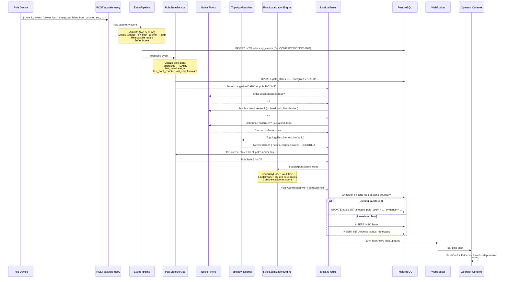

# ElectriFix — Fault Localization Engine: Engineering Specification

> Specification-only. No implementation code. Derived from [ARCHITECTURE.md](file:///Users/balajinayakbardawal/Learnings/ElectriFix/ARCHITECTURE.md) and [DATABASE-DESIGN.md](file:///Users/balajinayakbardawal/Learnings/ElectriFix/DATABASE-DESIGN.md). Consistent with all six assignment documents. Revised after engineering review on 2026-08-04.

---

## Product Policies

The localization engine relies on configurable operational policies rather than hardcoded business values. These policies are consumed by the pipeline but are **not part of the localization algorithm itself**. Changing a policy value changes system behavior without modifying localization logic.

| Policy | Default | Consumed By | Description |
|--------|---------|-------------|-------------|
| `HEARTBEAT_INTERVAL` | 15 min | `Debouncer` | Expected interval between heartbeats. Device spec: 15 min ± 45s jitter. |
| `HEARTBEAT_TIMEOUT_MULTIPLIER` | 2 | `Debouncer` | Number of missed heartbeats before marking `PRESUMED_DARK`. Default: 2 × 15 min = 30 min. |
| `DEBOUNCE_DURATION` | 30 min | `Debouncer` | Time a pole must remain silent before confirming dark state. Derived from `HEARTBEAT_INTERVAL × HEARTBEAT_TIMEOUT_MULTIPLIER`. |
| `OUTAGE_TOLERANCE_MINUTES` | 40 min | `ScheduledOutageFilter` | Time window before/after a scheduled outage during which dark poles are suppressed. |
| `VERIFICATION_THRESHOLD` | 0.80 | `VerificationPolicy` | Fraction of affected monitored poles that must report `LIVE` before a ticket is verified. |
| `FEEDER_DARK_THRESHOLD` | 0.80 | `FaultLocalizationEngine` | Fraction of DTs on a feeder that must be fully dark to classify as feeder-level fault. |
| `STALE_HEARTBEAT_MINUTES` | 20 min | `ConfidenceScorer` | If `last_live_pole` heartbeat is older than this, confidence is reduced. |
| `SENSOR_GAP_THRESHOLD` | 0.30 | `ConfidenceScorer` | If >30% of poles in the affected area have no device, confidence is reduced to LOW. |

> [!IMPORTANT]
> These policies are **intentionally separated** from the localization algorithm. The engine receives pre-filtered, pre-debounced state. It does not evaluate heartbeat timeouts or outage windows — those decisions are made by upstream consumers of these policies. The engine's only direct policy consumption is `FEEDER_DARK_THRESHOLD` for feeder-level classification and the confidence scorer's thresholds.

---

## 1. Purpose

### What the Engine Owns

The `FaultLocalizationEngine` is the **single entry point** for the core domain capability: given the current state of the network and a resolved topology, determine where faults are, group them into incidents, and produce structured evidence explaining why each fault was localized there.

Specifically, it owns:

- **Boundary detection.** Identifying the edge between the last live pole and the first dark pole in a radial tree.
- **Multi-fault separation.** Finding *all* distinct live/dark boundaries under a DT, not just one.
- **Fault grouping.** Clustering multiple dark regions that share the same upstream fault edge into a single incident.
- **Confidence scoring.** Producing `HIGH` / `MEDIUM` / `LOW` with structured reasons for every localized fault.
- **Evidence assembly.** Producing a complete `FaultEvidence` record for every fault — topology source, affected poles, coordinates, pincode, suppressed sensors, and confidence reasoning.

### What the Engine Does NOT Own

| Concern | Owner | Reference |
|---------|-------|-----------|
| Telemetry ingest, validation, deduplication | `EventPipeline` | ARCHITECTURE.md §4 Infrastructure |
| Current pole state (energized/dark/presumed_dark) | `PoleStateService` | ARCHITECTURE.md §4 domain/pole-state |
| Tree construction from registry data | `TopologyResolver` implementations | ARCHITECTURE.md §4 domain/topology |
| Dead sensor detection | `DeadSensorDetector` in `domain/noise-filter` | ARCHITECTURE.md §4 domain/noise-filter |
| Scheduled outage suppression | `ScheduledOutageFilter` in `domain/noise-filter` | ARCHITECTURE.md §4 domain/noise-filter |
| Transient debouncing | `Debouncer` in `domain/noise-filter` | ARCHITECTURE.md §4 domain/noise-filter |
| Ticket lifecycle state machine | `TicketLifecycle` in `domain/ticket` | ARCHITECTURE.md §4 domain/ticket |
| Restoration verification | `RestorationVerifier` in `domain/ticket` | ARCHITECTURE.md §4 domain/ticket |
| Fault persistence, ticket creation | `localize-faults` use case | ARCHITECTURE.md §4 Application Layer |
| LLM-generated summaries | `localize-faults` use case (lazy, non-blocking) | ARCHITECTURE.md Decision D5 |

### Upstream Dependencies

```
PoleStateService  ──→  provides current pole states (PoleState[])
TopologyResolver  ──→  provides resolved tree for a DT (NetworkGraph)
```

The engine receives **already-processed, already-filtered data**:

1. `PoleStateService` has already updated the pole's energized status.
2. `DeadSensorDetector` has already flagged isolated dark poles with live children.
3. `ScheduledOutageFilter` has already suppressed outage-window events.
4. `Debouncer` has already confirmed sustained dark state (not transient).

The engine never reads raw telemetry. It consumes `PoleStateService` snapshots only after `EventPipeline` has enforced the telemetry stream identity `(device_id, boot_counter, seq)` and lexicographic `(boot_counter, seq)` ordering. It never accesses the database. It never imports Express, Drizzle, or any framework.

### Downstream Consumers

| Consumer | What It Receives |
|----------|-----------------|
| `localize-faults` use case | `FaultCandidate[]` — each containing `FaultEvidence`, affected poles, fault location, confidence |
| `ticket-repository` (via use case) | Fault and ticket records written to the database |
| `websocket-emitter` (via use case) | Real-time push of `fault:new` and `fault:updated` events |
| `FaultCard` / `FaultEvidence` UI | Evidence displayed to operator |
| `ConfidenceBadge` UI | Confidence level and reasons |

---

## Non Goals

The Fault Localization Engine does **NOT**:

- **Dispatch crews** or recommend crew composition.
- **Estimate repair duration** or predict time-to-fix.
- **Perform predictive maintenance** or forecast future faults.
- **Optimize routing** to fault locations.
- **Generate AI-based decisions.** Localization is deterministic graph traversal, not machine learning.
- **Mutate telemetry.** The engine is a read-only consumer of pole states.
- **Write directly to the database.** All persistence is handled by the `localize-faults` use case.
- **Own restoration verification.** That responsibility belongs to `RestorationVerifier`.
- **Own ticket lifecycle.** That responsibility belongs to `TicketLifecycle`.

These boundaries are architectural guarantees, not future work.

---

## Engine Invariants

The following invariants are **architectural guarantees** that must hold at all times. They serve as implementation guards — any code change that violates an invariant is a bug.

1. **One active physical fault produces exactly one active ticket.** Never zero, never two.
2. **One physical boundary cannot create multiple incidents.** All dark poles downstream of the same fault edge are grouped into one fault.
3. **Localization is deterministic.** Given the same inputs, it always produces the same outputs.
4. **Localization never depends on LLM output.** The AI summary is generated lazily *after* localization and is nullable.
5. **FaultLocalizationEngine never writes directly to persistence.** It returns `FaultCandidate[]` to the calling use case, which handles all DB operations.
6. **TopologyResolver never mutates topology.** It returns a read-only `NetworkGraph`. The tree is built from static registry data.
7. **FaultEvidence is immutable after creation.** Evidence represents the reasoning used when the fault was localized. Subsequent telemetry creates a new localization revision rather than modifying historical evidence.
8. **The engine is stateless.** It holds no state between invocations. All state comes from `PoleStateService` and `TopologyResolver` at call time.

---

## Determinism

Given:

- The same `NetworkGraph` (topology)
- The same `PoleState[]` snapshot
- The same scheduled outage state

The engine **must** produce identical `FaultCandidate[]` output.

- No randomness.
- No timestamps used in decision logic. (Timestamps appear in evidence for display, not for computation.)
- No AI reasoning.
- No external API calls.
- The only heuristic component is `TopologyResolver` (specifically `InferredTopologyResolver`), which is invoked *before* the engine and produces a deterministic tree from deterministic GPS inputs.

### Idempotency

Repeated localization over identical `PoleState` snapshots must produce identical `FaultCandidate[]`.

The `localize-faults` use case is responsible for ensuring that duplicate processing does not create duplicate faults or tickets. The engine itself produces the same output every time — the use case deduplicates against existing persisted faults.

---

## 2. Inputs

### 2a. Pole States (from PoleStateService)

The engine receives a snapshot of current pole states for all poles under the affected DT(s).

| Field | Type | Assumption |
|-------|------|------------|
| `pole_id` | string | Always present. Primary identifier. |
| `energized` | enum | `LIVE`, `DARK`, `PRESUMED_DARK`, `UNKNOWN`. Already set by PoleStateService. |
| `last_heartbeat_at` | timestamp \| null | Null if never heard from. |
| `firmware_version` | string \| null | Determines behavior (fw 1.2 = no `power_lost`). |
| `device_health` | enum | `NO_DEVICE`, `HEALTHY`, `OFFLINE`, `DEGRADED`. `NO_DEVICE` means no telemetry hardware is installed. |
| `has_device` | boolean | `false` for ~9% of poles. |

**Key assumptions:**

- States are **already debounced**: a pole is only `DARK` or `PRESUMED_DARK` if the Debouncer has confirmed sustained absence (≥2 missed heartbeats or explicit `power_lost`).
- States are **already filtered**: dead sensors have been flagged by `DeadSensorDetector` and excluded before the engine sees them.
- States for poles with `has_device = false` are always `UNKNOWN`.

### 2b. Resolved Topology (from TopologyResolver)

The engine receives a `NetworkGraph` for the affected DT — a tree data structure (adjacency list) where:

| Property | Description |
|----------|-------------|
| `root` | The DT node (root of the tree) |
| `nodes` | All poles under this DT, with their GPS coordinates |
| `edges` | Parent-child relationships (directed: parent → child) |
| `source` | `RECORDED`, `INFERRED`, or `FALLBACK` |

**Key assumptions:**

- The tree is **always a tree** — no cycles, no loops. The LT network is radial by physics.
- For `RECORDED` topology: edges come directly from `parent_pole_id` in the registry. Exact.
- For `INFERRED` topology: edges come from geometric nearest-neighbor reconstruction. Approximate. Quality-checked.
- For `FALLBACK` topology: **no edges**. All poles are flat children of the DT node. No parent-child structure.

### 2c. Noise-Filtered Context

The engine does not receive raw noise data directly, but it must handle poles in these states that arrive through the filtered pipeline:

| Pole State | Meaning for Engine |
|-----------|-------------------|
| `LIVE` | Pole is energized. Confirmed by recent heartbeat or `power_restored`. |
| `DARK` | Pole explicitly reported `power_lost`. Confirmed. |
| `PRESUMED_DARK` | No explicit `power_lost`, but missed ≥2 heartbeats. Likely dark. Often fw 1.2 devices. |
| `UNKNOWN` | No device fitted, or device never heard from. Pole exists in topology but has no telemetry. |

---

## 3. Outputs

### 3a. FaultCandidate

For every distinct fault detected, the engine produces one `FaultCandidate`:

| Field | Type | Description |
|-------|------|-------------|
| `fault_type` | `span` \| `dt` \| `feeder` | What kind of fault |
| `dt_id` | string | Which DT this fault is under |
| `feeder_id` | string | Which feeder (for feeder-level faults or denormalization) |
| `span_pole_a` | string \| null | Last live pole (upstream). Null for DT/feeder faults. |
| `span_pole_b` | string \| null | First dark pole (downstream). Null for DT/feeder faults. |
| `lat` | number | Fault location latitude |
| `lon` | number | Fault location longitude |
| `pincode` | string \| null | PIN code of fault location |
| `affected_poles` | string[] | All downstream dark poles |
| `affected_pole_count` | number | Count of affected poles |
| `confidence_level` | `HIGH` \| `MEDIUM` \| `LOW` | Overall confidence |
| `topology_source` | `RECORDED` \| `INFERRED` \| `FALLBACK` | How the tree was obtained |
| `evidence` | FaultEvidence | Complete explainability record |

### 3b. FaultEvidence

Attached to every `FaultCandidate`. This is the structured explainability record — deterministic, not AI.

| Field | Type | Description |
|-------|------|-------------|
| `last_live_pole` | string | The last pole reporting energized before the fault boundary |
| `first_dark_pole` | string | The first pole reporting de-energized after the fault boundary |
| `fault_span` | [string, string] | The edge where the fault is localized (pair of pole IDs) |
| `affected_poles` | string[] | List of all downstream dark poles |
| `affected_pole_count` | number | Count |
| `topology_source` | `RECORDED` \| `INFERRED` \| `FALLBACK` | How topology was obtained |
| `confidence_level` | `HIGH` \| `MEDIUM` \| `LOW` | Overall confidence |
| `confidence_reasons` | ConfidenceReason[] | Structured list of factors |
| `coordinates` | { lat, lon } | GPS of fault midpoint |
| `pincode` | string \| null | PIN code |
| `suppressed_sensors` | string[] | Poles flagged as dead sensors (excluded from analysis) |

### FaultEvidence Immutability

`FaultEvidence` is **immutable after fault creation.** It represents the reasoning that produced the localization at the moment of detection.

- If subsequent telemetry changes the network state (e.g., more poles go dark, or some come back), this constitutes a **new localization event**, not a mutation of the original.
- The `localize-faults` use case may create a new fault or merge into an existing one, but it does not overwrite historical evidence.
- This preserves the audit trail: an operator or reviewer can always see *exactly what the system knew* when it made its decision.

### 3c. ConfidenceReason

Each reason is a structured factor:

| Field | Type | Description |
|-------|------|-------------|
| `factor` | string | Human-readable description of the factor |
| `positive` | boolean | `true` if this factor increases confidence, `false` if it decreases |
| `detail` | string | Specific explanation for this factor |

---

## 4. Event Flow

### End-to-End Sequence: Device to Dashboard



### Localization Triggers

Localization is triggered **only** after `PoleStateService` publishes a meaningful state transition. Not every telemetry event invokes the engine — only transitions that could indicate a new fault or a resolved fault.

#### Transitions That Invoke Localization

| From | To | Trigger Source | Action |
|------|-----|---------------|--------|
| `LIVE` | `DARK` | Explicit `power_lost` event | Invoke `localize-faults` for this pole's DT |
| `LIVE` | `PRESUMED_DARK` | Missed ≥2 heartbeats (Debouncer) | Invoke `localize-faults` for this pole's DT |
| `DARK` | `LIVE` | `power_restored` or `boot` event | Notify `RestorationVerifier` for affected tickets |
| `PRESUMED_DARK` | `LIVE` | `power_restored` or `boot` event | Notify `RestorationVerifier` for affected tickets |
| `UNKNOWN` | `DARK` | First `power_lost` from a previously unheard pole | Invoke `localize-faults` |

#### Transitions That Do NOT Invoke Localization

| Transition | Reason |
|-----------|--------|
| `LIVE` → `LIVE` | Normal heartbeat. No state change. |
| Duplicate heartbeat (same `boot_counter` and `seq`) | Dropped by EventPipeline before reaching PoleStateService. |
| RSSI change (same energized state) | Telemetry metadata, not a state transition. |
| Battery voltage change | Telemetry metadata, not a state transition. |
| Duplicate `power_lost` (same `boot_counter` and `seq`) | Dropped by EventPipeline. |
| Event suppressed by `ScheduledOutageFilter` | Scheduled outage — not a fault. |
| Pole flagged as `DEAD_SENSOR` | Dead sensor — not a fault. |

#### Batch Detection

During storms, multiple poles under the same DT may report dark within seconds. The `localize-faults` use case handles this by localizing **per-DT**: when any pole under DT X transitions to dark, the engine receives *all* current pole states for DT X and finds *all* boundaries in a single call. Subsequent dark transitions for the same DT within a short window can either re-invoke (idempotent — same result) or be coalesced by the use case.

---

## 5. Localization Algorithm

### Overview

The algorithm is a **deterministic graph traversal**. It is not an AI model, not a probabilistic classifier, and not an LLM. It is instant, free, and explainable.

The core insight from [01-problem-context.md](file:///Users/balajinayakbardawal/Learnings/ElectriFix/assignmentDocs/01-problem-context.md): **The fault is on an edge. Sensors report on nodes. The answer is the frontier between the live region and the dark region.**

### Step-by-Step Algorithm

#### Step 1: Collect Dark Poles

Input: `PoleState[]` for all poles under the affected DT.

- Collect all poles where `energized` is `DARK` or `PRESUMED_DARK`.
- Exclude poles already flagged as dead sensors.
- If no dark poles remain → no fault. Return empty.

#### Step 2: Classify by Topology Mode

The topology source determines the algorithm's precision:

| Source | What We Have | Algorithm | Result |
|--------|-------------|-----------|--------|
| `RECORDED` | Exact tree from `parent_pole_id` + `seq_on_line` | Full tree traversal | Span-level fault |
| `INFERRED` | Approximate tree from geometric reconstruction | Same tree traversal, lower confidence | Span-level fault (less certain) |
| `FALLBACK` | Flat list of poles under DT, no edges | DT-level localization only | DT-level fault |

#### Step 3: Boundary Detection (BoundaryFinder)

For `RECORDED` and `INFERRED` topologies (where we have a tree):

**For each dark pole:**

1. Start at the dark pole.
2. Walk toward the root (DT) following parent edges.
3. At each step, check the parent's state:
   - If parent is `LIVE` → **boundary found**. The fault is on the edge between this live parent and the dark child.
   - If parent is `DARK` or `PRESUMED_DARK` → continue walking toward root.
   - If parent is `UNKNOWN` (no device) → continue walking, but note the gap. The boundary is somewhere between the last known-live ancestor and the first known-dark descendant.
4. If we reach the DT root and everything is dark → this is a **DT-level fault** (the DT itself or its HT fuse has failed).

**Output**: A set of `(last_live_pole, first_dark_pole)` boundary pairs.

**Handling UNKNOWN (no-device) poles in the boundary:**

When a pole with `has_device = false` sits between the last live and first dark:

- The fault could be on any span involving the unmonitored pole.
- Report the boundary as a **range**: "fault between P-2211 and P-2214" (spanning the gap).
- The `span_pole_a` is the last pole with a device reporting `LIVE`.
- The `span_pole_b` is the first pole with a device reporting `DARK`.
- Add a confidence reason: "Unmonitored poles in fault boundary — location is approximate."

#### Step 4: Fault Grouping (FaultGrouper)

Multiple dark poles may share the same upstream fault edge. These are symptoms of a single cause.

**Grouping rule:**

1. Collect all boundary pairs from Step 3.
2. Two boundary pairs that share the **same fault edge** (same `last_live_pole` and same `first_dark_pole`) are the **same fault**.
3. Two boundary pairs with **different fault edges** are **different faults**.

See §6 for detailed grouping rules.

#### Step 5: Compute Affected Poles

For each distinct fault:

1. Take the `first_dark_pole` (the downstream end of the fault edge).
2. Traverse the entire subtree rooted at `first_dark_pole`.
3. Count all poles in that subtree — these are all electrically downstream and affected.
4. Include poles with `UNKNOWN` state (no device) in the count if they are in the subtree — they are physically downstream and presumed affected.

#### Step 6: Compute Fault Location

| Fault Type | Location | Coordinates |
|-----------|----------|-------------|
| Span fault | Midpoint between `span_pole_a` and `span_pole_b` | Average of GPS coordinates of the two boundary poles |
| DT fault | DT location | DT's GPS coordinates from `distribution_transformers` table |
| Feeder fault | Feeder's primary DT or substation | First DT coordinates on feeder |

#### Step 7: Resolve PIN Code

1. Use `span_pole_a`'s pincode if available.
2. Else use `span_pole_b`'s pincode.
3. Else use offline `pincode-lookup` from coordinates.
4. Else use nearest pole's known pincode (fallback).
5. If all fail → `null` with a confidence reason noting the gap.

#### Step 8: Score Confidence (ConfidenceScorer)

See §7 for the complete confidence model.

#### Step 9: Assemble FaultEvidence

Build the complete `FaultEvidence` record. See §8.

#### Step 10: Return FaultCandidate[]

Return one `FaultCandidate` per distinct fault, each with its complete `FaultEvidence`.

### Algorithm for FALLBACK Topology (No Tree)

When the topology source is `FALLBACK` (60% of DTs):

1. We know which poles belong to this DT, but not their parent-child relationships.
2. We know which of those poles are dark.
3. We **cannot** determine the specific fault edge.
4. Report as a **DT-level fault**:
   - `fault_type = 'dt'`
   - `span_pole_a = null`, `span_pole_b = null`
   - Location = DT coordinates
   - Confidence = `LOW`
   - Evidence includes: "Topology unknown — cannot determine specific span"
5. Count affected poles = all dark poles under this DT.

### Feeder-Level Fault Detection

A feeder-level fault is detected when:

- **All DTs under a feeder** have all (or nearly all) poles reporting dark simultaneously.
- No single DT explains the outage.

Detection:

1. After localizing at DT level, check: are multiple DTs under the same feeder all fully dark?
2. If ≥80% of DTs on a feeder are fully dark → classify as feeder-level fault.
3. `fault_type = 'feeder'`
4. Location = first DT on feeder or substation coordinates.
5. Merge individual DT-level faults into one feeder-level incident.

---

## 6. Fault Grouping

### The Problem

From [00-candidate-brief.md](file:///Users/balajinayakbardawal/Learnings/ElectriFix/assignmentDocs/00-candidate-brief.md): *"A control room that receives 40 separate alerts for one snapped wire is worse than no system at all. Grouping is part of the problem."*

One physical fault (a snapped wire) produces many dark poles. The engine must produce **one incident per physical cause**, not one incident per symptom.

### Merge Rules — When Multiple Boundaries Become ONE Fault

| Condition | Action | Rationale |
|-----------|--------|-----------|
| Multiple dark poles share the **same fault edge** (same `last_live_pole`, same `first_dark_pole`) | **Merge** into one fault | They are all downstream of the same break |
| Multiple dark poles on **different branches** of the same DT all trace back to the **same ancestor** that is the first dark node on their respective paths | **Merge** — the fault is at their common upstream ancestor | One break at a junction affects all downstream branches |
| All poles under a DT are dark | **Merge** into one DT-level fault | The DT itself has failed |
| All DTs under a feeder are dark | **Merge** into one feeder-level fault | The feeder has failed |

### Split Rules — When NOT to Merge

| Condition | Action | Rationale |
|-----------|--------|-----------|
| Two dark regions under the **same DT** have **different fault edges** (different `last_live_pole` boundaries) | **Split** into two separate faults | Two independent breaks on the same DT's lines |
| Two dark regions under **different DTs** on the same feeder | **Split** into two separate faults | Independent DT-level events (unless feeder-level fault detected) |
| A dark pole is an isolated dead sensor (live children) | **Exclude** — not a fault at all | Dead sensor, not outage |

### Example: Three Simultaneous Faults During a Storm

```
DT-0112:
  Line 1: P-1(LIVE) — P-2(LIVE) — ╳ — P-3(DARK) — P-4(DARK)
  Line 2: P-10(LIVE) — ╳ — P-11(DARK) — P-12(DARK) — P-13(DARK)

DT-0113:
  Line 1: P-20(LIVE) — P-21(LIVE) — ╳ — P-22(DARK) — P-23(DARK)
```

Result: **3 separate faults**, each with their own boundary, evidence, and ticket.

- Fault 1: Span P-2 → P-3 under DT-0112 (2 affected poles)
- Fault 2: Span P-10 → P-11 under DT-0112 (3 affected poles)
- Fault 3: Span P-21 → P-22 under DT-0113 (2 affected poles)

### When NOT to Split

```
DT-0112:
  P-1(LIVE) — P-2(LIVE) — ╳ — P-3(DARK) — P-4(DARK)
                                    │
                                    └── P-5(DARK) — P-6(DARK)  (branch)
```

P-3, P-4, P-5, P-6 are all dark. They all trace back to the same fault edge (P-2 → P-3). This is **one fault**, not two. The engine must not split it just because there's a branch.

---

## 7. Confidence Model

### Levels

| Level | Meaning | Operator Display |
|-------|---------|-----------------|
| `HIGH` | Strong evidence. Recorded topology, multiple downstream confirmations, no sensor gaps. | 🟢 "High confidence — location verified by recorded wiring data" |
| `MEDIUM` | Reasonable evidence. Inferred topology, or some sensor gaps, but location is likely correct. | 🟡 "Medium confidence — location based on inferred wiring order" |
| `LOW` | Weak evidence. Fallback topology, major sensor gaps, or contradictory data. | 🔴 "Low confidence — fault area identified, exact span unknown" |

### Confidence Rules

Confidence is evaluated deterministically by applying an ordered set of rules. Each rule has a condition, an effect on confidence level, and an operator-facing reason. Rules are evaluated top-to-bottom; the final confidence level is the result of applying all matching rules.

**Baseline:** Start at `HIGH`.

| # | Condition | Effect | Operator Reason |
|---|-----------|--------|----------------|
| R1 | Topology source is `RECORDED` | Remain `HIGH` | ✓ Recorded wiring data available |
| R2 | Topology source is `INFERRED` | Downgrade to `MEDIUM` | ✗ Wiring order estimated from pole coordinates |
| R3 | Topology source is `FALLBACK` | Set to `LOW` | ✗ Topology unknown — cannot determine specific span |
| R4 | Unmonitored poles in fault boundary (`has_device = false`) | Downgrade `HIGH` → `MEDIUM` | ✗ Unmonitored poles in fault boundary — location approximate |
| R5 | `last_live_pole` heartbeat older than `STALE_HEARTBEAT_MINUTES` (default: 20 min) | Downgrade `HIGH` → `MEDIUM` | ✗ Last live pole heartbeat is stale (may have gone dark) |
| R6 | Only 1 downstream pole confirms dark | Downgrade `HIGH` → `MEDIUM` | ✗ Limited downstream confirmation (1 pole only) |
| R7 | All affected poles are `PRESUMED_DARK` (no explicit `power_lost`) | Downgrade `MEDIUM` → `LOW` | ✗ Dark status inferred from missed heartbeats (no explicit signal) |
| R8 | Sensor gaps exceed `SENSOR_GAP_THRESHOLD` (default: >30% of area) | Set to `LOW` | ✗ Insufficient sensor coverage to localize accurately |
| R9 | Contradictory or ambiguous data present | Set to `LOW` | ✗ Contradictory data detected — result may be unreliable |
| R10 | ≥2 downstream poles confirm dark | Add positive reason (no level change) | ✓ N downstream poles confirmed dark |
| R11 | `last_live_pole` heartbeat recent (within `STALE_HEARTBEAT_MINUTES`) | Add positive reason (no level change) | ✓ Last live pole confirmed energized (heartbeat Xm ago) |

> [!NOTE]
> Rules R3 and R8 set confidence to `LOW` regardless of starting level — they are **floor rules**. Rules R2, R4, R5, R6 only downgrade by one level. Rules R10 and R11 add positive reasons without changing the level. This is deterministic and implementable as a simple rule evaluator.

### Confidence by Topology Source (Summary)

| Topology | Best Possible | With Sensor Gaps | With Stale Data |
|----------|--------------|-----------------|----------------|
| `RECORDED` | `HIGH` | `MEDIUM` (R4) | `MEDIUM` (R5) |
| `INFERRED` | `MEDIUM` (R2) | `MEDIUM` (R2+R4) | `MEDIUM` (R2+R5) |
| `FALLBACK` | `LOW` (R3) | `LOW` (R3+R8) | `LOW` (R3) |

### HIGH Confidence Requirements

All of the following must be true (no downgrade rules triggered):

1. Topology source is `RECORDED` (R1 applies, R2/R3 do not).
2. ≥2 downstream poles confirm dark state (R10 adds positive reason, R6 does not trigger).
3. `last_live_pole` has a recent heartbeat within `STALE_HEARTBEAT_MINUTES` (R11 adds positive reason, R5 does not trigger).
4. No unmonitored poles in fault boundary (R4 does not trigger).
5. No contradictory data (R9 does not trigger).

### MEDIUM Confidence Requirements

Any of the following is true (while not meeting HIGH and not hitting LOW floor):

1. Topology source is `INFERRED` (R2 triggers).
2. Topology is `RECORDED` but unmonitored poles sit in boundary (R4 triggers).
3. `last_live_pole` heartbeat is stale (R5 triggers).
4. Only one downstream pole confirms dark (R6 triggers).

### LOW Confidence Requirements

Any of the following is true (floor rules):

1. Topology source is `FALLBACK` (R3 triggers).
2. All affected poles are `PRESUMED_DARK` with no explicit `power_lost` (R7 triggers).
3. Sensor gaps exceed `SENSOR_GAP_THRESHOLD` (R8 triggers).
4. Contradictory or ambiguous data present (R9 triggers).

---

## 8. Explainability

### The Operator's Question

The operator at 2 AM needs to answer: **"Why does the system think the fault is HERE?"**

Every localized fault carries a `FaultEvidence` record that answers this question with deterministic, verifiable facts — not AI-generated guesses.

### Complete FaultEvidence Example

For a span fault localized between P-024431 and P-024432 under DT D-0112:

```
FaultEvidence:
  last_live_pole:    P-024431  (heartbeat 3 min ago, energized = true)
  first_dark_pole:   P-024432  (reported power_lost at 02:14:07)
  fault_span:        [P-024431, P-024432]
  affected_poles:    [P-024432, P-024433, P-024434, ..., P-024445]  (14 poles)
  affected_pole_count: 14
  topology_source:   RECORDED
  confidence_level:  HIGH
  confidence_reasons:
    - { factor: "Recorded topology",     positive: true,  detail: "DT D-0112 has complete pole ordering from registry" }
    - { factor: "Downstream confirmations", positive: true,  detail: "14 of 14 downstream poles confirmed dark" }
    - { factor: "Last live confirmed",   positive: true,  detail: "P-024431 heartbeat received 3 minutes ago" }
    - { factor: "Sensor coverage",       positive: false, detail: "2 poles in affected area have no device" }
  coordinates:       { lat: 12.9685, lon: 77.5944 }
  pincode:           560078
  suppressed_sensors: [P-024440]  (flagged as dead sensor, excluded)
```

### How the Operator Reads This

The UI translates this into natural language:

> **Fault detected on span P-024431 → P-024432**
>
> 📍 12.9685°N, 77.5944°E — PIN 560078
>
> 🟢 **High confidence**
>
> **Why here?** The last pole reporting power is P-024431 (heartbeat 3 min ago). The next pole downstream, P-024432, reported power lost at 02:14. Everything beyond it — 14 poles — is dark. The wiring order comes from department records.
>
> **Note:** 2 poles in the affected area have no monitoring device. 1 pole (P-024440) was excluded as a dead sensor.

### DT-Level Evidence (Fallback Topology)

When topology is `FALLBACK`:

```
FaultEvidence:
  last_live_pole:    null
  first_dark_pole:   null
  fault_span:        null
  affected_poles:    [P-024500, P-024501, ..., P-024570]  (71 poles)
  affected_pole_count: 71
  topology_source:   FALLBACK
  confidence_level:  LOW
  confidence_reasons:
    - { factor: "Topology unknown",  positive: false, detail: "DT D-0200 has no recorded pole ordering" }
    - { factor: "DT-level only",     positive: false, detail: "Cannot identify specific span — all 71 poles under this DT are affected" }
    - { factor: "Dark confirmations", positive: true,  detail: "63 of 65 monitored poles confirmed dark" }
  coordinates:       { lat: 12.9701, lon: 77.5880 }  (DT coordinates)
  pincode:           560078
  suppressed_sensors: []
```

Operator sees:

> **Fault detected: DT D-0200 area**
>
> 📍 12.9701°N, 77.5880°E — PIN 560078
>
> 🔴 **Low confidence** — exact span unknown
>
> **What we know:** 63 of 65 monitored poles under this transformer are dark. Wiring order was never digitized for this area, so we cannot pinpoint the exact span. A crew should start from the transformer.

---

## 9. Restoration Verification

### The Requirement

From [00-candidate-brief.md](file:///Users/balajinayakbardawal/Learnings/ElectriFix/assignmentDocs/00-candidate-brief.md): *"Restoration must be verified from telemetry, not from someone clicking a button. If a lineman marks it fixed and the poles are still dark, the system should not believe him."*

### How Restoration Is Detected

**Owner:** `RestorationVerifier` in `domain/ticket` — NOT the FaultLocalizationEngine.

The engine's output (specifically `affected_poles`) is what the `RestorationVerifier` watches. The verifier reads from `PoleStateService`, not from the engine.

**Flow:**

1. When power returns, affected devices send `boot` followed by `power_restored` within ~20 seconds.
2. `EventPipeline` processes these events.
3. `PoleStateService` updates affected poles: `DARK` → `LIVE`.
4. `RestorationVerifier` monitors affected poles for this fault.
5. When a sufficient threshold of affected poles report `LIVE`:
   - If ticket is in `detected`, `acknowledged`, or `crew_assigned` → move directly to `verified`.
   - If ticket is in `resolved` (crew marked done) → verify and move to `verified`.

### Verification Policy

`VerificationPolicy` determines restoration requirements. The FaultLocalizationEngine is **not responsible** for this policy — it belongs to `RestorationVerifier` in `domain/ticket`.

| Parameter | Default | Description |
|-----------|---------|-------------|
| `VERIFICATION_THRESHOLD` | 0.80 (80%) | Fraction of affected monitored poles that must report `LIVE` for verification to pass |

- **Rationale:** Some poles (the ~9% without devices) will never report. Some devices may have failed during the outage. Requiring 100% would cause tickets to hang forever.
- **Configurability:** The threshold is a product policy (see Product Policies section). A deployment with higher device reliability could raise it; one with older infrastructure could lower it.

### Premature Closure Rejection

When crew marks ticket as `resolved` but `PoleStateService` shows poles still dark:

1. `RestorationVerifier` checks: does the fraction of `LIVE` monitored poles meet `VERIFICATION_THRESHOLD`?
2. If NO → reject. `TicketLifecycle` pushes back to `crew_assigned`.
3. Increment `rejection_count` on the ticket.
4. Set `rejection_reason` = "X of Y affected poles still dark."
5. Emit `ticket:updated` via WebSocket.

### Ticket Lifecycle States

```
detected → acknowledged → crew_assigned → resolved → verified → closed
                                              ↓          ↑
                                         (poles dark?)   (telemetry
                                              ↓           confirms)
                                         crew_assigned ←──┘
                                         (system rejects)
```

Also:
- `detected → verified` (auto-resolve: power came back before operator acknowledged)
- `acknowledged → verified` (auto-resolve: power came back before crew assigned)

---

## 10. Noise Handling

Every noise scenario from the assignment, with deterministic behavior.

### 10a. Duplicate Telemetry

**Source:** At-least-once delivery. Retries up to 6 hours.

**Behavior:** `EventPipeline` handles this before the engine is invoked. `(device_id, boot_counter, seq)` is the unique stream identity and uses `ON CONFLICT DO NOTHING`. Duplicates are silently dropped. For each device, `(boot_counter, seq)` is strictly monotonic in lexicographic order; the engine never sees duplicates.

### 10b. Out-of-Order Packets

**Source:** Two poles lose power simultaneously; downstream arrives first.

**Behavior:** The engine operates on **current state**, not event sequence. By the time the engine is called, both poles are `DARK` in `PoleStateService`. Order of arrival does not affect localization. The state snapshot is what matters, not the order it was built.

### 10c. Firmware 1.2 (No `power_lost`)

**Source:** ~8% of fleet. Device simply stops heartbeating.

**Behavior:**
1. `Debouncer` detects: fw 1.2 device silent for >30 min (missed ≥2 heartbeats).
2. `PoleStateService` marks pole as `PRESUMED_DARK`.
3. Engine treats `PRESUMED_DARK` the same as `DARK` for boundary detection.
4. Confidence is reduced: "Dark status inferred from missed heartbeats (no explicit power_lost)."

### 10d. Missing `power_lost` (fw ≥1.3, Failed Transmission)

**Source:** Capacitor-powered transmission succeeds only ~70% of the time.

**Behavior:** Same as 10c. The device goes silent. `Debouncer` detects via missed heartbeats. `PoleStateService` marks `PRESUMED_DARK`. The engine handles it. Confidence notes the gap.

### 10e. Missing Heartbeat (Live Pole)

**Source:** A live pole's heartbeat is delayed or missed due to radio congestion.

**Behavior:** `Debouncer` requires ≥2 missed heartbeats before marking `PRESUMED_DARK`. A single missed heartbeat does NOT change state. This prevents transient false positives.

### 10f. Dead Modem / Device Failure

**Source:** ~4% of fleet offline at any moment. Dead modem, vandalism, water ingress, expired SIM.

**Behavior:**
1. `DeadSensorDetector` checks: is this an isolated dark pole with live children?
2. If yes → flag as `DEAD_SENSOR`. Do not invoke engine.
3. If no → proceed with normal localization.
4. `device_health = 'OFFLINE'` is tracked in `PoleStateService` based on RSSI patterns and heartbeat regularity.

### 10g. Device Failure vs Power Outage (Ambiguity)

**Source:** A pole goes silent. Is it a dead device or dark power?

**Behavior:** The engine disambiguates using **topological context**:
- If the silent pole's **children are all live** → dead sensor (physically impossible for a line fault to darken a parent while children remain live on a radial network).
- If the silent pole's **children are also dark** → likely power outage. Proceed with localization.
- If the silent pole has **no children in topology** (leaf node) → ambiguous. Mark `PRESUMED_DARK` and note reduced confidence.

### 10h. Scheduled Outage

**Source:** Planned load shedding and maintenance. ±40 min tolerance.

**Behavior:** `ScheduledOutageFilter` handles this before the engine:
1. Check if the affected feeder/DT has an active outage window (±40 min tolerance).
2. If yes → suppress. Do not invoke engine.
3. If window expires and poles still dark → re-evaluate as potential fault.
4. If outage was cancelled (10% rate) and poles go dark during what should have been the window → the ±40 min tolerance catches this edge case; after tolerance expires, dark poles are re-evaluated.

### 10i. Late Retries (Stale `power_lost`)

**Source:** Device offline for hours, then replays old events.

**Behavior:** `EventPipeline` handles: if `(boot_counter, seq)` is lexicographically lower than the last processed tuple for that device, the event is a stale retry. Discarded. An event from a higher `boot_counter` begins a new device generation even if its `boot` event was lost. The backend never compares `seq` values across different boot counters. Stale retries never reach `PoleStateService` or the engine.

### 10j. Clock Skew (±90 seconds)

**Source:** Device clocks are unreliable.

**Behavior:** The engine never uses `device_ts` for ordering or decision-making. It relies on:
- `received_at` (server timestamp) for recency.
- `(boot_counter, seq)` for deterministic ordering within a device stream.
- Current state snapshots, not event timestamps.

### 10k. Missing Devices (~9% of Poles)

**Source:** Not all poles have telemetry devices fitted.

**Behavior:**
1. These poles exist in the topology with `has_device = false`.
2. Their state is permanently `UNKNOWN`.
3. The engine includes them in topology traversal but cannot observe their state.
4. If an unmonitored pole sits in the fault boundary → the engine reports a wider span and reduces confidence.
5. If an unmonitored pole is downstream of a confirmed fault → it is counted in `affected_poles` (physically affected even though unconfirmed).

### 10l. Unknown PIN Code (~3% of Poles)

**Source:** `pincode` is missing in the registry.

**Behavior:**
1. Try adjacent pole's pincode.
2. Try `pincode-lookup` (offline reverse-geocode from coordinates).
3. If all fail → `pincode = null` in evidence.
4. Never blocks fault creation or ticket creation.

---

## 11. Missing Topology Strategy

### The Central Design Problem

From [02-data-and-systems.md](file:///Users/balajinayakbardawal/Learnings/ElectriFix/assignmentDocs/02-data-and-systems.md) §3: *"For roughly 60% of distribution transformers, `seq_on_line` and `parent_pole_id` are empty."*

This is NOT an edge case. It is the majority of the network.

### Three Resolver Strategies

#### RecordedTopologyResolver (40% of DTs)

**Selection:** DT has `has_recorded_topology = true` (computed at seed time by checking if its poles have `seq_on_line` + `parent_pole_id` populated).

**Behavior:**
1. Load all poles for this DT from registry.
2. Build tree from `parent_pole_id` edges.
3. Validate: tree is connected, no cycles, all poles reachable from DT root.
4. Return `NetworkGraph` with `source = 'RECORDED'`.

**Result:** Span-level localization. Confidence: `HIGH` (assuming other factors met).

#### InferredTopologyResolver (Implementation Deferred)

**Selection:** DT has `has_recorded_topology = false`, and inference is enabled.

**Behavior:**
1. Load all poles for this DT. All have GPS coordinates (always present, always trustworthy).
2. Load DT location.
3. Reconstruct the tree geometrically:
   a. DT is the root.
   b. For each pole, find its nearest neighbor closer to the DT → that is its parent.
   c. This produces a minimum spanning tree approximation.
4. Quality check: does the inferred tree produce reasonable line lengths? Are branch angles physically plausible (wires follow streets, not straight lines)?
5. If quality check passes → return `NetworkGraph` with `source = 'INFERRED'`.
6. If quality check fails → fall through to `FallbackTopologyResolver`.

**Known failure modes:**
- Poles on parallel streets may be incorrectly linked.
- Poles at intersections where lines cross may be assigned to the wrong branch.
- Very irregular old networks with non-linear pole placement.

**Result:** Span-level localization. Confidence: `MEDIUM`.

#### FallbackTopologyResolver (60% of DTs Without Inference)

**Selection:** DT has `has_recorded_topology = false` and either inference is not implemented or quality check failed.

**Behavior:**
1. Load all poles for this DT.
2. Return them as a **flat list** — all poles are direct children of the DT node, no parent-child edges between poles.
3. `source = 'FALLBACK'`.

**Result:** DT-level localization only. The engine knows which DT is affected and how many poles are dark, but cannot identify the specific span. Confidence: `LOW`.

### Selection Logic

```
Given: dt_id

1. Check distribution_transformers.has_recorded_topology
   ├── true  → RecordedTopologyResolver.resolve(dt_id) → NetworkGraph (RECORDED)
   └── false → InferredTopologyResolver available?
                ├── yes → InferredTopologyResolver.resolve(dt_id)
                │          └── quality check passes? 
                │              ├── yes → NetworkGraph (INFERRED)
                │              └── no  → FallbackTopologyResolver.resolve(dt_id) → NetworkGraph (FALLBACK)
                └── no  → FallbackTopologyResolver.resolve(dt_id) → NetworkGraph (FALLBACK)
```

### What the Operator Sees

| Topology | UI Shows |
|----------|----------|
| `RECORDED` | "Fault on span P-2211 → P-2212" with span highlighted on map |
| `INFERRED` | "Fault likely on span P-2211 → P-2212 (wiring order estimated)" with dashed span on map |
| `FALLBACK` | "Fault in DT D-0200 area — exact span unknown" with DT area shaded on map |

The operator always knows which kind of answer they are looking at.

---

## 12. Failure Scenarios

### 12a. False Positives (Alerting When No Fault Exists)

| Scenario | Mitigation |
|----------|------------|
| Dead sensor flagged as fault | `DeadSensorDetector` catches isolated dark with live children BEFORE engine is called |
| Scheduled outage fires alert | `ScheduledOutageFilter` suppresses with ±40 min tolerance BEFORE engine is called |
| Single missed heartbeat | `Debouncer` requires ≥2 missed before marking PRESUMED_DARK |
| Stale `power_lost` replay | `EventPipeline` discards if `(boot_counter, seq)` is lower than the last processed tuple |

### 12b. False Negatives (Missing a Real Fault)

| Scenario | Behavior |
|----------|----------|
| Fault on span between two unmonitored poles | Not detectable. **Known limitation.** Neither pole has a device. Downstream poles (if monitored) will eventually report dark, producing a wider-span localization. |
| fw 1.2 device on leaf pole loses power | Detected via missed heartbeats (≥30 min delay). Documented latency trade-off. |
| All affected poles lack devices | Not detectable until complaints arrive. The system is honest: it can only localize what it can observe. |

### 12c. Unknown Localization

| Scenario | Behavior |
|----------|----------|
| Dark poles under DT with FALLBACK topology | DT-level fault reported. Confidence: LOW. Operator told exact span is unknown. |
| Contradictory data | Report with LOW confidence and note the contradiction in evidence reasons. |

### 12d. Sensor Contradictions

| Scenario | Behavior |
|----------|----------|
| Dark pole with live children | Flagged as dead sensor by `DeadSensorDetector`. Excluded from analysis. Not a line fault (physically impossible on radial network). |
| Live pole with all dark ancestors | Anomalous. Possible device malfunction or unreported restoration. Flag in evidence and reduce confidence. |

### 12e. Topology Inference Failure

| Scenario | Behavior |
|----------|----------|
| Inferred tree fails quality check | Fall through to `FallbackTopologyResolver`. DT-level result. |
| Inferred tree produces wrong span | Fault localized to wrong edge. **Known limitation.** Confidence is `MEDIUM` — operator is told the wiring order is estimated. |

### 12f. Database Temporarily Unavailable

| Scenario | Behavior |
|----------|----------|
| Cannot read pole states from DB | `PoleStateService` serves from in-memory cache. Engine continues working. |
| Cannot write fault/ticket to DB | Use case retries. Fault is computed but not persisted. Log error. Emit via WS if possible. |

### 12g. WebSocket Unavailable

| Scenario | Behavior |
|----------|----------|
| WS connection fails | Fault is still persisted to DB. Dashboard falls back to polling. Operator sees fault on next refresh. |

---

## 13. Acceptance Scenarios

### Scenario 1: Span Fault with Recorded Topology

**Given:** DT D-0112 has recorded topology. P-1 through P-10 are on a line.

**When:** Span between P-5 and P-6 breaks. P-6 through P-10 lose power. P-6 through P-9 send `power_lost`. P-10 has no device.

**Then:**
- One fault created: span P-5 → P-6
- `affected_poles` = [P-6, P-7, P-8, P-9, P-10]
- `affected_pole_count` = 5
- `confidence_level` = HIGH
- `topology_source` = RECORDED
- One ticket created in `detected` status
- Dashboard shows fault marker at midpoint of P-5 and P-6

### Scenario 2: DT Fault

**Given:** DT D-0200 has recorded topology. 70 poles on multiple lines.

**When:** DT fuse blows. All 70 poles lose power.

**Then:**
- One DT-level fault. `fault_type = 'dt'`.
- `affected_pole_count` = 70
- Location = DT coordinates
- `confidence_level` = HIGH (all poles dark, recorded topology, no ambiguity)
- Evidence: "All poles under DT are dark — likely DT or HT fuse failure"

### Scenario 3: Feeder Fault

**Given:** Feeder F-07 has 12 DTs.

**When:** All 12 DTs go fully dark simultaneously.

**Then:**
- One feeder-level fault. `fault_type = 'feeder'`.
- Individual DT faults merged into one feeder incident.
- `affected_pole_count` = sum of all poles across 12 DTs
- `confidence_level` = HIGH

### Scenario 4: Three Simultaneous Span Faults (Storm)

**Given:** DT D-0112 has recorded topology with two lines.

**When:** Three spans break simultaneously on different lines under the same DT and a neighboring DT.

**Then:**
- Three separate faults created, each with own boundary, evidence, and ticket.
- Dashboard shows three fault markers.
- Not merged — different fault edges.

### Scenario 5: Dead Sensor

**Given:** P-50 is dark but P-51, P-52 (children of P-50) are live.

**When:** P-50's device reports silence for >30 min.

**Then:**
- `DeadSensorDetector` flags P-50 as dead sensor.
- **No fault created.** No ticket.
- P-50 excluded from localization analysis.
- If a real fault later occurs downstream, P-50 appears in `suppressed_sensors`.

### Scenario 6: Firmware 1.2 Device

**Given:** P-30 is on fw 1.2. It does not send `power_lost`.

**When:** P-30 loses power. It simply stops heartbeating.

**Then:**
- After ≥2 missed heartbeats (~30 min), `Debouncer` flags P-30.
- `PoleStateService` marks `PRESUMED_DARK`.
- Engine localizes the fault normally but with `PRESUMED_DARK` in evidence.
- `confidence_level` may be reduced to MEDIUM: "Dark status inferred from missed heartbeats."

### Scenario 7: Missing Topology (Fallback)

**Given:** DT D-0300 has no recorded topology (60% case). 50 poles, no `parent_pole_id`.

**When:** 40 of 50 poles go dark.

**Then:**
- One DT-level fault: `fault_type = 'dt'`.
- `span_pole_a = null`, `span_pole_b = null`.
- `topology_source` = FALLBACK.
- `confidence_level` = LOW.
- Evidence: "Topology unknown — cannot determine specific span."
- Operator told: "Fault in DT D-0300 area — exact span unknown. Start from transformer."

### Scenario 8: Scheduled Outage

**Given:** Scheduled outage for feeder F-07 from 10:00 to 12:30. ±40 min tolerance.

**When:** At 10:15, all poles under F-07 go dark.

**Then:**
- `ScheduledOutageFilter` suppresses. No fault. No ticket.
- If at 13:15 (40 min after window end) poles are still dark → re-evaluate as potential fault.

### Scenario 9: Out-of-Order Telemetry

**Given:** P-6 and P-7 both lose power. P-7's `power_lost` arrives before P-6's.

**When:** Both events are processed by `EventPipeline` and `PoleStateService`.

**Then:**
- By the time engine is called, both P-6 and P-7 are `DARK` in `PoleStateService`.
- Engine operates on current state snapshot. Order of arrival is irrelevant.
- Correct boundary is found regardless.

### Scenario 10: Duplicate Telemetry

**Given:** Device retransmits `power_lost` for P-6 three times (same `boot_counter` and `seq`).

**When:** `EventPipeline` processes all three.

**Then:**
- First insert succeeds. Second and third hit `ON CONFLICT DO NOTHING`.
- `PoleStateService` updated once.
- Engine called once.
- No duplicate faults or tickets.

### Scenario 11: Repair and Verification

**Given:** Fault on span P-5 → P-6. Ticket in `crew_assigned`. P-6 through P-9 affected.

**When:** Crew repairs the wire. P-6, P-7, P-8, P-9 send `boot` then `power_restored`.

**Then:**
- `PoleStateService` marks each pole `LIVE` as `power_restored` arrives.
- `RestorationVerifier` sees ≥80% of affected poles (with devices) now `LIVE`.
- Ticket moves to `verified`.
- Auto-closes after hold period.

### Scenario 12: Premature Closure Rejected

**Given:** Fault on span P-5 → P-6. P-6 through P-9 affected. Only P-6 and P-7 restored.

**When:** Crew marks ticket as `resolved`.

**Then:**
- `TicketLifecycle` checks: only 2 of 4 monitored poles are `LIVE`. 50% < 80% threshold.
- Rejection: push back to `crew_assigned`.
- `rejection_count` incremented. `rejection_reason` = "2 of 4 affected poles still dark."

### Scenario 13: Unmonitored Poles in Boundary

**Given:** Line: P-1(LIVE, has device) — P-2(no device) — P-3(no device) — P-4(DARK, has device).

**When:** Fault somewhere between P-1 and P-4.

**Then:**
- Engine reports boundary as P-1 → P-4 (wider span).
- Evidence: "2 unmonitored poles in fault boundary — location approximate."
- `confidence_level` = MEDIUM (reduced due to gap).
- Coordinates = midpoint of P-1 and P-4.

### Scenario 14: Cancelled Scheduled Outage

**Given:** Outage scheduled for DT D-0112 at 14:00-15:00. Cancelled at 13:55 but feed not updated.

**When:** At 14:10, poles under D-0112 go dark (real fault, not load shedding).

**Then:**
- `ScheduledOutageFilter` suppresses initially (within ±40 min window).
- At 15:40 (40 min after window end), poles still dark → re-evaluate.
- Engine is invoked. Fault detected. Ticket created.
- **Known limitation:** up to ~2 hour delay for faults coinciding with cancelled outages.

### Scenario 15: Auto-Resolve Before Acknowledgment

**Given:** Fault detected on span P-5 → P-6. Ticket in `detected` (nobody has acknowledged yet).

**When:** Power restored automatically (e.g., auto-recloser trips and resets). All affected poles report `power_restored`.

**Then:**
- `RestorationVerifier` detects restoration.
- Ticket moves directly from `detected` → `verified`.
- Auto-closes after hold period.
- Operator sees: "Fault was detected and auto-resolved. Power confirmed restored."

### Scenario 16: Repeated Duplicate Telemetry (Idempotency)

**Given:** Fault on span P-5 → P-6 already detected. Ticket exists in `detected` status. Fault and evidence persisted.

**When:** Device retransmits `power_lost` for P-6 five more times (same `boot_counter` and `seq`). Additionally, P-7 (already dark) retransmits its `power_lost` three times with its same tuple.

**Then:**
- All duplicate events are dropped by `EventPipeline` (`ON CONFLICT DO NOTHING`).
- `PoleStateService` is not updated (no state change: P-6 and P-7 are already `DARK`).
- Localization is **not re-invoked** (no state transition occurred).
- No duplicate faults created.
- No duplicate tickets created.
- No duplicate WebSocket events emitted.
- The existing fault, ticket, and evidence remain unchanged.
- **Idempotency guarantee holds:** the system is in exactly the same state as before the duplicates arrived.

---

## 14. Performance Expectations

### Algorithm Complexity

| Operation | Complexity | Notes |
|-----------|-----------|-------|
| Boundary detection (per dark pole) | O(depth) where depth ≤ ~20 | Walk to root. Depth of LT tree is bounded by line length (~240 poles max, typically ~70). |
| Boundary detection (all dark poles in DT) | O(D × depth) where D = dark poles | Worst case ~240 poles × 20 depth = 4,800 steps. Trivial. |
| Fault grouping | O(B²) where B = distinct boundaries | B is tiny — typically 1-3 per DT, maximum ~10. |
| Confidence scoring | O(1) per fault | Fixed number of factor checks. |
| Evidence assembly | O(A) where A = affected poles | Traversing affected subtree. |
| Total per DT | O(N) where N = poles in DT | Linear in DT size. |

### Expected Throughput

| Metric | Target (from assignment) | Expected |
|--------|--------------------------|----------|
| Fault occurrence → localized ticket visible in UI | < 120 s (p95) | **< 5 s** for recorded topology, **< 10 s** for fallback. The 120s budget is generous; most latency is in Debouncer waiting for confirmation, not in the algorithm itself. |
| Ingest throughput sustained | ≥ 500 msg/s | Not limited by engine. Engine is invoked per-DT, not per-message. |
| Ingest burst tolerated | 5,000 messages in 10 s | EventPipeline ring buffer handles this. Engine is not on the ingest hot path. |

### Latency Breakdown

| Phase | Expected Latency |
|-------|-----------------|
| EventPipeline (validate, dedup, store) | < 50 ms |
| PoleStateService update | < 10 ms |
| Noise filter checks | < 5 ms |
| TopologyResolver.resolve() | < 20 ms (cached after first call) |
| FaultLocalizationEngine.localize() | < 10 ms per DT |
| DB write (fault + ticket) | < 30 ms |
| WebSocket emit | < 5 ms |
| **Total (happy path)** | **< 130 ms** |

The 120-second budget exists primarily for the Debouncer — waiting for ≥2 missed heartbeats for fw 1.2 devices or failed `power_lost` transmissions. The algorithm itself is near-instant.

### Memory Usage

| Data | Memory |
|------|--------|
| Pole states (in-memory cache) | ~4,000 × ~200 bytes = ~800 KB |
| One DT's NetworkGraph | ~70 nodes × ~100 bytes = ~7 KB |
| All DTs' cached trees | ~60 × ~7 KB = ~420 KB |
| Total engine memory footprint | **< 2 MB** |

### Potential Bottlenecks

| Bottleneck | Likelihood | Mitigation |
|-----------|------------|------------|
| Storm: many DTs affected simultaneously | Moderate (monsoon) | Engine is stateless and per-DT. Process DTs sequentially or in parallel. Each takes < 10ms. |
| Topology cache miss | Low (cache on first access) | Trees are small and stable. Cache per DT, invalidate never (registry is static). |
| DB write contention | Low | Faults are low-volume (12-120/day). Not a hot path. |

---

## 15. Known Limitations

> These are documented trade-offs, not bugs.

1. **Faults between two unmonitored poles are invisible.** If neither pole has a device, the system cannot detect the fault until a downstream monitored pole goes dark. The reported fault location will be wider than the actual span.

2. **Firmware 1.2 detection has ~30 minute latency.** These devices don't send `power_lost`. Detection relies on missed heartbeats (15 min interval × 2 = 30 min). The assignment's 120-second target cannot be met for faults affecting only fw 1.2 devices.

3. **Topology inference is heuristic.** Geometric nearest-neighbor reconstruction may produce incorrect trees for networks with irregular pole placement, parallel streets, or lines that double back. Confidence reflects this (`MEDIUM`), but some faults in the 60% of DTs may be localized to the wrong span.

4. **Fallback topology provides DT-level localization only.** For the 60% of DTs without recorded or successfully inferred topology, the system can only say "fault somewhere under this DT." This is still better than the current 2-hour process, but less precise than span-level.

5. **Faults coinciding with cancelled scheduled outages may be delayed.** If an outage is cancelled without the feed being updated, and a real fault occurs during the would-be window, the system suppresses for up to the ±40 minute tolerance. Worst case: ~2 hour detection delay.

6. **Restoration threshold (80%) may not suit all scenarios.** If a fault affects 5 poles and one device is permanently dead, the threshold requires 4 of 4 remaining to report `LIVE`. A stuck device could prevent ticket verification. Production would need manual override capability (not in scope for this assignment).

---

## 16. Open Questions

No open design questions.

All design decisions are resolved in [ARCHITECTURE.md](ARCHITECTURE.md) and [DATABASE-DESIGN.md](DATABASE-DESIGN.md). The specification above is implementable without additional architectural clarification.
